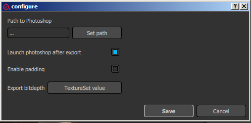

# 版本2.3

**Substance Painter2.3**&#x200B;改进了脚本API，以发布其第一个正式增效工具：导出带有完整图层栈栈的Photoshop。

发行日期： *15 2016年9月*

## 主要功能

### 新的Photoshop导出增效工具

在此版本中，我们侧重于在脚本API中添加新的可能性，以实现&#x200B;**Photoshop高级导出器**。 要访问此新导出，只需单击主工具栏中可用的Photoshop图标（如果增效工具已激活，则为默认情况）。 该增效工具允许导出纹理集中可用的完整图层栈栈，并在PSD文件内创建类似结构。 此功能&#x200B;**需要在计算机上安装Photoshop**&#x200B;才能生成PSD文件。

一些选项可通过插件菜单的“配置”按钮找到：

## 教程

我们的最新教程介绍了使用新插件的导出过程：

## 发行说明

### 2.3.1

（2016年10月7日发布）

**已添加：**

* [Plugin]&#x200B;[Photoshop]允许指定要导出的素材/栈栈/通道
* [脚本]函数名称有一些不一致

**已修复：**

* [导出]可以在自定义导出预设中丢弃Alpha
* [导出]Alpha在sRGB通道上获取错误的灰度系数转换
* [导出]非方形文档导出为方形
* [导出]如果缺少其他映射，则无法导出其他映射
* [射线]某些参数（如发射强度）不起作用
* [NVIDIA] NVIDIA Quadro K2200/GTX 750/760启动时崩溃
* [AMD]缩览图和预览的颜色集不正确
* [AMD]新建文件和文件打开时冻结且驱动程序失败
* [日志]日志文件中缺少“software-version”

### 2.3.0

（2016年9月15日发布）

**已添加：**

* [增效工具]新增的“导出到Photoshop”增效工具（导出完整的图层栈栈）
* [导出]允许指定内边距的宽度（以像素或无限为单位）
* [导出]允许在UV之外设置背景类型
* [托架]混合10种材质的新材质分层着色器
* [层架]新的粘土着色器可使用Height/法线通道查看细节
* [搁板]带环境输入的新烘焙光线滤镜
* [托架]更新了一些蒙版生成器以添加非方形变换
* [视区]将合成的法线图（normal+Height+烘焙）添加到独奏模式
* [脚本]允许导出其他映射
* [脚本]允许查询每个纹理集的可用其他映射
* [脚本]允许检索声道格式
* [脚本]在烘焙文档中添加示例
* [脚本]允许查询图层的可见性
* [脚本]允许查询图层的混合模式和不透明度
* [脚本]允许导出转换后的映射（最终正常映射、混合AO等）
* [Substance]读取和连接自定义用法
* [快捷键]添加修改键(SHIFT)以向后循环单独模式
* [导出]更新了默认导出预设以禁用Alpha
* [UI]现在，仅当引擎可用时，才会计算缩览图
* [UI]计算缩略图时显示提及

**已修复：**

* 打开某些旧项目时崩溃
* 纹理通道缓存损坏时崩溃
* 使用“材质图层”工作流程混合超过4种材质时崩溃
* [UI]如果工具栏被隐藏，则工具快捷键不起作用
* [UI] “视图”菜单将“图像”工具栏标记为“未命名”
* [UI]增效工具工具栏在“视图”菜单中命名为“未标题”
* [烘焙]在编辑烘焙设置时按Enter键将启动烘焙过程
* [Baker]某些参数的范围不正确
* [导入]由于非常大的数字，无法导入OBJ网格
* [导入]某些OBJ文件导入的子对象过多
* [导出]导出时通道背景填充为黑色，而不是默认颜色
* [工具]如果FOV太低，粒子将无法正常工作
* [工具]子栈叠中使用蒙版时，画笔预览颜色不正确
* [视区]当画笔进入2D视图的空白区域时，它变得巨大
* [视区]绘制“正常”纹理时出现空白画笔预览
* [脚本]文档不正确：列出了“ao”而不是“ambientoclusion”
* [脚本]关闭Painter时，使用子进程()启动的进程被终止
* [托架]烘焙光照滤镜使用不正确的AO输入
* [MacOS]已删除消火栓项目（不兼容）
* 加载\*.spt文件（而不是\*.spp）时，将打开默认项目
