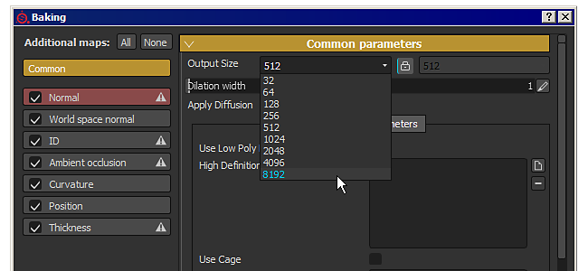
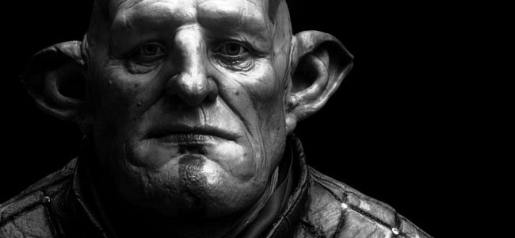
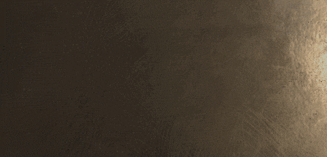

# 版本2.5

**Substance Painter2.5**&#x200B;引入了许多新功能：从画笔设置中的不透明度（除了流之外）到能够在8K等量中生成更多映射。

发行日期：*2017年2月21日*

## 主要功能

### 新建画笔不透明度

{width="650px"}

现在，在Substance Painter中绘画时，**画笔参数**&#x200B;中的新设置是&#x200B;**不透明度**。\
**不透明度**&#x200B;控制画笔描边的&#x200B;**整体强度**，而相比之下，**流量**&#x200B;设置控制画笔描边内&#x200B;**每个单独的图章**&#x200B;的强度。 这意味着现在可以在同一区域&#x200B;**上绘画和重画，而无需创建重叠值**。 为此，请将“流量”设置为100，并将“不透明度”值设置为您喜欢的强度。 由于不透明度的工作原理，无法将其与钢笔压力相关联。 对于这种控制，流量仍然是最佳选择。

我们还在此新参数旁添加了一个&#x200B;**新修饰符**，默认情况下，该参数位于&#x200B;**“A”**&#x200B;键上。 按此键将允许&#x200B;**继续上一个画笔描边**，而不是创建新的画笔描边。 这意味着您可以使用所需的不透明度绘制一致的颜色，同时保留移动摄像机的可能性。 另一个示例是继续使用克隆工具执行的复制。

### 以8K和非方形分辨率进行全新烘焙

面包机经过改进后，支持分辨率高达&#x200B;**8192x8192**（8K加上消除锯齿功能），这意味着您现在可以使用其他地图以1:1的比率以8K导出。\
我们还添加了对&#x200B;**非方形**&#x200B;分辨率的支持。 例如，现在可以烘焙&#x200B;**4096x2048**。 为此，只需单击下拉菜单旁边的“**锁定**”图标以选择分辨率。

### 视区中新增了对颜色配置文件的支持

我们添加了&#x200B;**LUT**（纹理）支持，以控制Substance Painter中&#x200B;**视区**&#x200B;的渲染。 要应用配置文件，只需在“**显示设置**”窗口中启用“**颜色配置文件**”设置，然后将LUT加载到专用插槽中。 它同时适用于&#x200B;**OpenGL**&#x200B;视口（绘画）和&#x200B;**IRay**&#x200B;渲染器。 一些示例默认自常用的&#x200B;**相机预设**&#x200B;到更多的&#x200B;**艺术效果**。 有关详细信息，请参阅文档的专用页面： [颜色配置文件](../../features/post-processing/color-profile.md)

### 与Substance Designer6兼容的新Substance引擎

我们增加了对&#x200B;**Substance Designer6**&#x200B;的支持，这意味着使用&#x200B;**SD6**&#x200B;创建的资源可以打开并在&#x200B;**Substance Painter2.5**&#x200B;中使用！\
一个很好的示例是能够使用SD6的&#x200B;**新文本节点**&#x200B;并将其集成到Substance中。 通过这种方式，无需离开应用程序，即可创建&#x200B;**动态文本**&#x200B;并直接绘制它们。 **默认情况下，我们包含10种字体**，每种字体都有不同的样式，以覆盖最常见的用途。 您可以在&#x200B;**托架**&#x200B;的“**过程**”部分找到它们。

{width="400px"}

### 货架上的新内容

除了使用新货架进行一些修复和改进之外，我们还添加了一组&#x200B;**新滤镜**，以改进绘画和纹理效果。 我们还&#x200B;**改进了**&#x200B;现有筛选器（如“**HSL**”）的行为。 我们在创建&#x200B;**新项目**（例如&#x200B;**Unity 5**&#x200B;和&#x200B;**Unreal Engine 4**）时还添加了新的&#x200B;**模板**。

### 支持自定义着色器UI的全新脚本改进

在此版本中，我们添加了一种&#x200B;**脚本和控制** **着色器参数**&#x200B;的方法。 我们还添加了对使用&#x200B;**自定义UI**&#x200B;而不是默认UI的支持，从而开启了多种新的可能性，例如&#x200B;**动画着色器**。\
有关更多详细信息，请查看应用程序的“帮助”菜单中的脚本文档。

## 教程

我们最新的Twitch流中介绍了新的主要功能：

## 发行说明

### 2.5.3

（2017年3月15日发布）

**已修复：**

* [Baker]使用特定网格进行烘焙时崩溃

**已知问题：**

* [Mac]在某些情况下，粒子会导致纹理损坏

### 2.5.2

（2017年3月14日发布）

**已修复：**

* [工具] Wacom绘图板在Linux上不起作用
* [工具]使用涂抹工具时出现黑色伪像
* [面包师]如果搭配笼使用“按名称匹配”，烘焙会失败
* [烘焙师]仅使用法线图烘焙时，环境遮蔽损坏
* [托架]常规滤镜无法正确处理Alpha（对比度/发光度、高反差等）
* [视口]加载启用了阴影的项目时出现性能问题
* [视口] MacOS上的3D视图出现抖动问题
* [视口]启用颜色配置文件后，粒子预览无法正确显示
* [Iray]如果Iray无法初始化，则将项目切换回OpenGL时崩溃
* [IRay]渲染SpecGloss着色器/mdl时，光泽度被忽略
* [着色器]规格/光泽着色器与Iray和SD不匹配
* [着色器]从线性到sRGB LUT转换的sRGB转换不同
* [Shader]使用过时的着色器加载项目时渲染不正确
* [着色器]“pbr-coated”着色器不再起作用
* [导出]即使纹理集中不存在某些通道，仍会导出这些通道
* [图层]混合模式“正常映射反转细节”不适用于灰度通道
* [UI] HDPI显示器和显示器的“颜色选择窗口”在150%时出现问题

**已知问题：**

* [Mac]在某些情况下，粒子会导致纹理损坏

### 2.5.1

（2017年2月27日发布）

**已修复：**

* [Mac] Wacom绘图板输入在3D和2D视图中损坏
* [面包师]按名称匹配不再有效
* [Bakers]“平均法线”设置不再有效
* [Iray]缺少烘焙法线图时渲染不正确
* [射线]与OpenGL渲染器相比，颜色配置文件的行为不同
* [Iray]将渲染导出为位图时不包括颜色配置文件校正
* [Substance]材质滤镜不再工作
* [工具]笔触不透明度不存储在画笔预设中
* [工具]仿制画笔UV对齐方式不再有效
* [导出]以整数形式导出时，位移通道应居中（0.5内）
* [模板]绝对路径存储在模板中
* [TextureSet]移除通道后，通道纹理会持续存在

**已知问题：**

* [Linux] Wacom绘图板输入在3D和2D视图中不起作用
* [Mac]在某些情况下，粒子会导致纹理损坏
* [导出]在极少数情况下，AMD GPU上可能会出现黑色矩形

### 2.5.0

（2017年2月21日发布）

**已添加：**

* 添加对AMD Radeon Pro和AMD FirePro GPU的支持
* [工具]添加对笔触不透明度的支持
* [工具]添加一个修改选项，以允许继续最后一个画笔描边
* [Iray]更新以支持Pascal GPU
* [视区]添加对颜色配置文件(LUT)的支持
* [Substance]集成新框架（SD6引擎）
* [UI]在“文件”菜单中增加“最近打开的文件”大小列表
* [导入]使用物质中的类别在导入对话框中填充前缀
* [烘焙师]允许烘焙8K纹理
* [烘焙师]允许烘焙非方形分辨率
* [烘焙]烘焙重量的高多边形网格时提高内存消耗
* [架子]锁定架子（和项目）以禁止同时编辑并避免损坏
* [架]从物质中读取类别和关键字，以便用于过滤
* [托架]允许从搜索查询结果中排除资源
* [Shelf]改进了缩览图时间计算
* [Shelf]允许在项目中嵌入预设
* [托架]允许使用SHIFT键快速折叠/展开树视图
* [托架]允许在资源为只读状态时保存缩览图（本地缓存）
* [托架]新内容：新过滤器（变换、镜像、三平面等）
* [托架]新内容：新LUT配置文件（经典和艺术效果，例如黑色胶片、复古等）
* [Shelf]新增内容：10种可快速生成自定义文本的新字体Substance
* [Shelf]新模板：Unity 5和Unreal Engine 4
* [Shelf]改进了HSL滤镜，使艺术家更友好
* [Shader]在PBR着色器中添加对Specular level声道的支持
* [Shader]在Alpha测试着色器中添加对抖动的支持
* [Shader]在PBR着色器中添加对视差遮蔽映射的支持
* [着色器]允许为着色器参数定义自定义UI
* [MatLayering]为材质图层工作流程创建新的蒙版通道
* [脚本]允许在SP项目中写入元数据
* [脚本]允许使用特定导出预设导出
* [脚本]允许将着色器参数检索为JSON
* [脚本]添加对WebSocket连接的支持
* [脚本]添加加载着色器实例的可能性
* [脚本]添加创建新项目的可能性
* [脚本]允许检索导入到项目中的网格的URL
* [脚本]允许非方形生成
* [脚本]报告通过脚本API设置数据时出错
* [Substance]添加user-data标记以指定法线贴图格式

**已修复：**

* 选取颜色和物质时崩溃
* 将非RGBA32f图像加载为环境映射时崩溃
* 与在AMD GPU上绘画相关的崩溃
* [网格] OBJ导入无法识别没有mtl文件的素材
* [网格]在某些网格上，UDIM纹理集名称生成可能不正确
* [UI]查看器中的“还原/重做”按钮设置窃取焦点并停止鼠标滚动
* [UI]某些标签未正确裁剪为高DPI
* [图层]绘画效果的替换模式在蒙版上的行为不正确
* [图层]“相减”混合模式在Alpha中存在错误行为
* [工具]在UV边框上绘画时，画笔大小在2D视图中变得很大
* [工具]对齐的直线在高DPI下具有异常行为
* [工具]模板分辨率有时不正确
* [Bakers]如果“相对于定界框”为“关”，则会固定“最大遮挡距离”值
* [着色器]栈栈和自动参数通道定义不匹配
* [3D视图]根据项目设置，普通通道的显示不一致
* [视区]某些正常映射具有固定值，这些值显示为伪像
* [视区]默认始终禁用后效果
* [导出]如果缺少正常通道，则正常混合设置不正确
* [导出]在某些情况下，AMD GPU上的纹理生成不正确
* [导出]如果着色器参数位于组中，则无法正确导出
* [导出]在自定义托架中编辑导出预设时输出日志错误
* [托架]树视图筛选与文件夹名称不完全匹配
* [Shelf]难以读取重命名搁置预设
* [Shelf]重新启动后未保留导入到Shelf中的着色器资源
* [托架]内容：焊缝工具预设缺失
* [托架]内容：Tile Generator无法正常工作
* [托架]内容：修复了橡胶轮胎脏智能材料上的错误蒙版
* [Shelf]内容：修复了皮革包材料上组名称不正确的错误
* [Iray] Iray中缺少一半的网格
* [Linux]将资源拖动到3D视图上方时崩溃
* [Mac]在Sierra上每次启动时都会重置首选项

**已知问题：**

* [导出]在极少数情况下，AMD GPU上可能会出现黑色矩形
* [Iray]颜色配置文件有时可能以奇怪的方式表现
