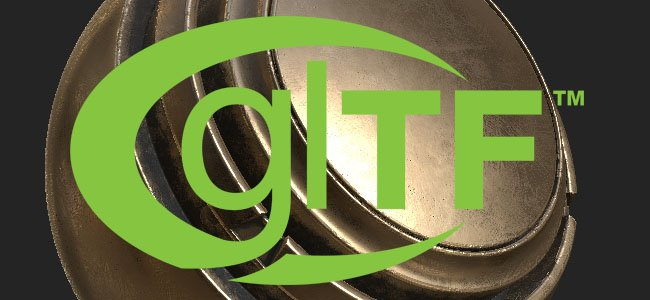
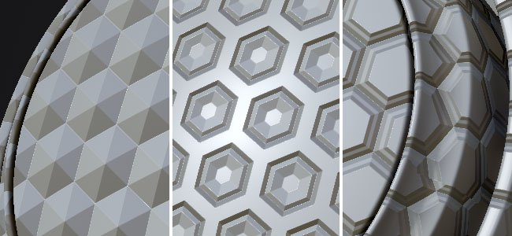

# 版本2017.3

**Substance Painter2017.3**&#x200B;侧重于新的高级导出预设，支持&#x200B;**AdobeProject Felix**&#x200B;和开放格式&#x200B;**glTF**。 此新版本还通过改进界面和添加自动保存插件而重点提供了用户体验。

发行日期：*2017年9月28日*

## 主要功能

### Adobe标准素材导出预设

我们在此版本中包括的一个新导出器支持Adobe标准素材，可与Adobe Dimension（以前是AdobeProject Felix）结合使用。 我们允许您通过一键导出要导入Project Felix的场景网格及其纹理。 要访问它，只需在导出纹理窗口中选择“**Adobe标准素材**”即可。 有关详细信息，请参阅： [http://www.adobe.com/products/dimension.html](https://www.adobe.com/products/dimension.html)

你也可以查看我们关于它的博客帖子： <https://www.allegorithmic.com/blog/new-dimension-substance-ecosystem>

### glTF 2.0导出预设

我们还添加了对&#x200B;**glTF**&#x200B;文件格式的支持，导出了&#x200B;**场景网格**&#x200B;和&#x200B;**PBR纹理**（金属/粗糙度）。 要访问它，只需在导出纹理窗口中选择“**glTF PBR金属粗糙度**”即可。 **glTF**&#x200B;是由Khronos组指导的开源文件格式。 您可以在&#x200B;**Windows 10**&#x200B;中查看您的glTF文件，或者直接使用WebGL查看器，例如&#x200B;[**Babylon**](http://sandbox.babylonjs.com/)。

有关详细信息，请参阅： <https://github.com/KhronosGroup/glTF>

### 自动保存插件

在此版本中，我们还包含了一个新的插件，该插件可以&#x200B;**创建当前打开项目的备份**。 它会在当前打开的项目一侧创建一个备份文件。\
因此，我们还在“文件”菜单中添加了一个“**另存为副本**”条目。 可以通过禁用插件本身来停止&#x200B;**自动保存**，其&#x200B;**设置**&#x200B;可以&#x200B;**通过配置面板**&#x200B;访问。 达到警告时间的延迟时，主工具栏中的按钮下方将会显示一个&#x200B;**进度条**，允许根据需要将其暂停几分钟（如果您希望在备份之前完成某些操作，这会非常有用）。

如果创建了备份但尚未保存项目（又称“未标题”），则备份将存储在&#x200B;**Documents/Allegorithmic/Substance Painter/autosave**&#x200B;文件夹中。 否则，备份将位于项目本身的旁边（除非路径被配置面板覆盖）。

### 改进的渐变滤镜

**渐变滤镜**&#x200B;已完全改版。 与&#x200B;**节点**&#x200B;中可用的&#x200B;**渐变映射** Substance Designer的作用更加相似。 它现在最多支持&#x200B;**10种不同的颜色**，可以指定颜色在&#x200B;**渐变&#x200B;****内的位置**，从而打开许多新门。 这允许创建更多&#x200B;**高级颜色模式**，也可以&#x200B;**重新映射高度图**并创建&#x200B;**新形状**。

主滑块（颜色量）定义用于创建渐变的总颜色数。 下面的按钮定义了颜色混合模式（sRGB或线性）。 如果要在颜色之间进行正确的混合，这一点非常重要。 例如，混合纯红色和纯绿色应该会得到一个漂亮的黄色。 如果禁用该按钮，则不会出现这种情况（它会变为深褐色）。 重映射Height或任何其他灰度通道时，应禁用此按钮以避免执行灰度系数转换。

顶部的按钮允许将滤镜的结果替换为渐变本身，以便在2D视图中显示渐变。

### 界面和行为改进

在此版本中，应用程序不同停靠区的&#x200B;**选项卡**&#x200B;现在位于各自窗口的&#x200B;**顶部，而不是底部**。 这一选择不仅有助于提高界面的可读性，而且与其它应用程序更加一致。 此更改之后将选项卡标题旁边的&#x200B;**小叉号**&#x200B;引入&#x200B;**轻松关闭它**。 也可以&#x200B;**右键单击选项卡**&#x200B;以显示&#x200B;**上下文菜单**（允许关闭或取消停靠窗口）。 取消停靠窗口的快捷方式是只需将选项卡拖放到窗口区域之外。

现在也可以通过从文件资源管理器将项目&#x200B;**拖放到视口**&#x200B;中&#x200B;**打开项目**。 这同样适用于&#x200B;**网格**&#x200B;文件：将网格文件拖放到&#x200B;**空视口**&#x200B;中将打开&#x200B;**新建项目窗口**，但在&#x200B;**已打开的项目**&#x200B;上执行此操作将打开&#x200B;**项目配置对话框**，从而允许快速&#x200B;**更新网格**。

**注意** ：如果拖放操作存在问题，请务必[查看有关该主题的常见问题解答](../../technical-support/technical-issues/miscellaneous-issues/impossible-to-drag-and-drop-files-into-the-shelf.md)。

### 性能改进

此版本的Substance Painter还包含有关我们管理GPU内存(VRam)方式的全新且强大的性能改进。 均匀颜色（如填充层）现在被压缩成更小的纹理，加速了它们在主内存和GPU内存之间的转换，但也减少了它们的内存占用和计算时间。 当打开大型项目并达到GPU内存限制时，这一点应该特别明显。

## 发行说明

### 2017.3.3

（2017年12月1日发布）

**已修复：**

* [Steam]版本检查器弹出窗口在启动时不可见
* [导出]在Photoshop CS6中打开PSD文件时，锁定这些文件的组

### 2017.3.2

（2017年11月20日发布）

**已添加：**

* [UI]改进新版本对话框并添加更改日志
* [UI]在新版本对话框中指示维护是否已过期
* [许可证]更新许可证系统以处理维护日期
* [导出]将Adobe标准素材重命名为Adobe Dimension

**已修复：**

* [Mac]绘画会导致黑色方块和纹理损坏
* [引擎]缓存有时可能会在视区中消失
* [引擎]内存压缩触发器时出现块状伪像
* [烘焙]烘焙特定网格时出现奇怪的错误消息
* [导出]PSD写入错误，Photoshop无法正确识别
* [图层]不应跨多个项目复制/粘贴图层
* [Substance]在某些情况下，常规输入的UserData色彩空间会翻转
* [托架]生成器中的微法线输出反向曲率
* [托架] HSL滤镜也会影响Alpha通道
* [Linux]由于缺少依赖项，在Centos上安装失败
* 在某些情况下，安装程序不会从以前的安装中删除所有资源

### 2017.3.1

（2017年10月26日发布）

**已添加：**

* [导出]允许从项目导出网格
* [Shelf]从选项卡标题中删除“Sub-Shelf”
* 将后期处理设置保存在模板中
* 使TDR消息更易于理解
* 改进“设置”窗口以报告错误

**已修复：**

* 删除多个子货架时崩溃
* 在引擎计算期间从某个级别切换到其他某个级别时崩溃
* [Mac]在引擎计算期间Intel GPU崩溃
* [Mac][视区]启用抖动时性能不佳
* [Mac]在日志文件中将MacOS 10.13识别为“未知版本”
* [贝克]烤笼子已经不起作用了
* [图层] Ctrl + C快捷键（复制操作）不再有效
* [图层]粘贴图层不会使用锚点的引用刷新UI
* [锚点]复制或复制/粘贴具有引用的图层会断开链接
* [导出]在某些情况下，8K导出可能会导致应用程序崩溃或死锁
* [导出]生成的glTF文件格式存在多个问题
* [导入]无法再重新导入具有相同文件名的网格
* [插件]“自动保存”窗口始终显示在所有内容之上
* [UI]当您在TDR对话框中按“Escape”时，出现无限循环
* [UI]重置UI会在盘架窗口上显示第二个标题栏

### 2017.3

（2017年9月28日发布）

**已添加：**

* [导出]允许导出Adobe项目Felix的网格和纹理
* [导出]允许导出为glTF文件格式
* [引擎]使用块压缩优化VRAM中的纹理大小
* [视区]可以在视区中拖放网格或项目
* [UI]改进关于TDR的警告消息
* [UI]应仅在提出请求时显示日志
* [UI]允许清除日志窗口的内容
* [UI]在状态栏中显示警告和错误
* [UI]像在Web浏览器中一样在顶部显示选项卡
* [UI]改进“无法绘画”的上下文和消息
* [UI]在“文件”菜单中添加“另存为副本”操作
* [图层]默认情况下，将默认拼贴设置设为1
* [Shelf]改进了渐变滤镜以支持10种动态颜色
* [托架]在mini-shelf的默认查询中添加空间
* [托架]为托架中的本地资源添加“在资源管理器中打开”操作
* [托架]为Adobe材料标准(Project Felix)添加模板和着色器
* [托架]将材质图层着色器中的最大拼贴增加到128
* [托架]添加了Sobel曲率，用于显示蒙版生成器的微细节
* [插件]添加具有可自定义时间间隔的自动保存插件
* [脚本]添加“另存为副本”函数

**已修复：**

* [UI]布局在首次启动时中断
* [导出]导出时生成的PSD存在格式错误
* [导出] EXR始终导出8位Height图
* [导出]导出损坏的其他映射时崩溃
* [导入]在某些情况下，硬边不会保留在低多边形网格上
* [导入]改进了导入有问题的网格时的错误消息
* [Bakers]启用“按名称匹配”后，ID映射生成失败
* [视区]切线空间未与烘焙器同步
* [效果]向后移动图层不会恢复锚点的引用
* [效果]在两个带锚点的蒙版之间创建链接时出现刷新问题
* [效果]不应列出蒙版上方的蒙版锚点
* [效果]从锚点提取Alpha设置不起作用
* [引擎]蒙版在第一次画笔描边后自行反转
* [引擎]在特定项目上切换纹理集时崩溃
* [托架]删除项目中的预设时崩溃
* [Shelf] Typo in advanced Tri-Planar filter
* [Shelf] MG Mask Builder AO杂色缩放无法正常工作
* [托架] MG蒙版生成器具有反转曲率参数
* [托架]导入的alpha生成的是材料球体预览，而不是平整球体预览
