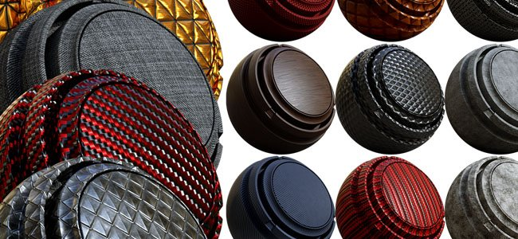

# 版本2017.4

**Substance Painter2017.4**&#x200B;使用&#x200B;**图层实例化**&#x200B;添加了一项新的工作流程功能，允许轻松同步项目内不同纹理集之间的图层。

发行日期：*2017年11月23日*

## 主要功能

### 图层实例化

**图层实例化**&#x200B;是一个新系统，允许在&#x200B;**其他图层和纹理集**&#x200B;之间保持&#x200B;**同步**&#x200B;图层&#x200B;**参数**。 创建图层实例时，原始图层将成为&#x200B;**源**，除非断开链接，否则实例将&#x200B;**保持更新状态**。 实例化图层是&#x200B;**一种很好的方法**，它可以&#x200B;**只需单击几下即可为资源添加纹理**，避免来回更新图层。 要轻松对资源进行纹理化，只需跨其他纹理集&#x200B;**实例化文件夹**，并将智能素材或任何其他图层放入其中，即可立即&#x200B;**随处复制该资源**。

有两种方法可创建实例：

* 复制图层后，选择“**粘贴为实例**”（或使用快捷键CTRL+SHIFT+V）
* 选择一个图层后，选择“**跨纹理集实例化**”（或使用快捷键CTRL+SHIFT+D）

>[!NOTE]
>
> 与图层实例化相关存在一些限制：
> 
> * 任何绘画操作都将仅存在于源图层上，实例化图层不会复制画笔描边。
> * 锚点引用的锚点必须位于实例的同一级别，锚点不能位于实例化文件夹的外部，否则将被破坏。
> * 如果智能素材与实例图层一起保存，则源图层必须位于智能素材文件夹中，否则实例链接将断开。
> * 根据图层栈栈设置，实例化图层可能会创建循环，这是不受支持的，会破坏实例结果。 请删除或移动实例以修复此问题。

有关更多详细信息和示例，请参阅专用页： [图层实例化](../../interface/layer-stack/layer-instancing.md)

### 支持Unreal Engine 4的DCC Live-link

以前的&#x200B;**实时链接Substance Painter**&#x200B;测试版现在已&#x200B;**集成了**。 我们借此机会支持Unreal Engine 4，它现在允许自动在引擎中查看项目结果。

要将Substance与&#x200B;**Unreal Engine 4**（所需版本最低为&#x200B;**4.18**）连接，请在此处下载应用程序插件： <https://www.unrealengine.com/marketplace/substance-plugin>

### 新货架内容

我们添加了&#x200B;**20个新的程序素材**，还添加了&#x200B;**40个新的污渍映射**（其中一些是程序性的）。 新材料可在&#x200B;**货架**&#x200B;的“**材料**”部分找到，例如6种新金属、8种新塑料、一些织物和2种新木表面。 新污渍映射可直接在&#x200B;**托架**&#x200B;的“**污渍**”部分中找到。

非常感谢Clément Feuillet和Nicolas Longchamps允许我们许可他们的内容使用这个新版本。

### 改进了Sketchfab导出

我们更新了Sketchfab导出，并添加了将您的项目发布为草稿甚至更新已上传项目的功能。 这应该会让项目迭代更易于执行。

### 性能改进

我们继续致力于提升业绩。 在此新版本中，我们重新设计了视区中的许多OpenGL渲染，从而大幅提升了速度。 我们还改进了画笔描边的计算方式，并且它们需要的内存纹理计算量应小得多。 总体而言，它可以提供更快的结果和更好的绘画感觉。

## 教程

我们的最新视频详细介绍了这些新增功能：

## 发行说明

### 2017.4.2

（2018年1月24日发布）

**已添加：**

* [导出]获取包含步骤进度的导出的状态
* [导出]允许取消导出
* [导出]将纹理导出到Sketchfab而不损失正常映射质量
* [导出]以glTF二进制格式(glb)导出
* [导出]允许在导出窗口的“配置”选项卡中调整列大小
* [着色器]为着色器 API添加更改日志
* [脚本]导出纹理时添加“修改前”和“修改后”回调功能
* [Iray]升级到SDK 2017.1（支持Volta GPU）

**&#x200B;**&#x200B;已修复：**&#x200B;**

* 在显示主窗口之前退出应用程序时崩溃
* [MAC]使用IRAY加载灰度地图时崩溃
* [MAC]新的High Sierra操作系统无法正确检测VRAM
* [Plugin]从Substance Source下载资源不再有效
* [脚本]不正确的最低增效工具版本检测
* [导出]导出纹理后无法保存导出预设
* [实例化]在TextureSet中实例化且没有其他映射的生成器出现问题
* [视区]分辨率高于4k时，抖动不起作用
* [视口] 2D视图素材显示被噪声覆盖
* [Shelf]缩短了Shelf预设的加载时间
* [引擎]在颜色选区下绘画时，混合不正确

### 2017.4.1

（2017年12月15日发布）

**已添加：**

* [脚本]通过脚本API导出网格
* [导入]禁用不支持的网格文件格式的导入（仅允许obj、fbx、dae、ply）
* [Log]在日志文件中更准确地指出TDR问题

**已修复：**

* 如果在资源搜索完成之前关闭应用程序，则会崩溃
* 使用涂抹/仿制工具打开项目时崩溃
* 在查看器设置中撤消着色器更改后使用重做时发生崩溃
* [引擎] Painter 2017.2和2017.4之间的纹理设置不同
* [视区]从实例中选取ID映射会取样错误的颜色
* [导出]导出无效的正常纹理或遮蔽纹理时崩溃
* [导出]在Photoshop CS6中打开PSD文件时，锁定这些文件的组
* [Plugin] Photoshop增效工具会忽略通道选择并始终导出所有内容
* [图层]在纹理集之间复制/粘贴时，锚点中断
* [图层]如果某些锚点的引用损坏，则无法恢复
* [着色器] pbr涂层二次粗糙度参数被破坏
* [Steam]版本检查器弹出窗口在启动时不可见

**已知问题：**

* [AMD]尝试在网格上绘画时崩溃/冻结。 可通过GPU驱动程序更新进行修复。

### 2017.4

（2017年11月23日发布）

**已添加：**

* [实例化]允许跨图层实例化参数
* [实例]允许在源图层和实例之间跳转
* [实例化]添加“跨纹理集实例化”操作
* [实例]在图层栈栈中指示重新进入实例（循环）
* [实例]删除源时删除实例
* [实例化]不允许锚点引用来自实例化文件夹外部
* [UI]将撤消栈栈移动到其名为“历史记录”的窗口中
* [插件]集成DCC实时链接插件
* [Engine]使用稀疏绘制提高绘制性能
* [导出]将草稿和重新导出选项添加到Sketchfab导出程序
* [架]为字体物质添加“翻转”控件
* [托架]添加20种新的程序材料
* [Shelf]添加40个新的垃圾地图（基于位图和程序）
* [视口]在其他可见纹理集上启用画笔预览冲突
* 更新AMD GPU驱动程序的最低要求

**已修复：**

* 计算分辨率过大的Substance时崩溃
* 使用粒子进行重绘时崩溃
* [视区]使用特定网格时，2D视图中的Specular反射不正确
* [UI]在“历史记录”窗口中显示一些不需要的操作

**已知问题：**

* [图层]如果某些锚点的引用损坏，则无法恢复
* 在查看器设置中撤消着色器更改后使用重做时发生崩溃
