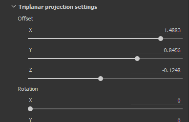
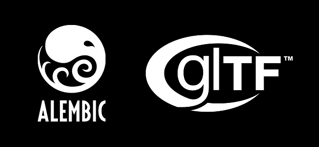
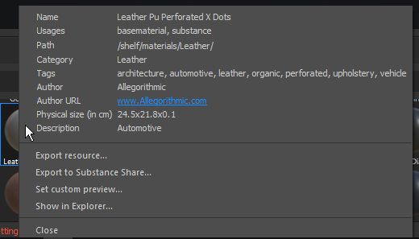

# 版本2018.2

**Substance Painter2018.2**&#x200B;添加了人们期待已久的功能，例如次表面散射绘画，使纹理制作比以往更轻松。

发行日期： *2018年8月2日*

## 主要功能

### 次表面散射

**实时**&#x200B;视口和&#x200B;**Iray渲染器**&#x200B;现在支持&#x200B;**次表面散射**。\
次表面散射是光线穿透物体或表面的一种机制。 一部分光被材料吸收，然后&#x200B;**散射到**&#x200B;内，而不是像金属表面那样被反射。 现实生活中的许多材料都有次表面散射，如皮肤或蜡。

我们的子表面效果实现与其他游戏引擎以及其他离线渲染器的实时实现非常匹配。 因此可以非常方便地编写散布纹理，以便在其他应用程序中使用。

{width="650px"}

以上就是众所周知的数字Emily 2资源的示例。 感谢美国加州大学创意技术研究所和Wikihuman项目的成员，他们让我们能够用Digital Emily 2资源演示我们的渲染。\
（请注意，这种比较是在类似但不完全的光照条件下进行的，这可能会解释视觉差异。）

要在项目中添加次表面散射，请按照以下步骤操作：

1. 转到&#x200B;**显示设置**&#x200B;窗口和&#x200B;**激活** **次表面散射**&#x200B;设置。
1. 在当前纹理集中添加“**散射**”通道
1. 在新通道中使用填充图层或&#x200B;**白色绘画**&#x200B;以&#x200B;**显示**&#x200B;视口中的子表面效果。

在[次表面散射文档](../../features/subsurface-scattering/subsurface-scattering.md)中可以找到更详细的过程。

>[!NOTE]
>
> 为了支持实时视口中的次表面散射，项目中的&#x200B;**着色器**&#x200B;必须&#x200B;**更新**。\
> 有关自定义着色器的信息，请参阅&#x200B;**帮助菜单**&#x200B;中提供的文档，以了解&#x200B;**着色器 API**&#x200B;中的更改内容。

### 操纵器

已改进填充图层控件，以提供操纵器。 现在可以更轻松地精确放置和控制填充投影。

使用&#x200B;**UV 投影**&#x200B;时，操纵器将显示在&#x200B;**2D 视图**&#x200B;中：

* 单击&#x200B;**外部**&#x200B;操纵器将&#x200B;**旋转**&#x200B;它。
* 单击&#x200B;**边框**&#x200B;处的&#x200B;**方形**&#x200B;将&#x200B;**对其进行缩放/调整**&#x200B;大小。
* 单击&#x200B;**内部**&#x200B;操纵器将&#x200B;**转换**&#x200B;它。
* 使用&#x200B;**CTRL**&#x200B;影响&#x200B;**对称**&#x200B;中的多个角。
* 使用&#x200B;**SHIFT**&#x200B;到&#x200B;**约束**&#x200B;的变换（平移、旋转或缩放）。\
  

使用&#x200B;**三投影**&#x200B;时，**3D 视图**&#x200B;中将出现操纵器：

* 虚线立方体表示全局投影
* 使用&#x200B;**W**、**E**&#x200B;或&#x200B;**R**&#x200B;键盘快捷键在&#x200B;**平移**、**旋转**&#x200B;和&#x200B;**缩放**&#x200B;模式之间切换。
* 使用&#x200B;**T**&#x200B;键盘快捷键在操纵器的“本地”和“全局”方向之间切换。
* 使用&#x200B;**SHIFT**&#x200B;到&#x200B;**约束**&#x200B;转换。
* 三平面立方体投影也可以在高级填充图层属性中进行修改：\
  \
  

根据当前的投影模式，视口顶部的上下文工具栏也会随之调整，并提供更多工具和控件：

有关详细信息，请参阅[填充图层文档](../../painting/fill-projections/fill-projections.md)。

### 对模板和投影工具的非方形和非耕作支持

改进了模板参数和投影工具，以支持非方形分辨率和非耕作行为。\
现在，默认参数默认设置为non-tilling。 此参数可在刀具属性中更改：

耕作模式可以设置为以下类型：

* **无拼贴**（默认）
* **水平拼贴**
* **垂直拼贴**
* **H和V拼贴**（旧行为）

此新参数可以保存在工具或笔刷预设中，从而便于与自定义内容共享。

>[!NOTE]
>
> * 投影比率也将与输出非方形分辨率的Substance文件相适应。 将从输出节点直接计算该比率。
> * 使用“投影”工具，如果多个声道具有不同的比例，找到的第一个比例将应用于所有其他声道。

### 相机导入和管理

现在，可以在网格导入的同时&#x200B;**在Substance Painter内导入自定义相机**。\
可以在&#x200B;**3D视口**&#x200B;中选择要查看&#x200B;**的相机，并使用**&#x200B;在Iray中渲染&#x200B;**。**

有关更多详细信息，请参阅[相机管理文档](../../interface/viewport/camera-management.md)。

要&#x200B;**将相机**&#x200B;导入项目：

1. 在同一文件中导出带有相机的项目网格（使用支持的格式，如FBX、Alembic或glTF）
1. 在[新建项目窗口](../../getting-started/project-creation.md)（或[项目配置](../../interface/project-configuration.md)）中选择“导入相机”设置。\
   
1. 使用视口中的下拉菜单或使用[显示设置](../../interface/display-settings/camera-settings.md)中的设置切换到所需的相机。\
   

“显示设置”窗口中的“相机设置”已扩展为控制相机的属性。\
可以在相机之间&#x200B;**切换**，查看其&#x200B;**比率**&#x200B;和&#x200B;**锁定**&#x200B;其属性，以避免修改它。 可以使用“恢复”按钮将相机恢复为初始值。

帧（及其入口）也会考虑在内，从而可以通过非常特定的视角进行查看和绘画。 帧和关口显示在3D视口上方，其不透明度可在[显示设置](../../interface/display-settings/camera-settings.md)窗口的&#x200B;**视口设置**&#x200B;中控制：

### 图层栈栈行为改进

* **将材料和智能材质拖放到Id 图上：**\
  改进了工具架内容向视口的拖放操作。 通过在拖放素材时按&#x200B;**CTRL**，现在可以选择将用作蒙版的ID颜色。\
  具有颜色选择效果的黑色蒙版将添加到在图层堆叠中创建的新图层中。 如果将同一材料拖放到其他ID颜色上，将更新现有图层并合并ID颜色。\
  
* **图层栈栈拖放滚动：**\
  现在，在图层堆叠周围拖动图层时会显示一个小窗口。\
  将资源或图层拖到图层堆叠窗口的边框附近时，它将自动开始滚动内容。\
  

### glTF和Alembic网格导入

现在支持使用新文件格式导入网格和创建新项目：

* **glTF** ：此格式在导出纹理时可用，现在可以在导入过程中使用。 如果glTF文件包含纹理，则它们将被导入并放置在图层堆叠内（对于金属/粗糙度工作流程）。
* **Alembic** ：此格式在VFX/动画行业中广泛用于传输网格。

>[!NOTE]
>
> Substance Painter无法控制此时应导入的动画帧。\
> 这意味着，导出Alembic文件时，必须已设置要在资源上绘画的引用帧。

### Substance集成改进

Substance Painter内的Substance集成已改进，产生了人们期待已久的请求：

* <b>在以下情况下可见： </b>\
  “Visible if”是Substance文件格式的一个很棒的功能，可根据条件隐藏参数。\
  此功能提供了更清晰的参数和上下文设置列表，从整体上使各种材料和滤镜更易于使用。\
  有关详细信息，请参阅[Substance Designer文档](https://experienceleague.adobe.com/en/docs/substance-3d-designer/home)。\
  
* **Substance预设** Substance预设是提供材料的高级微调和变体的简单方法。 [Substance Source](https://source.allegorithmic.com)上的许多材料都有预设，因此请尝试！\
  如果Substance文件包含一个或多个预设，则参数列表中的新下拉列表将可用。 选择要应用哪个预设来更新参数。\
  
* **Substance的属性**\
  Substance属性现在显示在界面中，从而更容易检索有关特定文件的信息。\
  可以在两个不同的位置查看属性：属性窗口中参数上方或右键单击工具架中的资源。\
   

### 新示例项目“Jade Toad”

名为“**JadeToad**”的新示例项目现在包含在Substance Painter中。 此示例项目默认启用&#x200B;**次表面散射**&#x200B;效果。\
若要查找项目，请使用&#x200B;**文件** > **打开示例……**&#x200B;菜单项。

## 发行说明

### 2018.2.3

（2018年9月25日发布）

**&#x200B;**&#x200B;已修复：**&#x200B;**

* [2D视图] 2D视图在创建新项目时被一些网格破坏
* [崩溃]从UV 投影切换到三平面投影会导致崩溃
* [RayCollider]由于“RayCollider”导致多次崩溃
* [工具]切换图层会丢失修改的画笔属性
* 切换到橡皮擦时，画笔设置重置

**已知问题：**

* AMD VEGA GPU上的计算冻结
* Windows操作系统上快捷键出现的Huion平板电脑问题

### 2018.2.2

（2018年9月11日发布）

**已添加：**

* 摘要：包含内容更新的修补程序、新的脚本功能并能够禁用自动更新
* [内容]&#x200B;[架]添加皮肤架预设
* [内容]&#x200B;[搁架] 19种皮肤法线转化为次表面散射材料
* [脚本]从打开的项目创建项目模板
* [脚本]获取/设置已打开项目的导出设置
* [更新]可以从设置和环境变量禁用自动更新弹出窗口
* [更新]直到维护过期弹出窗口的下一个版本才显示

**已修复：**

* [相机]从正交切换到透视可导致缩放错误
* [显示]某些地图以线性显示而不是sRGB
* [视区]网格焦点行为不正确
* [2D视图]项目中的相机损坏时UV外壳消失
* [SSS]&#x200B;[工具提示]日志中出现子表面散布工具提示
* 某些项目无法在2018.2中打开，并且错误消息无法保存空的Substance包
* [蒙版]在某些情况下，使用蒙版时，绘画工具颜色可能会卡住
* [材料]不在特定情况下显示地图
* [Proj]&#x200B;[Tools]操纵器在生成器中处于活动状态
* [Substance]缺少参数的Substance组
* [脚本]文档中的软件名称不正确
* [UDIM]日志中没有关于多个UV磁贴上的UV外壳的信息

**已知问题：**

* AMD VEGA GPU上的计算冻结
* Windows操作系统上快捷键出现的Huion平板电脑问题

### 2018.2.1

（2018年8月3日发布）

**已修复：**

* 升级项目时缺少着色器参数

**已知问题：**

* AMD VEGA GPU上的计算冻结
* Windows操作系统上快捷键出现的Huion平板电脑问题

### 2018.2

（2018年8月2日发布）

**已添加：**

* 摘要：夏季版、次表面散射支持、投影和填充改进、相机导入和选择、Alembic/glTF支持、Id 图上的拖放、改进的Substance格式支持和新内容
* [SSS]&#x200B;[视口]&#x200B;[Iray]通用次表面散射
* [SSS]同步MDL和次表面散射参数
* [SSS]添加了一个名为“散布”的新灰度通道
* [SSS]&#x200B;[着色器设置]次表面散射（皮肤或半透明）的散布类型参数
* [SSS]&#x200B;[着色器设置]次表面散射的散布比例参数
* [SSS]&#x200B;[着色器设置]次表面散射的散射颜色参数
* [SSS]&#x200B;[显示设置]次表面散射的散射样本计数
* [Shader]&#x200B;[Iray]集成亚表面散射MDL for Iray
* [着色器]通过资源更新程序更新着色器
* [Shader]更新更改日志API和文档
* [刀具属性]&#x200B;[项目]三平面投影的新参数
* 直接使用操纵器控制3D视图中的[视区]&#x200B;[项目]填充层属性（三面投影）
* [Shortcuts]&#x200B;[Proj]用于三平面投影机械手的新快捷键Q、W、E、R、T
* 直接使用操纵器在2D视图中控制[视区]&#x200B;[项目]填充图层属性(UV 投影)
* UV 投影操纵器的[快捷键]&#x200B;[项目]新快捷键Q
* [上下文工具栏]&#x200B;[项目]控制三平面投影机械手
* [上下文工具栏]&#x200B;[项目控制]UV 投影操纵器
* [工具属性]禁用投影和模板工具的纹理拼贴
* [模板]投影工具/模板使用非方形图像
* [模板]允许在“属性”窗口中控制拼贴模式
* [模板]缩放时不在非拼贴模板上居中
* [相机]从Maya、Max、Blender、Modo、DAE导入相机
* [摄像机]&#x200B;[视区]选择和控制视区中导入的摄像机
* [相机]&#x200B;[Iray]在Iray中选择和控制导入的相机
* [相机]&#x200B;[UI]&#x200B;[新建项目]&#x200B;[项目配置]“导入相机”默认处于选中状态
* [相机]&#x200B;[快捷键]添加快捷键“&lt;”和“>”以在相机之间切换
* [相机]&#x200B;[视区]在视区中添加框架
* [相机]&#x200B;[视区设置]控制帧不透明度
* [相机]&#x200B;[相机设置]最大焦距为500毫米
* [相机]&#x200B;[相机设置]曝光率
* [相机]&#x200B;[相机设置]添加锁定选项
* [相机]&#x200B;[相机设置]添加恢复选项
* [相机]&#x200B;[相机设置]添加焦距属性
* [glTF]导入glTF文件
* [glTF]导入环境遮蔽映射
* [Alembic]导入带有静态几何的Alembic 1帧
* [托架]使用带有修饰符的ID映射将材质直接拖放到网格上(CTRL/Command)
* [图层栈栈]通过拖放材质到带有ID地图的网格上来自动创建ID蒙版
* [图层栈栈]通过拖放操作在图层栈栈上自动滚动图层
* [UI]&#x200B;[工具属性]显示Substance的预设
* [UI]&#x200B;[帮助菜单]帮助菜单的改进
* [UI]&#x200B;[新建项目]&#x200B;[项目配置]重新整理窗口
* [UI]&#x200B;[新建项目]&#x200B;[项目配置]将“网格”术语替换为“文件”
* [UI]&#x200B;[Substance]在用户界面中显示Substance属性
* [快捷键]在2D和3D视图之间切换“F4”
* [快捷键]用于切换模板“N”和快速蒙版“U”的新快捷键
* [Substance集成]将Substance参数中的“visible if”语句考虑在内
* [视区]移动摄像机后不强制计算阴影
* [内容]使用导入的相机更新MeetMat
* [内容]添加启用了子表面散射的样本 — JadeToad
* [内容]添加启用了子表面散布的新PBR项目模板
* [内容]更新了导出预设，以添加新的散布通道
* [内容]&#x200B;[搁架]添加了以下以下表面的次表面散射支持：pbr-metal-rough、pbr-metal-rough-alpha-test、pbr-coated、pbr-spec-gloss
* [内容]&#x200B;[托架]向5种智能素材（大理石和皮肤）添加了散布通道
* [内容]&#x200B;[托架] 1个新玉材质
* [内容]&#x200B;[货架] 1种新蜡材料

**已修复：**

* [CMD]使用带有不同版本的相同命令行获得不同结果
* [TDR]如果设置了TdrLevel，则日志中没有任何错误
* [Baker]Ambient occlusion映射被翻转
* [Id 图]在0-1范围之外选取时崩溃
* [Iray]切换纹理集并返回绘画模式时崩溃
* [视口]在视口之间同步拖放区域以进行拖放
* [引擎]拼贴填充图层或绘制小画笔时叠印伪像
* [许可证]许可证服务错误软件版本检查
* [许可]重新设计我们处理身份验证的方式
* [API]即使使用模板进行创建，也调用`onNewProjectCreated`脚本API事件
* [着色器]未编译着色器文件时，未从缓存中加载已编译的着色器
* [工具架]从工具架中导出HDR文件时，将输出一个包含固定值的文件
* [导出] EXR导出功能钳制介于0到1之间的RGB颜色值
* [Content]噪声“3D Perlin噪声分形”像素化

**已知问题：**

* AMD VEGA GPU上的计算冻结
* Windows操作系统上快捷键出现的Huion平板电脑问题
