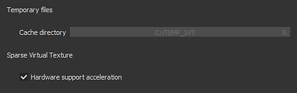
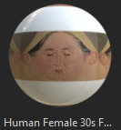

# 版本2018.3

**Substance Painter2018.3**&#x200B;现已推出，它带来了许多新的工作流程和渲染功能！

发行日期： *2018年11月20日*

## 主要功能

### 2D视图导出

现在可以&#x200B;**导出2D视图**&#x200B;将&#x200B;**渲染**&#x200B;为纹理。 此功能已被许多人请求，我们最终使其可用！ 导出过程将采用&#x200B;**2D视图**&#x200B;的当前状态，以使用常规导出设置（填充、文件格式、位深度）渲染纹理。 这意味着如果视图模式设置为&#x200B;**独奏**&#x200B;而不是&#x200B;**素材**&#x200B;模式，则2D视图将按原样导出。

前往&#x200B;**导出窗口**&#x200B;并选择名为“**2D视图**”的新配置：\

名为“**2D视图**”的新&#x200B;**转换后的映射**&#x200B;也可在导出窗口的&#x200B;**配置**&#x200B;选项卡中找到，以备您创建自己的&#x200B;**导出预设**。

### 改进的烘焙光线滤镜

**烘焙光照环境**&#x200B;筛选器已得到大幅改进，现在可正确支持&#x200B;**HDR环境映射**。\
您现在可以复制视区的光照（如2D视图中所示），并将它放下到“基色”通道中。 新滤镜提供了进一步的控制，如&#x200B;**旋转****环境**&#x200B;映射&#x200B;**垂直**&#x200B;和更改&#x200B;**曝光**。

### 实时各向异性Specular反射

在此新版本中，我们引入了一种名为“**pbr-metal-rough-各向异性-angle**”的新着色器。 此着色器支持两个名为“**各向异性角度**”和“**各向异性级别**”的通道，可用于创建各向异性Specular反射。 此着色器还将按原样转换为Iray，无需任何转换。

通过单击“着色器”按钮并打开mini-shelf ，您可以通过[着色器窗口](../../interface/shader-settings/shader-settings.md)访问此新着色器：

已更新默认示例项目“**Preview Sphere**”，以利用该新着色器并展示如何设置不同的通道。

>[!NOTE]
>
> 如果在&#x200B;**各向异性角度**&#x200B;通道中使用渐变时，外观&#x200B;**线条伪像**&#x200B;看起来很奇怪，请尝试将滤镜模式更改为“**最接近**”（如果是填充图层），因为这可能会改善着色器的取样并消除问题。

### 更新了清晰皮毛着色器

已改进&#x200B;**透明涂层**&#x200B;着色器（**pbr涂层**），可提供更多控件和渲染可能性。 我们还借此机会使其与&#x200B;**Iray**&#x200B;兼容，并带有专用的&#x200B;**MDL**。

以下是更改列表：

* **控制**&#x200B;辅助&#x200B;**粗糙度**&#x200B;图层（通过&#x200B;**用户0**&#x200B;通道）。
* **蒙版**&#x200B;退出辅助图层（通过&#x200B;**用户1**&#x200B;通道）。
* 选择要应用于表面图层的行为： **保持法向细节**（原始）或&#x200B;**平滑表面**（新，忽略网格法向映射）

为了方便起见，我们还添加了一个新的项目模板，此模板已准备好对此新着色器添加纹理，名为： **PBR — 金属粗糙度涂层**。

### 新视区消除锯齿

我们对Substance Painter的消除锯齿后处理进行了重新处理，并更改为名为“**随机采样抗锯齿**”(**TAA**)的新方法。\
这种新技术在每个情况下都以最低的成本提供了更好的效果。 **TAA**&#x200B;的工作原理是累积多个帧上的信息，从而允许在不丢失细节的情况下生成非常平滑的边缘。

由于它不再是后期效果，因此设置已在&#x200B;**显示设置**&#x200B;窗口内移动了一点，现在位于&#x200B;**后期效果**&#x200B;部分的&#x200B;**下方**。

这种新的消除锯齿功能与透明度相结合，也提供了新的可能性。 如果项目正在使用&#x200B;**Alpha — 测试**&#x200B;着色器，请尝试启用“**Alpha 仿色**”设置：

新的&#x200B;**TAA**&#x200B;还将很好地滤除&#x200B;**Specular反射**&#x200B;和&#x200B;**次表面散射**&#x200B;样本中可见的蓝色噪声图案。

### 稀疏虚拟纹理化(SVT)

此新版本中的一项重大更改是引入了&#x200B;**稀疏虚拟纹理**&#x200B;或&#x200B;**SVT**。

这一新的系统改变了Substance Painter的一些基础知识和应用方式。 Substance Painter现在使用SVT为视口保持特定的内存空间，从而允许&#x200B;**流入和流出纹理**。 主要好处是能够更轻松地加载更大的项目，并减少GPU的压力，以&#x200B;**提高性能**。 这意味着，如果内容变得太大，将会卸载磁盘上的某些纹理，并在必要时稍后将它们找回)。 这是应用程序关闭时删除的&#x200B;**易失性缓存**。

该系统的另一个好处是在&#x200B;**视口**&#x200B;中引入了&#x200B;**mipmaps**，这将提高纹理质量并减少莫尔效果，在织物图案中尤其明显。

我们公开了有关这个新系统的几个控件，可以在主偏好设置（**编辑>设置**）中进行编辑：

* **缓存目录** ：此设置控制Substance Painter将其临时文件（包括SVT缓存）写入的位置。
* **硬件支持加速** ：如果启用，Substance Painter将通过GPU使用稀疏纹理的本机支持（如果禁用，它将回退到软件实现）

有关SVT的详细信息，请查看我们的文档页面： [稀疏虚拟纹理](../../features/sparse-virtual-textures.md)

>[!NOTE]
>
> 建议在&#x200B;**固态驱动器(SSD)**&#x200B;上设置&#x200B;**缓存目录**&#x200B;以确保在处理Substance Painter时具有最佳性能。
> 
> 可通过环境变量[环境变量](../../pipeline-and-integration/configuration/environment-variables.md)覆盖这些设置。

### 全新和改进的“对称”工具

对称工具已重新设计，现在允许偏移原点。 当项目部分对称或偏离中心时，现在可以调整计划。 偏移将按轴保存在项目内部。

我们还借此机会对该功能给予了一些爱，现在有了新的视觉反馈：

* **交叉线**&#x200B;现在由网格上的&#x200B;**默认**&#x200B;绘制，以显示对称平面的位置。
* 现在，在移动&#x200B;**光标**&#x200B;时会显示一个&#x200B;**镜像点**，以显示将应用镜像画笔描边的位置。

所有新视觉效果都可以通过上下文工具栏中的新“对称”菜单进行微调：

* **镜像X、镜像Y、镜像Z** ：定义用于对称的方向
* **偏移** ：控制每个轴的偏移值。 十字箭头图标允许将所有偏移重置回0。
* **对称平面** ：显示平面允许绘制切割网格的平面。 “显示交集”在网格上绘制一条线，其中平面切割网格。
* **对称光标** :Show光标将在应用对称的位置绘制辅助画笔光标。 “绘画时隐藏”仅在未绘画时显示该光标。
* **操纵器** ：显示操纵器将在视窗中显示操纵器以偏移对称平面。 **操纵器大小**&#x200B;控制控制器在视区中的大小。

与三平面和UV操纵器相同的&#x200B;**快捷键**&#x200B;可用于隐藏/显示对称操纵器：

* **Q** ：显示/隐藏操纵器
* **偏移** ：对齐平移（离散偏移）
* **+ / -** ：更改操纵器大小

### 改进的三平面机械手

在控制三平面机械臂时，除了控制其转动的3个原轴外，还增加了新的转动球体。 例如，在投影噪声图案时，球体使得快速尝试不同角度变得更加容易。

### 导出8位抖色纹理

现在以8位模式将普通和Height映射纹理导出为文件Substance Painter时，将自动应用&#x200B;**抖动**&#x200B;以减少&#x200B;**条纹** **问题**。

>[!NOTE]
>
> 如果导出预设使用正常映射但Alpha中有其他内容（如RGB=正常，A =粗糙度），则只有正常映射会被抖动。

### 图层栈栈行为改进

对图层栈栈和图层管理进行了一些工作流程改进：

* 通过&#x200B;**右键单击**&#x200B;菜单为图层栈栈内的&#x200B;**图层**&#x200B;和&#x200B;**文件夹**&#x200B;分配&#x200B;**颜色**&#x200B;以组织图层。\
  Substance Painter图层颜色的行为与其他软件包中的行为略有不同，但是：
  * 文件夹中的图层将继承文件夹的颜色（但将显示为灰色）。
  * 如果移动图层时没有在含有颜色的文件夹中分配颜色，则将继承文件夹颜色。
  * 如果图层具有专用颜色，它不会被文件夹覆盖。利用这种原始行为，无需手动指定太多颜色，即可更轻松地为图层栈叠着色和整理。

* 通过&#x200B;**单击并滑动**&#x200B;鼠标，快速&#x200B;**隐藏和取消隐藏**&#x200B;多个&#x200B;**图层**。\
  我们还借此机会对隐藏文件夹中取消隐藏图层的行为进行了一些改进，现在也可以取消隐藏文件夹。

* 使用&#x200B;**箭头**&#x200B;键盘&#x200B;**快捷键**&#x200B;快速&#x200B;**在混合模式**&#x200B;之间切换。\
  在&#x200B;**关闭**&#x200B;混合弹出菜单之后，**焦点**&#x200B;将&#x200B;**保留在图层上**，并且可以使用相同的上一个快捷键继续更改该图层。

### 过滤器和生成器的新Substance输入

已显示自定义过滤器和生成器的新Substance输入。 这些新的纹理输入允许创建更高级的效果，这要归功于新的网格相关信息。

可取得之新输入数据为：

* 网格位置
* 网格世界空间法线
* 网格世界空间切线
* 网格世界空间双色调
* 网格纹理大小
* 网格UV蒙版

有关更多详细信息，请参阅新文档： [基于网格的输入](../../content/creating-custom-effects/mesh-based-input.md)

例如，我们现在提供了一个名为“**UV边框距离**”的新&#x200B;**蒙版生成器**，它根据当前纹理集的UV 岛边框创建黑白蒙版。

>[!NOTE]
>
> 这些输入直接从基于项目Mesh的Substance Painter引擎提供，并且不使用[Bakers](../../baking/baking.md)。

### 新增和更新的内容

在此新版本中，我们加入了新内容：

* 要与新的&#x200B;**各向异性**&#x200B;着色器一起使用的新过程&#x200B;**渐变**&#x200B;图案：

  * 径向各向异性
  * 渐变圆形
  * 渐变磁盘重叠
  * 渐变磁盘已偏移
  * 渐变薄片
  * 渐变替代
  * 渐变检查器
  * 渐变检查器双
  * 渐变编织
  * 渐变编织已旋转
  * 渐变编织角度
  * 渐变编织角度已旋转\
    
* 新建&#x200B;**环境**&#x200B;映射：

  * Studio汽车中性色\
    
* 新建&#x200B;**项目** **模板** ：

  * PBR — 金属粗糙度各向异性角度
  * PBR — 金属色粗糙涂层
* 新建&#x200B;**材质** ：

  * 人类女性30多岁脸部06（可通过货架中的皮肤预设快速找到）\
    此新皮肤材料由&#x200B;**Texturing.XYZ**&#x200B;提供，为绘制逼真的皮肤提供出色的表面细节。\
    

我们还更新了一些现有内容以对其进行优化：

* 更新程序筛选器“**烘焙光照环境**”：请参阅上文。
* 更新的滤镜“**MatFx Shutline**” ：现在允许隐藏素材效果并仅保留Height/正常结果。
* 更新了&#x200B;**示例项目** ：预览球体现在可用于对称，并为自定义渲染采用新的相机角度。 其默认着色器现在为“各向异性角度”。

## 发行说明

### 2018.3.3

（2019年3月7日发布）

**已添加：**

* [内容]集成新项目模板：“PBR — 金属粗糙度Alpha — 混合”
* 更改了Linux动态库搜索顺序，以在系统上安装之前确定安装目录中的库的优先顺序

**已修复：**

* 网格有时从3D视口中消失（按F可重置摄像机）
* [glTF]使用新的Sketchfab许可证类型更新Substance PainterSketchfab上传程序
* [Import][glTF]错误处理glTF文件中定义的输入纹理调制
* [导入][glTF]在某些情况下，使用glTF导入时地平面显示不正确
* [导出][美元]不透明度在Arkit中不起作用
* [导出][美元]在某些情况下，美元z导出会崩溃
* [Export][USD]不保存即导出为美元会导致崩溃
* [Export][USD]纹理的拼贴模式不正确，网格的分割模式不正确，着色器的输出类型不正确
* [导出][USD]仅稀疏导出具有所有几何的部分纹理集
* [实例]尝试删除损坏的实例图层时崩溃
* [回归][导出]某些映射未以所选位深度导出
* [Linux]库libtbb.so.2的问题

**已知问题：**

* 某些情况下，AMD VEGA GPU上的计算冻结
* Windows操作系统上快捷键出现的Huion平板电脑问题

### 2018.3.2

（2019年1月24日发布）

**已添加：**

* 摘要：包含新增功能的修补程序
* [导出]允许导出到USDZ
* [视口]允许在“显示设置”中控制纹理质量
* [视口]在“显示设置”中添加了mip偏差设置
* [视口]在“显示设置”中添加了各向异性过滤
* [增效工具]更新官方增效工具以使用Substance Painter2018的样式
* [许可证]默认情况下，将许可证安装在用户文件夹中

**已修复：**

* 崩溃与解压缩关联
* 在独奏素材上添加TAA
* 带阴影的杂色、带抖动的TAA和Alpha测试着色器
* 删除所有传统PBR着色器的Specular抖动
* 在某些情况下，着色器设置会崩溃
* OpenGL和Iray渲染之间的散射激活不同步
* 涂抹和仿制工具不再适用于特定网格
* 某些纹理集无法显示在Iray渲染中
* 关闭项目后未保存重命名的纹理集
* 在ID地图上拖放材质时出现线框伪像
* [脚本]保存项目时未强制创建文件路径
* [脚本]回调“onProjectAboutToSave()”不再有效
* 论坛链接在报告错误窗口中损坏

**已知问题：**

* 某些情况下，AMD VEGA GPU上的计算冻结
* Windows操作系统上快捷键出现的Huion平板电脑问题

### 2018.3.1

（2018年12月6日发布）

**已添加：**

* 摘要：修补程序
* [对称][视口] 2D视图中的对称绘画已恢复，现在具有固定的仿制画笔预览

**已修复：**

* [导出] 2D视图导出在某些情况下输出黑色纹理
* [Iray]实例化素材图层后，Iray中的正常信息变得不正确
* 非方形纹理集在某些情况下可能会导致崩溃
* [还原]在少数情况下，多个Ctrl+Z可能会随机导致崩溃
* [QML]在某些情况下（绑定循环），AlgScrollView可能会在日志中创建警告

**已知问题：**

* 某些情况下，AMD VEGA GPU上的计算冻结
* Windows操作系统上快捷键出现的Huion平板电脑问题
* 当同时处于活动状态时，消除锯齿和阴影可能会产生意外的结果

### 2018.3.0

（2018年11月20日发布）

<b><b>已添加：</b></b>

* 摘要：视口升级、正确的2D视图导出、新的UI帮助程序、增强的对称工具、新内容和性能的大幅提升
* [消除锯齿][视口] 3D视口的新随机采样抗锯齿过滤（通过“显示设置”）
* [导出]将2D视区的内容导出为单个纹理
* [导出][抖动]导出时显示抖动
* [图层栈栈]图层和文件夹上的颜色
* [图层栈栈]快速激活和停用多个图层和效果
* [图层栈栈]使用上下键和鼠标滚动更轻松地导航混合模式
* [Proj][UI]三面体的所有三轴上附加旋转机械手
* [Proj][Shorcuts] — 和+可更改UV 投影操纵器大小
* [着色器]在PBR涂层着色器中控制带通道的涂层参数
* [Substance]为滤镜和生成器显示新的基于网格的纹理输入
* [Symmetry][Viewport][UI]用机械臂控制对称偏移
* [Symmetry][上下文工具栏][UI]带有选项的新对称面板
* [对称]新的对称线相交模式
* [Symmetry]新的symmetry仿制光标
* [对称][快捷键] Q可隐藏，-，+可更改大小，移位可对齐
* [日志]改善无法导出纹理时的错误消息
* [脚本]允许在“显示设置”中更改或更新资源
* [脚本]允许在纹理集中创建或移除通道
* [Content][Shaders]通过专用着色器(pbr-metal-rough-各向异性-angle)增加对各向异性的支持
* [内容]使用各向异性和修改角度更新预览球体
* [内容]更新了matFx快门线
* [内容]新增纹理功能。XYZ无缝人脸扫描
* [内容]新的各向异性程序
* [Content]新过滤器：烘焙光照环境
* [内容]新环境图：工作室汽车中性化
* [内容]新项目模板：PBR — 金属粗糙度各向异性角度（带各向异性通道）
* [内容]新项目模板：PBR — 金属粗糙涂层
* [SVT][引擎]稀疏虚拟纹理(SVT)
* [SVT][Preferences][UI] SVT硬件支持加速选项
* [SVT][日志]稀疏虚拟纹理功能的其他信息（如大小磁盘）
* [SVT][UI]如果磁盘上的缓存大小太小，则在启动时显示消息窗口
* [SVT][Preferences][UI]Substance Painter全局缓存位置
* [SVT]用于指定Substance Painter缓存路径的新环境变量
* [SVT]用于激活SVT硬件支持加速的新环境变量
* [SVT]通过硬件检测稀疏支持
* [SVT][硬件稀疏]提升Nvidia GPU的最低驱动程序版本
* [SVT][Shader][Viewport][UI]如果在项目打开时存在伪像，则向用户发出警告

<b><b>已修复：</b>\
</b>

* [拾色器]尝试选取颜色时出现绘画光标
* 按特定顺序选择或取消选择图层时崩溃可能会导致崩溃
* 将带有蒙版的图层作为实例粘贴时崩溃
* [User Channel][Regression]重命名用户通道时崩溃
* [User Channel]灰显画笔预览
* [Alembic]导入后，只有来自多个材质的一个纹理集
* [引擎]导出的纹理与画笔图章的视口不同
* [引擎]使用色阶效果进行反转不会完全影响纹理
* 拾色器正在应用画笔描边
* 将分辨率切换到128x128像素会导致崩溃
* 重新生成图层或为图层实例化时，网格图链接未正确更新
* [Substance] UserData ColorSpace不适用于作为输入请求的烘焙网格标准
* 使用多个着色器实例时MDL关联不匹配
* [对称][填充图层]对称平面及其在填充图层中活动的操纵器
* [视口]单击后并非始终更新平移透视点
* [UI]修复了HDPI监视器图标并删除了占位符

<b><b>已知问题：</b>\
</b>

* AMD VEGA GPU上的计算冻结
* Windows操作系统上快捷键出现的Huion平板电脑问题
* 当同时处于活动状态时，消除锯齿和阴影可能会产生意外的结果

<b>  
</b>
