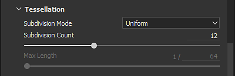
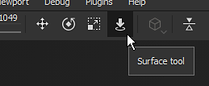
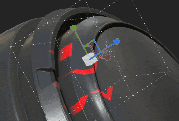
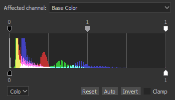

# 版本2019.1

**Substance Painter2019.1**&#x200B;扩展了其现有功能，并引入了新的艺术工具。 此版本重点提供了大量新内容。

发行日期：*2019年4月23日*

## 主要功能

### 动态笔触

在此版本中，画笔引擎现在支持我们所说的动态笔触。 这些类型的描边可以随时生成新的Substance版本，从而创建变化和新效果。 现在可以在资源上为每个新画笔描边绘制新的Substance素材或Alpha。

在绘画工具（绘画、橡皮擦、涂抹或克隆）中加载与动态描边兼容的资源时，将显示新的参数组：

动态笔触支持以下属性（如果显示在Substance图形中）：

* **图章索引** ：描边内的图章ID/编号。
* **随机植入** ：可以针对每个图章或每个描边进行更改。
* **时间** ：画笔描边的已用绘画时间，绘画速度快或慢会产生不同的结果。

图章索引带有其他两个参数：

* **图章开始** ：*从开始*（始终从0开始索引）或&#x200B;*从随机索引*（选择介于0和由&#x200B;**图章周期计数**&#x200B;定义的最大值之间的随机位置）。
* **图章周期计数** ：此参数定义将生成的Substance变化总量。 为了优化性能，此参数是一个极限。 Substance Painter使用它来回收已生成的内容，而不是创建新的内容。

您只需浏览货架并查看新图标旁边的新图标，即可找到与此新功能兼容的资源：

与该功能兼容的资源还会自动获得一个名为“**dynamicstroke**”的新标记，以便可以轻松按层架中的关键字进行筛选。

我们还添加了许多新的&#x200B;**工具预设**，供您使用：

{width="450px"}

>[!NOTE]
>
> 要了解有关此功能（及其性能影响）的更多信息，请查看[专用文档](../../painting/dynamic-strokes/dynamic-strokes.md)。

### 位移和镶嵌

Substance Painter现在在其实时视口和Iray中均支持&#x200B;**位移**&#x200B;和&#x200B;**网格镶嵌**。 它们都可以在着色器参数下方的&#x200B;**着色器设置**&#x200B;窗口中控制。

* **源通道** ：网格变形所基于的通道。 默认值为Height，但也可以设置为位移。
* **缩放** ：控制应用于项目中网格的变形量。

* **细分模式** ：统一或边长。 确定如何计算细分量。
* **细分计数** ：（模式一致）从1到32。 较高的值可生成更多多边形，从而提供更多细节，但可能会引发性能问题。
* **最大长度** ： （模式边缘长度） 1 /值。 将每个多边形边缘分割，直到每段都等于或小于该数值，即1/1为场景的大小。

加载“**拼贴素材**”示例项目（通过&#x200B;**文件>加载示例**）以快速试用此新功能：

{width="450px"}{width="450px"}

>[!NOTE]
>
> 书架中添加了一个名为“**Height到法线**”的新筛选器，可用于获取最终法线图（在Substance Painter的本机转换不够强的情况下）。

### 比较蒙版效果

有时，创建和混合素材会有些困难，这就是为什么我们创建了名为“**比较蒙版**”的新效果。 此效果允许快速轻松地比较两个通道并生成蒙版。

比较蒙版效果具有以下属性：

* **通道** ：源与要从中创建蒙版的目标之间进行比较的通道。
* **比较** ：此处有三个参数可用于选择蒙版的计算方式。 中间的下拉菜单定义比较操作（小于、在公差范围内、大于）。
* **常量** ：比较设置设为“常量”时要比较的值。
* **硬度** ：控制生成的蒙版比较的Smoothness/硬度。
* **直方图** ：提供源和目标的直方图视图。 有助于了解它们是否重叠了一点（如果不重叠，蒙版将为空）。

若要使设置更加简单，您可以右键单击图层并选择快捷键“**添加Height组合的蒙版**”，以在您的图层上快速添加此新蒙版。 此快捷键还会将Height声道混合模式切换到“正常”，而不是默认的“线性减淡（添加）”。\

### 径向对称

我们扩展了对称工具的功能，以处理径向对称。 对称设置菜单中现在提供了一个新模式来启用它（可在上下文工具栏中找到）。

可使用以下设置：

* **X/Y/Z** ：控制径向对称所使用的对称轴的方向。
* **计数** ：重复的点数。
* **角度范围** ：与原始点之间的重复点的位置。 此设置可用于制作一个完整的圆形或四分之一圆形等。

我们还添加了一些预览，以便在开始绘制之前可以更轻松地调整设置：

### 新填充图层投影模式

新增了两种具有填充图层和填充效果的投影模式： **平面**&#x200B;和&#x200B;**球面**。 同时我们增加了很多新的参数来进一步控制三维投影的行为。

* **新的平面投影模式**\
  使用此新模式现在可以投影平面。 这可用于在车辆上创建条纹或在特定位置放置贴花。

  
* **平面投影的曲面工具**\
  为了便于操作平面投影，我们又为3D机械手添加了一个新的控件，我们称之为“**曲面工具**”，该控件可以用快捷键“**Shift+W**”访问。 您也可以从上下文工具栏访问该链接。 请注意，此新模式仅适用于“平面投影”。

  

  
* **平面投影剔除/渐隐**\
  可使用多种设置使平面投影连续或有限。 启用剔除设置后，机械手周围的虚线框指示投影的边界框，而中线是投影的起始点。 缩放投影可以控制它到达的距离以及开始淡化的时间。

  {width="500px"}

  
* **新建球面投影模式**\
  球面投影现在可以使用这种新模式。 借助该工具，您可以获得高级图案或遵循更简单的弯曲曲面。

  {width="350px"}
* **新的形状裁剪设置**\
  现在，3D投影有一个控制投影重复的设置。 非常实用，例如，贴花可仅在特定区域上重复，而无需手动遮盖。

  {width="500px"}
* **已移动并重命名现有设置**\
  由于这些新的投影，我们稍稍改进了一些设置的工作方式。 例如，“**拼贴**”已重命名为“**UV 展开**”。 现在只能垂直或水平设置拼贴。 “缩放”、“旋转”和“偏移”现在属于名为“**UV变换**”的新参数组，可在各种投影模式下更加一致。

  

  
* **改进了旋转机械手全轴模式**&#x200B;现在，它不是绘制一个显式球体，而是隐藏起来，以避免隐藏下面的纹理。 在轴之间单击将选取允许同时旋转所有轴的球体。\
  

### 各种改进

* **多重选择纹理集**\
  现在可以选择多个纹理集，以通过“纹理集”设置一次性更改其分辨率。\
  在多重选择模式下，仍然存在“主”纹理集的概念，这也是为什么会选择更多的灰色元素。 如果需要在保留当前选区的情况下切换到其他纹理集，可以使用鼠标中键来执行此操作。
* **在纹理集列表中快速显示/隐藏**\
  现在，您可以单击并拖动（就像在图层栈栈中一样）来隐藏或显示“纹理集”。
* **改进了图层栈栈的UI**\
  我们更改了图层的隐藏/显示状态的图标，使其更加一致和易于理解。 我们还更改了选定图层的显示方式，以便与它们的效果和其他图层的选择进行比较。\
  
* **基于当前选区的新效果位置**&#x200B;在图层上添加的任何新效果现在都将位于当前所选效果的上方。\
  
* **素材通道按钮的快速切换**\
  您现在可以按ALT并单击通道按钮以将其隔离。 再次单击将启用所有通道。\
  
* **导出时抖动**&#x200B;现在可以通过文件格式和位深度旁边的导出窗口中的专用设置禁用抖动。 有关如何及何时应用抖动的更多信息[请参阅导出文档](../../export/export-window/export-window.md)。\
  
* **更好的直方图**\
  我们重新设计了直方图生成器。 现在，在图层栈栈发生更改后，直方图应显示更准确的信息并正确更新。\
  
* **更好地实例化图层**\
  实例化图层的混合模式现在设置为“穿透”，而不是默认的混合模式。 在跨纹理集实例化图层时，此混合模式将提高某些效果的兼容性。

### 新内容

在此版本中，我们还添加了许多新内容：从预设到阿尔法，甚至是新的强大滤镜。

* **新的画笔和工具预设**\
  此版本引入了新的动态笔触功能，并添加了一些画笔和工具预设，可供使用。

  * 10种新画笔预设：
    * 墨水变脏
    * 墨迹随机
    * 树叶弯曲粗糙
    * 弯曲的树叶
    * 杂乱的叶子
    * Leaf简单
    * 叶片漩涡
    * 之字形长
    * 之字形短
    * 之字形台阶
  * 11个新工具预设：
    * 秋叶
    * 裂缝
    * 足迹
    * 渐变色相
    * 指甲
    * 鹅卵石
    * 划痕
    * 喷色
    * 喷雾皮肤光
    * 喷红
    * 拉链
* **93个新Alpha**\
  数量太多，无法一一列举，所以看一下书架上的“Alpha”部分，您会看到许多新的箭头、三角形、标志和其他形状。
* **13个新筛选器**\
  我们在此新版本中提供了许多新滤镜，对于丢失的情况非常方便：

  * **模糊斜率** ：已将新的模糊滤镜添加到该系列。 此滤镜的工作方式与变形滤镜类似：使用现有输入或自定义输入模糊目标通道。
  * **斜面** ：在形状周围创建渐变边框，如果您想扩展蒙版，这会非常有用。
  * **颜色匹配** ：此筛选器尝试将源颜色与目标颜色匹配。 便于调整素材上的颜色。
  * **渐变曲线** ：此滤镜提供曲线预设列表，这些曲线预设可应用于任何灰度输入以更改其外观。
  * **渐变动态** ：通过新的输入图像（灰度或彩色）重新映射灰度输入。
  * **Height调整** ：此滤镜提供两个设置以轻松处理Height声道：偏移和正片叠底。
  * **Height为普通通道** ：此滤镜将Height通道转换为普通通道，并将其馈送至普通通道。 根据需要它有不同的强度控件。
  * **蒙版轮廓** ：此滤镜在灰度输入周围的黑色边框上创建白色。 这在蒙版中创建形状周围的边界时最有用。
  * **PBR 验证** ：我们添加了此筛选器，以检查您的PBR素材颜色是否在正确的范围内。 有关详细信息，请查看[PBR指南](https://www.allegorithmic.com/pbr-guide) ！
  * **MatFX剥落油漆** ：模拟旧油漆开始剥落。 此滤镜输出Alpha，以便与它下面的材质轻松混合。
  * **MatFx水滴** ：模拟对象表面上的水滴。 就像下雨后车上的水。
* **7个新生成器**\
  在此版本中，我们添加了一些新的生成器：

  * **环境遮蔽** ：提供环境遮蔽网格映射控制的蒙版生成器。 基于蒙版编辑器。
  * **世界空间法线** ：蒙版生成器，提供对世界空间法线网格图的控制。 基于蒙版编辑器。
  * **位置** ：提供对位置网格映射的控制的蒙版生成器。 基于蒙版编辑器。
  * **曲率** ：提供对曲率网格映射的控制的蒙版生成器。 基于蒙版编辑器。
  * **自动缝合器** ：蒙版生成器，用于在UV边界、网格曲率附近或自定义蒙版输入周围创建缝合。
  * **UV纹理密度** ：基于网格多边形的纹理密度输出彩色渐变的帮助程序。
  * **UV随机颜色** ：每个UV 岛生成随机颜色（或基于自定义渐变输入）。
* **2个新环境映射**

  * 秋日森林
  * 卡诺普斯地面

    
* **5个新过程**

  * 渐变色相
  * Gradient Builder
  * 颜色抖动（按索引）
  * 种子颜色抖动
  * 羽化风格化

    

## 教程

请查看我们的教程，了解我们的最新功能：

我们还有一个关于Substance学院的教程，介绍如何创建动态描边： [为Substance Painter创建自定义动态描边](https://academy.allegorithmic.com/courses/Creating-a-custom-Dynamic-Stroke-for-Substance-Painter)

## 发行说明

### 2019.1.3

*（2019年7月1日发布）*\
摘要： **具有2个新功能的错误修复**

**已修复：**

* “跟随路径”并非总是有效
* 通道映射不适用于单通道插槽中使用的SBSAR
* [图层栈栈]使用隐藏图层滚动时性能较低
* [TextureSet]在蒙版之间单击时崩溃
* [SVT]位移未正确显示，并且在某些情况下会闪烁
* [Alembic]使用点法线而不是顶点法线生成网格时崩溃
* [Alembic][Log]如果在导入期间不支持Alembic文件，则报告日志中的错误

### 2019.1.2

*（2019年5月21日发布）*\
摘要： **热修复**

**已修复：**

* 使用图像输入选择两个资源时崩溃

### 2019.1.1

*（2019年5月20日发布）*\
摘要： **热修复**

**已添加：**

* 使用Substance 引擎2019.1的上一版本更新到Substance Designer的最新版本

**已修复：**

* [Substance]输入图像未考虑时可见
* [SVT][引擎]更改纹理集分辨率在某些情况下会导致崩溃
* [引擎]某些情况下出现随机黑色纹理
* [图层栈栈][UI]使用SHIFT切换蒙版可以同时选择多个图层
* [图层栈栈]不透明度对使用穿透混合模式的绘画效果没有影响
* [图层栈栈]使用橡皮擦画笔描边时，“正常”滤镜输入的Height无法正确更新
* [LayersStack]撤销智能蒙版的放置时崩溃
* 激活阴影和时间消除锯齿功能后线框闪烁
* [位移]在某些重网格下在AMD上出现滞后
* [Windows]通过文件资源管理器打开某些项目时崩溃
* [直方图]在某些情况下，删除具有锚点的蒙版时崩溃
* 在极少数情况下，预览生成过程中崩溃
* [崩溃]使用太多仿制和涂抹工具时无法重新打开项目
* 在某些情况下，保存后，在材质模式下未显示网格
* [脚本] alg.mapexport.documentStructure()为文件夹返回不正确的值

**已知问题：**

* 双击纹理集名称将在进入重命名模式之前将其选中

### 2019.1

*（2019年4月23日发布）*\
摘要：**具有专用新内容、实时位移和镶嵌以及Iray、比较蒙版效果、径向对称、平面和球面投影的动态描边**

**已添加：**

* [工具]动态描边：Substance随画笔描边而变化
* [动态描边]使用选项公开新的图章索引参数
* [动态描边]考虑了$time参数
* [动态描边]为每个描边和每个图章生成新的$randomseed参数
* [动态描边]从随机数字开始动态描边索引
* [Dynamic stroke][Shelf]使用专门的新图标帮助查找动态描边资源
* 实时视区中的位移和镶嵌
* Iray中的位移和镶嵌
* [着色器设置][UI]用于控制位移和镶嵌的新选项卡
* [图层栈栈]新的比较蒙版效果：通过比较两个通道生成蒙版
* [图层栈栈][UI]右键单击菜单中的新条目“使用Height组合添加蒙版”以插入比较蒙版效果
* [对称]新的对称模式：径向绘画
* [对称设置]展开“设置”和“显示”两个部分
* [对称设置][UI]径向绘画预览
* 显示两种新的投影模式：平面投影模式和球面投影模式
* [Proj]适用于所有投影的全新形状裁剪模式
* [Proj]具有新机械手的平面模式：曲面工具
* “曲面”工具的[Proj][Shortcut]快捷键SHIFT+W
* [Proj]带有深度剔除和背面去除的平面投影蒙版
* [机械手]三面机构全三轴旋转机械手的改进
* [工具][UX]按住Alt键并单击聚焦通道的通道（启用或禁用所有其他通道）
* [Engine]更新到最新版本的Substance 引擎
* [纹理集]多项选择并更改分辨率
* [纹理集]快速激活和停用纹理集
* [纹理集]将独奏和所有选项合并到一个新菜单中
* [纹理集][图层栈栈]用于激活和取消激活的新图标
* [图层栈栈][UX]在已选择的效果上方插入效果
* [图层栈栈][UI]重做图层栈栈视图选择样式
* [图层栈栈]实例图层的混合模式现在默认处于穿透模式
* [导出]激活和停用抖动的选项
* [插件]支持滑块的精度功能键(SHIFT)
* [Plugin][UI]用于自动保存的新图标
* [脚本]列出文件夹的内容
* [脚本]允许删除文件
* [脚本]读取所有栈栈信息，包括已使用的资源
* [内容][动态描边]新增工具和画笔预设
* [Content][Dynamic stroke]两个新的程序渐变：渐变色相和渐变生成器
* [内容] 11个新滤镜：MatFx剥离颜料、MatFx水滴等
* [Content] 7个新生成器：自动缝合器、UV随机颜色、UV纹理密度等
* [内容] 93个新阿尔法字母：新文本、箭头和其他各种形状
* [内容] 2个新流程：渐变色相、渐变生成器等
* [Content]推出了21种适用于动态笔触的全新工具和画笔预设：鹅卵石、足迹、喷涂等
* [内容] 2新HDRis：卡诺普斯地缘和秋森林
* [内容]使用货架中的随机种子监管更新内容
* [内容]货架中包含已公开随机种子参数的新图标

**已修复：**

* [图层栈栈]图层栈栈会永远保持拖动
* [Mac] “在Finder中显示”可能会导致冻结
* [脚本]如果移动着色器文件，通过自定义UI保存的设置会丢失
* [脚本] API版本号不正确，不是最新的
* [效果]直方图内容无法正确显示
* [效果]在某些情况下，直方图效果不会更新
* [托架]缝合未正确对齐材料“塑料织物金字塔”

**已知问题：**

* 双击纹理集名称将在进入重命名模式之前将其选中
* [图层栈栈][UI]使用SHIFT切换蒙版可以同时选择多个图层
