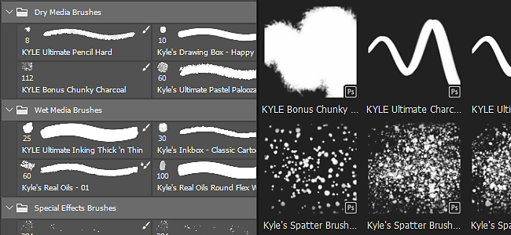
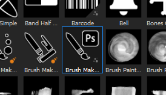
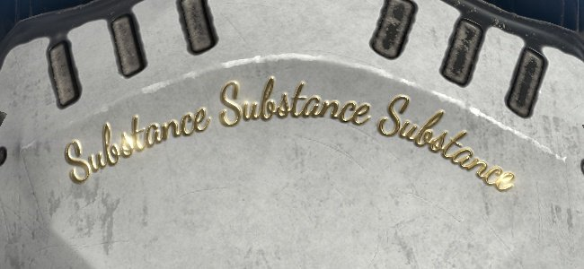

# 版本2019.3

**Substance Painter2019.3**&#x200B;引入了对Photoshop画笔预设的支持和网格的自动解封UV，并提供了各种生活质量改进，例如更好地处理图形平板电脑。

发行日期：*2019年12月17日*

## 主要功能

### Photoshop画笔预设支持(ABR)

您现在可以在Substance Painter中使用Photoshop画笔。 只需将预设导出为ABR文件，即可将其导入为常规画笔预设。 ABR文件中包含的预设将作为单独的画笔预设显示在架中。

如果您没有可导入的ABR文件，则可以在线找到大量此类文件：

* [Kyle的Adobe画笔预设](https://www.adobe.com/cn/products/photoshop/brushes.html)
* [ArtStation上的画笔预设](https://www.artstation.com/marketplace?q=photoshop%20brush&sort_by=trending)
* [DeviantArt上的画笔预设](https://www.deviantart.com/search?q=photoshop%20brush)
* [Cubebrush上的画笔预设](https://cubebrush.co/marketplace?categories=354,57)

为了支持Photoshop画笔，向绘画工具属性添加了各种新功能：

* **新的大小和流最小值参数**\
  现在，在启用“钢笔压力”时，可以指定工具的最小大小和最小流量。 此参数以基于当前定义的最大大小/流量的百分比工作。 使用Photoshop画笔预设时，将自动校准这些设置。\
  
* **新位置抖动参数**\
  为了与Photoshop的画笔行为匹配，我们添加了一些新设置。 现在可以定义将抖动应用于哪个轴以及如何分布随机位置（选择&#x200B;**一致**&#x200B;以匹配Photoshop）。\
  \
  
* **新的Alpha混合模式**\
  Photoshop合成画笔描边的方式与Substance Painter不同，因此我们添加了一个新的混合模式（变亮），以更好地匹配绘画效果。 当图章重叠时，此混合模式不会过度累积，这可以改善使用低“流量/不透明度”值绘画时的压力感。\
  \
  
* **支持圆度和翻转**\
  已添加名为&#x200B;**画笔制作器Photoshop**&#x200B;的新SubstanceAlpha，以支持圆度（缩放Alpha的Height）和翻转（镜像两个轴上的图像）等参数。 单击来自ABR文件的画笔预设时，会自动加载此Alpha。\
  \
  
* **针对图层的Alpha通道的新灰度系数校正**\
  Photoshop不会在线性灰度系数空间中混合其画笔描边，这意味着在使用Photoshop画笔预设绘画时，混合和不透明度可能看起来是错误的。 可以在图层上启用新设置，以匹配该行为并应用灰度系数校正。 这将影响用于绘制画笔描边的Alpha，以及图层蒙版用于与其他图层混合的方式，但图层的混合模式仍将在线性灰度系数空间中运行。\
  要&#x200B;**激活此设置**，只需右键单击图层并选择&#x200B;**灰度系数校正的Alpha/蒙版**。 图层旁边将出现一个新图标，指示何时启用此设置。\
   \
  
* **间距和位置抖动的最大值已增大**\
  为了正确匹配Photoshop画笔预设参数，已增加以下参数的最大值：

  * **间距**：最大间距现在可以设置为1000。
  * **位置抖动**：最大抖动现在可以设置为1000。

有关更多信息（例如如何导出ABR文件以及如何导入它们），请查看[Photoshop画笔预设](../../painting/presets/photoshop-brush-presets/photoshop-brush-presets-abr.md)文档。

>[!NOTE]
>
> 并非当前支持所有Photoshop画笔参数，请参阅[兼容性列表](../../painting/presets/photoshop-brush-presets/photoshop-brush-parameters-compatibility.md)以了解更多信息。

### 绘画和平板电脑支持方面的改进

除了支持Photoshop画笔预设之外，还针对图形平板电脑的使用进行了大量改进和修复。

* **直线第一图章不再加倍**\
  在绘制直线时，不再复制第一个图章（只需将直线放置在相应位置即可撤消您的图章）。\
  
* **直线压力插值**\
  直线现在支持压力。 压力值将在第一个图章和最后一个图章之间插值。\
  
* **新的画笔预览模式**\
  现在可以将视区中的画笔预览更改为不同的可视化模式。 要更改模式，只需单击上下文工具栏中的新下拉按钮。

  
* **钢笔压力曲线**\
  现在，可以在上下文工具栏中定义如何解释钢笔压力。 这些新设置控制压力累积的速度，从而允许使用不同的绘画样式。

  * **线性**：无变换，它检索到的压力由绘图板的笔提供。 如果已在Tablet驱动程序设置中定义了钢笔压力曲线，请使用此设置。
  * **缓入**（默认）：减慢压力的开始，让绘制细描边或淡淡描边变得更加容易。
  * **淡入淡出**：减慢压力的开始速度并加快其结束速度，从而更容易绘制柔和或强烈的笔触。

  
* **压力按钮不再是下拉列表**\
  我们将“Pen pressure”（钢笔压力）控件更改为简单的开/关按钮。 这使启用和禁用压力更加轻松快捷。

  
* **改进了对图形平板电脑的支持并切换到Windows Ink**\
  我们重新调整了处理图形平板电脑的方式。 这应能改善与最新图形平板电脑模型的总体兼容性，并减少我们过去遇到的问题数量。 在Windows上，我们还切换到Windows Ink而不是Wintab以提高兼容性。

  >[!NOTE]
  >
  > 确保您的Wacom驱动程序是最新的，并且已在平板电脑设置中启用“Windows Ink”。

### 自动UV展开（Beta版）

现在，Substance Painter将自动展开缺少UV坐标的网格。 这样就可以导入任何类型的几何并立即开始绘制。 我们的UV展开系统将在每个子网格生成一个UV 岛，同时仍然遵循素材分配以创建纹理集。 此功能当前处于测试阶段，以后版本中将继续改进。 自动展开将仅应用于&#x200B;**不使用UDIM工作流程**&#x200B;的项目。

* **自动UV展开**\
  默认情况下，Substance Painter现在会自动为缺少网格的网格生成UV坐标。 这适用于项目创建和网格重新导入。 但是，可以通过进入[主要设置](https://helpx.adobe.com/cn/substance-3d/unlisted/documentation/spdoc/general-71008262.html)并在&#x200B;**导入选项**&#x200B;下禁用&#x200B;**启用自动UV解封**&#x200B;来禁用此行为。

  
* **UV展开进度栏**\
  导入网格时，现在会出现一个进度条，指示进程的当前状态。 这还包括UV展开过程。

  
* **当前已知问题**\
  由于此新增功能目前处于测试阶段，因此可能会出现一些问题。 请参阅下面的发行说明，以获取当前已知问题的列表。 如果应用程序崩溃并产生错误结果，我们建议通过该应用程序向我们发送崩溃或错误报告，以帮助我们调查问题并改进流程。

>[!NOTE]
>
> 在架子中添加了一个新的&#x200B;**生成器**，以帮助可视化自动展开。 要使用它，只需创建一个新图层，添加生成器效果，并将新的&#x200B;**UV检查器**&#x200B;资源加载到其中。

### Substance集成改进

我们不仅支持一些期待已久的功能，还改进了现有的Substance，例如动态笔触功能，从而继续改进系统格式的集成。

* **使用软范围滑块进行非固定**\
  直到现在，Substance图表中显示的滑块都表现得像是被夹住的。 表示可以输入的值不能超过参数定义的缺省最小值和最大值。

  
* **支持参数中定义的步骤**\
  调整滑块时，现在将考虑具有具有已定义步骤的参数的Substance图表。
* **提高了浮点滑块的数字精度**\
  浮点滑块现在可以具有向下到6位小数的输入值。 但是，这受浮点精度的限制，这意味着在某些情况下可能会对值输入进行四舍五入。
* **带有动态笔触的新随机种子控件**\
  现在可以在定义的范围内请求多个随机种子值。 这允许创建独特的随机Substance变化，同时通过从缓存回收中获益而获得良好的性能。\
  在动态描边组下，将&#x200B;**随机种子类型**&#x200B;参数切换为&#x200B;**每个描边的随机**&#x200B;或&#x200B;**每个图章随机**&#x200B;以访问新参数。 **随机采样量**&#x200B;定义了总共将生成多少个Substance变化。 一旦生成了所选数量，即会在所选集合内选取随机变化。

  
* **新用户数据静态动态笔触**\
  添加了一个新的优化，允许指定Substance何时可视为动态描边。 与可视条件类似，现在可以在userdata字段中添加条件，以指定哪个条件Substance Painter应该使用“动态描边”功能生成新的Substance变化。 有关详细信息，请参阅[userdata文档](../../content/creating-custom-effects/user-data.md)。
* **将输出节点指定为所有通道的蒙版的新用户数据**\
  现在，可以在输出节点上添加新的用户数据，以将其用作所有其他通道的Alpha蒙版。 这与现有的&#x200B;**channels\_system** Alpha类似，但是不需要在Substance图中创建新的专用输出。 有关详细信息，请参阅[userdata文档](../../content/creating-custom-effects/user-data.md)。

### 其他改进

应用程序的其他部分已进行了各种改进，这应有助于在Substance Painter中开展日常工作。

* **独立视区焦点**\
  已修改2D和3D焦点（F快捷键），其行为如下：

  * **将鼠标悬停在2D视图上**：按F键只会聚焦2D视图。
  * **将鼠标悬停在3D视图上**：按F键只会聚焦3D视图。
  * **鼠标悬停在视区外**：按F键将同时聚焦2D和3D视图。

  {width="400px"}
* **烘焙窗口键盘和菜单快捷键**\
  烘焙窗口可以通过两种新的不同方式打开：

  * 按&#x200B;**Ctrl+Shift+B**。
  * 在“编辑”菜单中单击&#x200B;**生成网格图**。

  
* **使用Ctrl+Alt+左键单击快捷键滚动“坞站”和Windows**\
  添加了一个新的快捷键，它允许在不使用鼠标滚轮的情况下滚动窗口和停放。 现在可以使用绘图板的钢笔滚动该快捷方式。

  
* **性能改进**\
  在这样的背景下，已经进行了许多优化，这些优化应该可以提高Substance Painter的总体性能（从开口工程到绘画）。

### 新内容

在此版本中，添加了大量新内容：

* **更新了“Meet Mat”示例项目**\
  Mat已使用新的拓扑结构进行了更新，使其更易于位移。 ID地图经过重新设计，可提供更多蒙版功能，项目中还提供了一组新的相机，可提供新的视角。

  {width="500px"}
* **新筛选器**\
  添加了3个新滤镜，使风格化内容更轻松：

  * **MatFx漫画书**\
    此滤镜根据提供的输入（从基色/扩散到曲率）模拟阴影线和边缘线。

    
  * **MatFx水彩**\
    此滤镜通过读取输入吸收来模拟具有渗色和纸张颜色的水彩绘画。

    
  * **MatFx油画**\
    受[Emrecan Cubukcu](https://www.artstation.com/emrecancubukcu)作品的启发，此滤镜从输入中读取颜色信息，并根据各种参数将其转换为画笔笔触。 您可以使用多个预设轻松尝试各种变化。 我们建议将其与&#x200B;**烘焙光照环境**&#x200B;滤镜组合使用，或在纹理中手动烘焙/绘制阴影以最大程度地实现效果。

    

    

    >[!NOTE]
    >
    > 这是一个非常昂贵的滤镜，可能需要一些时间进行计算。 迭代时，建议在微调下方的图层之前禁用包含该效果的图层。
* **新画笔预设**

  * **102个Photoshop画笔预设**\
    随着Photoshop画笔支持的引入，包含了一组新的预设来展示它。 这些预设是从[Adobe网站](https://www.adobe.com/cn/products/photoshop/brushes.html)上提供的Kyle T. Webster包中选择的。

    {width="500px"}
  * **18个新画笔预设**\
    除了Photoshop画笔预设，还添加了新的更常规预设：

    * 基本硬压力
    * 炭精矿
    * 炭笔全帧
    * 炭笔光
    * 炭笔介质
    * 天然炭笔
    * 炭笔斜坡
    * 摆动笔触密度
    * 摆动点
    * 带分段的摆动笔触
    * 摆动描边
    * 喷涂滚轮箭头
    * 宽涂辊装订钉
    * 涂抹辊装订钉
    * 喷涂辊缝合
    * 涂色辊Stripe
    * 滚轮静脉长窄绘画
    * 涂色辊警告文本

    {width="500px"}
* **新工具预设**\
  添加了2个新的工具预设，用于模拟水粉画。

  * 水粉浓郁。
  * 水粉褪色了。

  
* **新阿尔法**\
  除了用于创建新画笔预设的alpha之外（请参阅上文），还集成了两个新的重要Alpha：

  * **画笔制作器Photoshop**\
    这个新的Substance图表通过“动态描边”功能复制Photoshop中一些可用的特定画笔参数。 可以通过控制圆度和翻转或输入图像。 一些抖动参数也可用于创建更多变化。 单击来自ABR文件的Photoshop画笔预设时，此Substance图表自动插入Alpha部分。

    
  * **画笔制作器绘画辊**\
    此新Substance图形可模拟绘画滚轮（或简单的色带工具），以便不间断地连续绘制图案。 要更轻松地设置，请查看现有预设或参阅图形说明。 我们建议启用[懒惰鼠标](../../painting/lazy-mouse.md)来正确绘制滚动画笔，而不会导致破裂。

    

    {width="290px"}
* **新的“UV检查器”生成器**\
  为了分析网格UV坐标，集成了一个新的生成器“UV检查器”。 这使得由“自动UV展开”生成的UV更易于理解。

  
* **新模板和导出预设**

  * **关键帧9+**\
    此导出预设使导出的纹理与新的关键帧9功能兼容，该功能简化了纹理和素材的加载和分配。 有关详细信息，请参阅[关键帧文档](https://luxion.atlassian.net/wiki/spaces/K9M/pages/1124335675/Material+Importer)。
  * **Spark AR Studio**\
    使用此新的项目模板和导出预设，可以更轻松地使用[Spark AR Studio](https://sparkar.facebook.com/ar-studio/)。

>[!WARNING]
>
> * 此版本不再支持MacOS 10.11 (El Capitan)。
> * 此版本不再支持CentOS 6.x。
> * 在CentOS 7.5（或更低版本）上，应用程序可能由于某些依赖项问题而无法启动，若要解决此问题，请更新系统或复制安装文件夹中的[以下库](https://centos.pkgs.org/7/centos-x86_64/freetype-2.8-12.el7.x86_64.rpm.html)。

## 发行说明

### 2019.3.3

*（2020年2月6日发布）*\
摘要： **升级到Iray 2019.3**&#x200B;的错误修复

**已添加：**

* 升级到Iray 2019.3
* [日志]指示Ryzen CPU的过时BIOS导致在烘焙期间崩溃
* [ABR]将ABR alphas提取到托架

**已修复：**

* [烘焙]如果高多边形网格没有UV，则烘焙失败
* [Linux]自定义鼠标快捷键未保存
* [画笔]轮廓消失，出现一些Alpha形状
* [Tablet]移动滑块时检测不佳
* [快捷键]无法使用“Ctrl+Alt+MouseClick”设置任何快捷键
* [托架]使用绘图板时看不到资源工具提示
* [2D视图]&#x200B;[导出] 2D视图预设未考虑正常信息
* 使用某些画笔在UV对齐中绘画时冻结
* 在滤镜下绘画会在正在进行的描边上创建伪像
* [视区]重新导入网格后，视区中的纹理缓存不正确
* [崩溃]导出到Photoshop后存储时出错
* [崩溃]导入资源时在前缀中写入特殊符号
* [崩溃]单击“锚点属性”中的引用
* [锚点]当锚点和参考之间存在筛选器时，通道不会更新
* “帮助”菜单中的图像URL链接不起作用

**已知问题：**

* [UV展开]处理高多边形网格可能需要较长时间
* [UV Unwrapping]合并完全相同坐标的顶点
* [UV展开]在某些情况下，UV生成在某些网格部分上可能会失败
* [UV展开]在某些情况下，单个UV 岛中的非均匀或高度扭曲的纹理比率
* [UV展开]纹理集之间的非均匀纹理比
* [UV展开]生成的UV 岛可能非常细长，在某些情况下，不适合UV空间
* [UV展开]具有小边或重叠边的退化表面或非三角形网格表面可能无法展开UV

### 2019.3.2

*（2020年1月21日发布）*\
摘要： **错误修复**

**已修复：**

* 打开以独奏声道模式保存的项目不会显示网格
* 使用仿制工具在图层下绘画时，视区并不总是更新的

**已知问题：**

* [Bakers]与Ryzen CPU上的多线程相关的崩溃
* [UV展开]处理高多边形网格可能需要较长时间
* [UV Unwrapping]合并完全相同坐标的顶点
* [UV展开]在某些情况下，UV生成在某些网格部分上可能会失败
* [UV展开]在某些情况下，单个UV 岛中的非均匀或高度扭曲的纹理比率
* [UV展开]纹理集之间的非均匀纹理比
* [UV展开]生成的UV 岛可能非常细长，在某些情况下，不适合UV空间
* [UV展开]具有小边或重叠边的退化表面或非三角形网格表面可能无法展开UV

### 2019.3.1

*（2019年12月20日发布）*\
摘要： **修补程序**

**已修复：**

* 使用具有特定UV 投影的网格时崩溃
* [ABR]在Photoshop预设之间切换时崩溃
* [Linux]由于libGLX依赖性问题，无法在CentOS 7.4上启动Substance Painter
* [Bakers]使用“文件”>“清理”后烘焙时崩溃
* [烘焙师]取消后烘焙进度对话框冻结
* [烘焙师]导出纹理后的烘焙网格不起作用
* [面包师]对黑色网格图使用“按名称匹配”结果
* [面包师]凯奇没有被考虑在内
* [托架]导入PSD文件会导致图像损坏
* [示例] “Mat”示例项目中的相机损坏且导出预设不正确

**已知问题：**

* [Bakers]与Ryzen CPU上的多线程相关的崩溃
* [UV展开]处理高多边形网格可能需要较长时间
* [UV Unwrapping]合并完全相同坐标的顶点
* [UV展开]在某些情况下，UV生成在某些网格部分上可能会失败
* [UV展开]在某些情况下，单个UV 岛中的非均匀或高度扭曲的纹理比率
* [UV展开]纹理集之间的非均匀纹理比
* [UV展开]生成的UV 岛可能非常细长，在某些情况下，不适合UV空间
* [UV展开]具有小边或重叠边的退化表面或非三角形网格表面可能无法展开UV

### 2019.3.0

*（2019年12月17日发布）*\
摘要：**主要版本，改进了手绘用户体验、使用平板电脑、Beta版中的自动UV解封(0.3.0)和各种手绘新内容**

**已添加：**

* 在Substance Painter中集成“自动UV解包0.3.0”版本
* [UV展开]当没有UV或部分UV时，Substance Painter中自动展开UV
* [UV展开]一个全局设置可激活和停用它
* [UV unwrapping]日志文件中报告的版本
* [UV展开]&#x200B;[UI]指示UV展开进度
* [UI]上下文工具栏中用于选择画笔预览的新设置：完整预览、画笔轮廓和十字线
* [工具] Alpha部分中新的高级混合模式：除了正常模式之外，还可以变亮（最大）
* [图层栈栈]每个图层的Alpha或蒙版灰度系数校正选项（右键单击菜单）
* [图层栈栈]&#x200B;[UI]校正图层Alpha后，添加“i”图标
* [Tablet]&#x200B;[工具]针对大小和流量公开最小压力
* [Tablet]&#x200B;[UI]上下文工具栏中用于选择曲线压力的新设置：线性、入点、出点
* [Tablet]&#x200B;[UX]按住Ctrl+Alt键并单击可滚动
* 导入Photoshop画笔预设（ABR格式）
* [ABR]支持形状参数
* [ABR]支持形状动态参数
* [ABR]支持转接参数
* [ABR]支持散布参数
* [ABR]&#x200B;[动态笔触]支持圆度和翻转
* [ABR]&#x200B;[托架]在滤镜编辑器中显示画笔文件夹结构
* [ABR]&#x200B;[托架]在缩览图中添加Photoshop图标
* [ABR]&#x200B;[托架]在ABR详细缩览图中添加不受支持的参数列表
* [工具]&#x200B;[动态笔触]新的动态描边设置可控制要生成的随机种子数
* [工具]&#x200B;[UI]添加新的分布和轴设置以实现散布抖动
* [快捷键]添加Ctrl+Shift+B以打开“烘焙”窗口
* [UI]&#x200B;[菜单]在“编辑”菜单中添加条目以打开烘焙窗口
* [UI]&#x200B;[设置]改进了快捷键列表的对齐方式
* [UI]通过打开/关闭按钮替换压力控件（大小和流量）图标
* [视区]允许单独聚焦2D和3D视区
* 更新到夸脱5.12.5
* [UI]指示网格加载进度
* [Substance]使用滑块增加对非夹持和柔和范围的支持
* [Substance]将Substance参数的精度提高到6个小数
* [Substance]考虑参数定义的步骤
* [Substance]支持userdata中的条件，优化动态笔触生成
* [Substance]允许通过userdata将图形输出指定为所有通道的蒙版
* [内容]使用位移友好的拓扑、新的ID地图和新相机更新“Mat”示例项目
* [内容]集成3个新滤镜(MatFx)：漫画书、水彩、油画（受Emrecan Cubukcu作品的启发）
* [内容]集成来自Kyle T. Webster包的102个Photoshop画笔预设
* [内容]集成18种新画笔预设：绘画辊箭头、绘画辊警告文本、炭笔精细等
* [内容]集成9个新Alpha：画笔生成器、画笔生成器、Photoshop、画笔图案等
* [内容]集成了2个新工具预设：水粉浓淡和水粉淡化
* [内容]集成1个新生成器：UV检查器（高亮UV 岛和接缝）
* [内容]集成2个新的导出预设：Keyshot 9+和Spark AR Studio
* [内容]集成1个新项目模板：Spark AR Studio (Facebook)

**已修复：**

* [Tablet]撤消光笔描边(Ctrl+Z)比撤消鼠标描边滞后得多
* [平板电脑]绘制直线时未考虑起点和终点压力
* [Tablet]使用直线时，绘制第一图章两次
* [Tablet]改进对Huion平板电脑快捷键的支持
* [Tablet]改进对Huion钢笔按钮的支持
* [Tablet]画笔预览和绘制的图章之间的偏移
* [Tablet]在极少数情况下，使用钢笔修改画笔的快捷键会导致性能降低
* [Tablet]在特定图层上绘画时出现滞后
* 切换视口时，极少数情况下可能会出现模糊纹理
* [UI]&#x200B;[Substance]图像输入并非始终显示
* 清理操作不会从架子中删除已导入项目中的预设
* [工具]&#x200B;[动态描边]调整图章周期计数时出现性能问题
* 在极少数情况下以3D/2D视口模式绘画时出现刷新问题
* 绘制一个很长的描边会导致冻结
* [Tool]使用特定动态笔触绘画时出现性能问题
* [UI]选择文件夹时，上下文工具栏仍显示画笔属性
* 对称轴值不会重置
* 导入具有浮点值的EXR纹理时完全为黑色
* 按住Alt键并单击要隔离的通道对于滤镜和生成器不起作用
* [导出]导出时特定项目崩溃
* [Substance]如果参数被“可见”隐藏，则下拉菜单上的默认值不正确。
* [着色器]通过“素材图层”定义的通道在UI中的排序方式不同
* [托架]预设元数据未保存在磁盘上

**已知问题：**

* [UV展开]处理高多边形网格可能需要较长时间
* [UV Unwrapping]合并完全相同坐标的顶点
* [UV展开]在某些情况下，UV生成在某些网格部分上可能会失败
* [UV展开]在某些情况下，单个UV 岛中的非均匀或高度扭曲的纹理比率
* [UV展开]纹理集之间的非均匀纹理比
* [UV展开]生成的UV 岛可能非常细长，在某些情况下，不适合UV空间
* [UV展开]具有小边或重叠边的退化表面或非三角形网格表面可能无法展开UV
* 邮件样本在导入的相机时遇到一些问题
