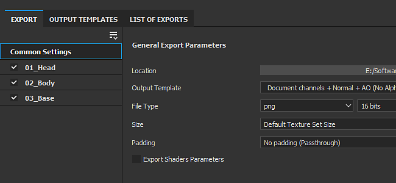
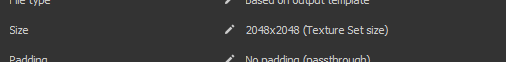

# 版本2020.1 (6.1.0)

**Substance Painter2020.1 (6.1.0)**&#x200B;提供了全新的导出器、python脚本、新的曲率烘焙器、新内容以及许多其他工作流程改进。

发行日期：*2020年4月22日*

>[!NOTE]
>
> 从此版本开始，应用程序版本号将开始更改其格式。 **2020.1**&#x200B;现在变为&#x200B;**6.1.0**。

## 主要功能

### 全新导出纹理窗口

“导出”窗口已彻底修改，可提供一种更简单、更直接的方法来配置和导出项目中的纹理。 它还带来了一些新功能，使出口更加方便。 新的导出窗口现在分为三个选项卡：

**设置**

此选项卡控制每个“纹理集”的常规设置和特定设置。

* **新的全局设置**\
  全局设置是在所有纹理集之间共享的一组参数。 它们可用于快速指定或更新参数，而无需分别手动编辑每个纹理集。 全局设置包含以下参数：

  * **输出目录**：定义将在其中生成纹理的目标位置。
  * **输出模板**：定义用于配置导出纹理的命名和打包的预设。
  * **文件类型**：定义导出纹理的文件格式和位深度。
  * **大小**：定义纹理集将导出时使用的最大纹理分辨率。
  * **填充**：定义如何生成UV 岛以外的信息。
  * **导出着色器参数**：如果启用，则导出存储着色器设置及其纹理集分配的json文件。

  
* **每个纹理集设置和参数覆盖**\
  “全局设置”下方是当前打开的项目中的纹理集列表。 “常规导出参数”部分显示继承自全局参数的设置。 也可以为每个纹理集选择其他&#x200B;**导出预设**。

  

  单击“钢笔”图标允许覆盖特定参数以更改其值。 再次单击它将禁用覆盖并将值重置为默认值（继承自全局设置）。

  
* **选择要导出的纹理**\
  “纹理集”导出参数下方是将生成的纹理列表。 使用此列表，可以通过选中或取消选中来精确选择应生成哪个文件。 该列表还显示继承自导出配置或输出模板的每个纹理的文件格式和位深度。 使用钢笔图标覆盖特定纹理的文件格式和位深度。
* **保存设置而不导出**\
  现在，可以使用新的&#x200B;**保存设置**&#x200B;按钮来保存项目的导出配置，而无需导出纹理。 如果您想调整项目，而不重新生成纹理，此功能非常有用，可能需要一些时间。

  
* **单击并拖动可快速启用/禁用导出**\
  使用鼠标单击和拖动可快速启用或禁用纹理集和纹理：

  

  

**输出模板**

此选项卡允许创建配置预设，以命名导出的纹理。

* <b>创建导出预设</b>\
  <b>输出模板</b>选项卡与旧导出器中的<b>配置</b>选项卡相同。 此工具可用于创建导出预设，以快速命名和打包纹理。 要了解如何创建自定义导出预设，请查看我们的文档页面。
* **在导出预设中设置文件格式和位深度**\
  导出预设新增了一种功能，即可以设置文件格式和每个纹理的位深度，从而更轻松地在项目间共享配置。

  
* **控制从输出模板导出的纹理**\
  设置导出过程时，使用新选项&#x200B;**基于输出模板**&#x200B;从导出预设定义纹理属性。

  

**导出列表**

此选项卡显示正在进行的导出过程以及导出的所有纹理的全局摘要。

* **导出的纹理列表**\
  该选项卡列出了每个“纹理集”要导出的各个纹理，并会考虑被覆盖的参数和忽略/排除的纹理。 这是在启动导出流程之前确保一切正常的好方法。 当导出过程开始时，界面将自动切换到此选项卡。

  
* **导出进程和日志记录**\
  选项卡右侧是一个控制台，可输出有关正在进行的导出过程的详细信息。 它将指示已成功导出哪些纹理，以及任何警告和错误。 界面底部还会显示一个进度条，其中提供了进程的当前状态：

  

  

### 新建贴花图层模式

从[资源](../../interface/assets/assets.md)中拖放材质时，有一种新的&#x200B;**贴花**&#x200B;模式可用。 它会在&#x200B;**平面投影**&#x200B;模式下创建新的填充图层，从而更轻松地定位图案和图像。 要使用它，只需在按住&#x200B;**ALT键盘快捷键**&#x200B;的同时从搁板中&#x200B;**拖放**&#x200B;任何材质来预览操纵器，并在贴花位于所需位置时释放鼠标。 释放鼠标按钮后，将创建新的填充图层。

现在，我们还将从Substance Source中选择的默认色架中包含5个贴花。 如果您想了解有关此新贴花工作流程的更多信息，请查看[此文章](https://magazine.substance3d.com/effortless-grunge-look-with-new-substance-source-parametric-decals/)。

>[!NOTE]
>
> 为使贴花更易于使用，我们实施了新的[user-data关键字](../../content/creating-custom-effects/user-data.md)，允许在创建图层时为每个通道指定默认混合模式。

### 新的Python脚本

现在可以编写和运行&#x200B;**Python**&#x200B;脚本和具有Substance Painter的模块。 我们将Python 3.7和PySide2与Substance Painter集成在一起，还通过专用的&#x200B;**substance\_painter**&#x200B;模块提供了一个自定义Python API。 此外，我们还借此机会从JavaScript版本开始重新思考我们的API，以使其更清晰、更易于使用。 他们具有相似之处，这应该可以简化现有用户的Python插件创建过程。

要了解有关Python API的更多信息，请查看通过应用程序中的“帮助”菜单访问的文档。

* **安装Python模块**\
  Python模块可以安装在用户帐户下的专用Documents文件夹中，但我们还提供了通过专用环境变量添加补充路径位置的方法，以便更轻松地在工作室中进行设置。
* **Substance PainterPython子模块**\
  已公开以下子模块（以后将提供更多子模块）：

  * substance\_painter.display
  * substance\_painter.event
  * substance\_painter.exception
  * substance\_painter.export
  * substance\_painter.logging
  * substance\_painter.project
  * substance\_painter.resource
  * substance\_painter.textureset
  * substance\_painter.ui
* **Python解释器**\
  新的Python控制台窗口可用于试用模块和/或运行python脚本：

  {width="500px"}

### 改进的烘焙师

此版本中改进了曲率烘焙器，并获得了一些新的环境遮蔽烘焙器。

* <b>从网格面包机新建曲率</b>\
  旧曲率烘焙器现已弃用，并由最近添加到Substance Designer中的新“从网格”版本替换。 要了解有关新烘焙器设置的更多信息，请查看文档页面。\
  新的面包师具有以下功能：

  * <b>更准确</b>：计算的曲率更精确，并生成逼真的值。
  * <b>网格接触</b>：网格之间的互连现在可生成曲率信息（与上一个烘焙器不同）。
  * <b>高多边形网格</b>：现在直接从高多边形网格烘焙细节，而不是从正常映射转换。
  * <b>性能</b>：新烘焙器使用光线追踪计算细节，这意味着它受益于GPU 射线追踪加速(RTX/Optix)。

  {width="500px"}

  出于兼容性原因，仍然可以通过曲率烘焙器设置访问旧曲率烘焙器。 选择设置&#x200B;**从法线映射生成**&#x200B;以使用旧烘焙器。

  
* <b>改进的环境遮蔽</b>\
  改进了环境遮蔽烘焙器，以支持新设置：

  * <b>地平面</b>：模拟网格下方的平面以创建来自地面的阴影。 有关详细信息，请参阅环境遮蔽文档。
  * <b>忽略背面</b>：在烘焙环境遮蔽时，有一个新的网格名称后缀可忽略特定对象。 例如，这允许忽略浮动几何细节。 有关更多信息，请参阅“按名称匹配”文档

  {width="500px"}

### 改进了网格导出（带镶嵌）

使用新增功能和设置，改进了导出网格：

* **导出原始网格拓扑或带镶嵌的导出网格**\
  导出网格时，现在可以选择应用为位移效果生成的镶嵌。 可能的设置包括：

  * **没有位移/镶嵌**：导出没有网格子划分的基网格。 如果禁用&#x200B;**应用三角化**，则将导出原始网格三角形、四边形或n-gon。
  * **使用位移/镶嵌**：导出包含子分割的网格。 如果启用了&#x200B;**重新计算顶点法线**，则将调整网格法线以匹配位移偏移。

  
* **场景层次结构和网格名称**\
  现在，原始场景层次结构和导入网格中的对象名称将保留下来，并重新应用于导出的网格。
* **以FBX文件格式导出**\
  项目网格现在可以导出为FBX格式以及其他文件格式。\
  **注意**：导入期间仍会丢弃与Substance Painter不兼容的数据（例如：外观设置、关节）。

### 改进的自动UV展开

现在，借助新设置，可以更轻松地控制“自动UV展开” ：

* **在项目创建期间使用自动UV解封**\
  创建项目时，现在有一个新设置，可用于启用或禁用新的自动UV展开过程。 将3D网格重新导入现有项目时，此设置也可用。

  
* <b>高级展开设置</b>\
  启用自动UV展开复选框旁是一个新的<b>选项</b>按钮。 它会打开一个新窗口，其中包含用于控制展开过程的高级设置，从而允许保留在展开过程的不同部分的现有网格信息，而不是总是像以前一样重新计算所有内容。 有关更多信息，请参阅专用文档。 当前设置包括：

  * <b>接缝</b>：定义是保留还是重新生成现有接缝。
  * <b>UV 岛</b>：定义是保留还是重新生成现有的UV解绕排。
  * <b>打包</b>：定义是保留还是重新生成UV 岛打包。
  * <b>边距大小</b>：定义每个UV 岛之间的间距（百分比）。

  

### 新内容

在此版本中，我们加入了几种新材料，并更新了许多导出预设，以匹配新的软件版本。

* **5种新贴花素材**\
  我们添加了5种直接来自Substance Source的新材质，以试用新的贴花功能：

  * 大型铁锈泄露
  * 中等不定芽胞杆菌
  * 稀缺的血液泄漏
  * 小子弹撞击混凝土墙壁
  * 喷漆标签

  
* <b>新的Vray着色器、项目模板和导出预设</b>\
  与[混沌组](https://www.chaosgroup.com/)合作，我们集成了两个复制VrayMtl行为的新着色器。 在尝试匹配使用Vray制作的渲染时，它们应提供更准确的外观。 使用项目模板轻松设置Vray的任何新项目。 请查看文档以了解有关它的更多信息。

  
* <b>新的Maxwell项目模板和导出预设</b>\
  在与[下一个限制](http://www.nextlimit.com/)协作时，我们为Maxwell渲染器集成了新的项目模板和导出预设。
* **已更新导出预设**\
  许多导出预设已更新，主要用于使用新的文件格式和位深度设置，但也用于匹配新的软件版本。

## 教程

请查看我们的新视频教程，了解新增功能：

## 发行说明

### 2020.1.3

*（2020年6月16日发布）*\
摘要： **错误修复**

**已添加：**

* [导出]在着色器参数json文件中添加位移设置

**已修复：**

* [崩溃][引擎]尝试擦除和替换现有通道时崩溃
* [崩溃]在素材图层上色蒙版后更改着色器
* [崩溃][引擎]在某些大型项目中崩溃
* [Bakers] “按名称匹配”不适用于从zBrush导出的OBJ
* [位移][SVT]位移打开时，项目打开时未显示纹理
* [导出]某些纹理导出为统一灰色
* [导出]不应为Dimension和Sketchfab导出预设导出禁用的纹理集
* [脚本][JavaScript]使用JavaScript API访问onProjectOpened事件中的导出配置时崩溃
* 导出后未调用[Scripting][Javascript] onExportFinished()

### 2020.1.2

*（2020年5月28日发布）*\
摘要： **带有Substance 引擎和烘焙器更新的错误修复**

**已添加：**

* [Bakers]更新到最新版本
* [烘焙师]环境遮蔽、曲率、Thickness烘焙师中新的采样方法
* 更新到Substance 引擎的最新版本
* [脚本][Python]允许为项目资源创建ResourceID
* [脚本][Python]允许查询通道信息
* [脚本][Python]添加dryrun和回调函数以模拟纹理导出

**已修复：**

* [Bakers]在特定情况下使用正切法线映射时，世界空间法线中的法线不正确
* [烘焙师]不使用高多边形时使用Optix烘焙环境遮蔽时出错
* [动态笔触]加载特定纹理集时发生延迟
* [导出]不应导出USD、glTF的禁用纹理集
* [脚本][JavaScript]无法编辑新的曲率生成器设置
* [脚本][JavaScript] alg.texturesets.addChannel()在某些情况下不返回错误
* [脚本][JavaScript] setProjectExportOptions()的Javascript API文档中出现拼写错误
* [脚本][JavaScript]始终导出所有纹理集
* [Scripting][Python] sys.executable返回python.exe的路径而不是Substance Painter
* 纹理缓存在Mac操作系统和Windows/Linux之间不兼容
* [Livelink UE4]仅最后一种材质用于组合网格中的所有纹理集

**已知问题：**

* [Export][Dimension][Skecthfab]不应导出禁用的纹理集
* [崩溃]在素材图层上绘制蒙版后更改着色器

### 2020.1.1

*（2020年5月5日发布）*

**已添加：**

* [导出] TextureSet上的可视反馈被覆盖

**已修复：**

* [导出]导出器窗口在特定分辨率监视器上过大，无法调整大小
* [导出]导出后未保存选项
* [导出]崩溃或无法使用“从缓存”导出预设导出
* [导出]取消导出操作会生成意外的额外空映射
* [导出]修复虚拟导出预设设置
* [Python]未考虑PYTHONPATH环境变量
* [Python][导出]取消通过Python的导出时返回异常错误
* [Python][Export] export\_project\_textures包含psd文件格式的错误结果

**已知问题：**

* [JavaScript]无法编辑新的曲率生成器设置
* [JavaScript][导出]始终导出所有纹理集
* [Bakers]在Linux上使用GPU 射线追踪时崩溃
* [Export][USD]不应导出禁用的纹理集

### 2020.1.0

*（2020年4月22日发布）*

**已添加：**

* 新的纹理和网格导出器
* [导出]新的导出器界面
* [导出][导出选项卡]允许选择根据纹理集导出哪些地图通道
* [导出][导出选项卡]允许一次修改所有纹理集的纹理集大小
* [导出][导出选项卡]允许每个纹理集使用其他模板（USD、glTF、Sketchfab和Dimension除外）
* [导出][导出选项卡]快速激活和停用地图和纹理集
* [导出][导出选项卡]导出分辨率8192x8192不再具有实验性
* [导出][导出选项卡]允许修改每个映射的文件格式和位深度
* [导出][导出选项卡]允许重置为默认参数值
* [导出][导出选项卡]允许保存设置而不导出
* [导出][输出模板选项卡]将“配置”选项卡重命名为“输出模板”选项卡
* [导出][输出模板选项卡]允许定义每个预设映射的文件格式和位深度
* [导出][导出列表]用于汇总和查看导出过程的新预览选项卡
* [导入/导出网格]导入/导出时间性能优化
* [导出网格]以FBX格式导出网格
* [导出网格]导出位移和镶嵌网格
* [导出网格][UI]用于重新计算法线顶点、应用三角化的新设置
* [导出网格]使用自动展开生成的新UV导出原始网格拓扑
* 更新了带有更多控件的自动UV展开
* [UV展开][UI]添加设置以在新项目窗口中激活自动UV展开
* [UV展开][UI]用于控制展开步骤（接缝、展开、打包）的新选项
* [UV展开][UI]允许保留现有的展开接缝/展开/打包
* [UV展开][UI]用于完全重新计算展开步骤的新选项
* [UV展开][UI]用于控制边距大小（无、小、中和大）的新选项
* 新烘焙师
* [面包师]用网格中的新曲率替换旧曲率
* [烘焙师]在“环境遮蔽”烘焙师中添加“按名称匹配”选项以忽略背面
* [烘焙师]在“环境遮蔽”烘焙师中添加地平面选项
* 新脚本Python API (3.7.6)
* [Python][UI] Python的新脚本菜单
* [Python][UI]“帮助”菜单中的新Python文档
* [Python]显示Substance PainterPython模块：substance\_painter、alg、display、project.setting、project、texturesets、ui
* [Python]显示新的“substance\_painter”Python模块
* [Python]显示新的Python子模块：alg、display、log、project、resource、texturesets、ui
* [Python]项目更改的侦听器
* [Python] Python文档中的新示例
* [JavaScript][UI]“插件”菜单已替换为JavaScript
* [视口]允许通过从层架中“拖放+ ALT”资源来创建贴花投影
* 新内容
* [内容]来自Substance Source的5种新贴花材料
* [内容]为Maxwell渲染器添加新项目模板和导出预设
* [内容]添加项目模板以导出Keyshot 9
* [Content]更新Keyshot 9导出预设以支持位移和发送
* [Content][Exporter]更新所有导出预设，以匹配最新版本的游戏引擎和渲染器
* [Content][Exporter]更新导出预设文件以使用新格式和抖动设置
* [内容]支持VRay素材(VRayMtl)的新模板和着色器
* [图层栈栈]允许使用垃圾桶图标或键盘快捷键删除图层效果Delete
* 删除插件Substance Source（使用带有“发送到”功能的启动器）
* [Windows]在高端GPU上不显示TDR警告

**已修复：**

* 新建项目文件对话框中的翻译问题
* [Bakers]设置“保存预处理的场景文件”不再有效
* [烘焙师]不使用高多边形的情况下使用optix烘焙时崩溃
* [平面投影]投影不适用于具有重复UV的网格
* [贴花]使用不同填充图层投影模式时正常通道中的行为差异
* [涂抹][仿制]在蒙版中绘画时可能会出现伪像
* [引擎]特定图层内容崩溃
* [引擎]在某些情况下，绘画时发生随机崩溃
* [锚点]对空蒙版的引用始终返回白色
* [导出]某些特定的栈栈配置中未考虑图层
* [导出网格]无法导出包含特殊字符的路径
* [导出网格]从Linux或MacOS导出时，无法读取glTF文件
* [导入网格]重新导入DAE、PLY或glTF无法按预期工作
* [崩溃]在素材图层上绘制蒙版后更改着色器

**已知问题：**

* [脚本][JavaScript]无法编辑新的曲率生成器设置
* [Bakers]在Linux上使用GPU 射线追踪时崩溃
* [Export][USD]不应导出禁用的纹理集
