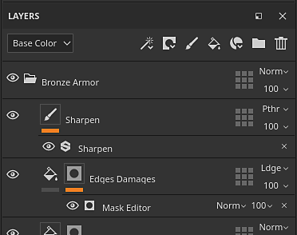
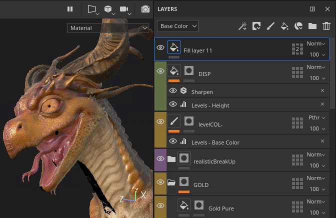
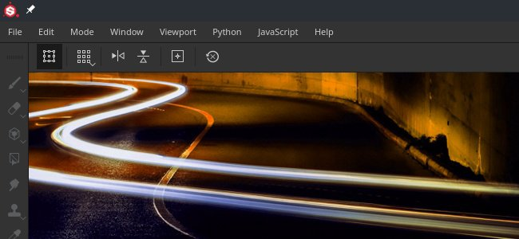
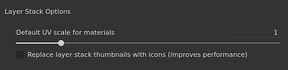

# 版本2020.2 (6.2.0)

**Substance Painter2020.2.0 (6.2.0)**&#x200B;引入了允许跨UDIM绘画的新UV 平铺工作流程。 它还包括针对任何类型项目的几项性能和项目大小改进。

发行日期：*2020年7月23日*

&#x200B;>> 

艺术家来源：[Damien Guimoneau](https://www.artstation.com/damz)创作的“龙”，以及[Jason Huang](https://www.artstation.com/jasonhuang)创作的“机器人”。

## 主要功能

### 跨UDIM绘画的新UV 平铺工作流程

在此版本中，我们将新的UV 平铺工作流程引入Substance Painter，该工作流程允许跨UDIM 平铺绘画。

使用新工作流程，**UV不再拆分为单独的纹理集**。 相反，根据网格的材质分配，UV拼贴包含在单个纹理集内。 在2D和3D视口中，同一纹理集中的UV 平铺可以&#x200B;**在没有接缝的情况下进行绘制**。

UV磁贴是以通用方式描述此新工作流的术语，因为UDIM主要是命名约定。 虽然UDIM是目前唯一可用的约定，但我们计划在未来将其扩展（例如支持Mudbox或ZBrush命名）。 我们还考虑用负坐标来支撑拼贴，这在UDIM格式中是不可能的。 这就是我们为此工作流程选择更广义的术语的原因。

下面概述了这一新工作流程中引入的更改：

* **正在创建UV 平铺项目**\
  创建新项目时，有一个新设置可用于指定是否应使用新工作流。

  请注意，一旦确定了工作流程并创建了项目，以后就不能再与其他设置相反对其进行更改。

  
* 2D视口中的UV 平铺

  使用新UV 平铺工作流程时，2D 视图现在将显示一个新网格，其中每个UV 平铺都有一个专用UDIM号。 可以单独绘制每个拼贴。

  
* 跨UV 平铺绘画

  UV 平铺

  位于同一纹理集中的纹理可以无缝跨对象绘制。 这样，只需将UV磁贴数量相乘，即可提高资源的总体分辨率和质量。
* “纹理集列表中的UV 平铺”窗口

  该

  纹理集列表包含

  已更新，以列出与导入的网格上找到的材料相关的UV磁贴。 每个UV 平铺都根据UDIM惯例显示其名称。

  
* 更改每个UV 平铺的分辨率

  虽然每个UV拼贴的默认分辨率基于其父纹理集，但可以按拼贴覆盖它。 只需在“纹理集列表”中选择磁贴，然后转到“纹理集设置”窗口来更改分辨率即可。 当拼贴的分辨率被覆盖时，新的分辨率将显示在其编号旁边的2D 视图中。

  
* 新建图层堆叠图标

  该图层堆叠为绘画和填充图层提供了新的图标。 由于UV 平铺包含多组纹理，因此无法在此小区域中显示所有字体。 这有助于提高性能，因为不再需要计算特定的缩略图。 这组新图标可用于常规项目，也可在主要设置中启用设置（请参阅下文）。

  
* 在图层上新建UV 平铺蒙版

  UV拼贴蒙版是一种用于遮蔽入点/出点图层的新方式，比常规蒙版更高效。 它提供了更好的性能，因为它允许完全放弃特定UV 平铺的计算。 我们建议使用此工具在处理包含许多UV磁贴的项目时获得舒适的体验。 有关详细信息，请参阅文档中的[专用页面](../../interface/layer-stack/geometry-mask.md)。

  {width="550px"}
* **通过蒙版UV 平铺绘画**\
  由于多个UV 平铺位于同一纹理集中，因此绘画网格的某些区域可能很困难，因为几何图形的其他部分挡在了后面。 为了避免这种情况，在名为&#x200B;**绘画描边忽略蒙版UV拼贴**&#x200B;的上下文工具栏中添加了一个新的绘画设置。 启用此设置后，通过UV 平铺蒙版排除的任何UV 平铺都将在视口中隐藏，从而允许绘画描边浏览/忽略它们。 修改UV 平铺蒙版将重新计算画笔描边，因为它允许重新导入可能已修改UV 平铺的网格或需要排除的新几何形状。 这样可以避免重做绘画描边。

  

  
* UV 平铺

  这些Baker还支持UV 平铺，现在烘焙窗口中提供了一个选择列表

  以指定应烘焙的拼贴和纹理集。 通过单击并拖动复选框或使用新的下拉菜单，可以快速更改选择。

  

  
* 使用新的$udim标签导出纹理

  输出模板中添加了一个新标签，允许导出文件名中包含UV 平铺编号的文件。 目前仅提供UDIM惯例。 当标签不可用时，也可以使用括号来定义文件名中的可选元素。 例如，这样可创建仅在UV 平铺项目可用时附加UDIM号的文件名，从而使导出预设与任何类型的项目兼容。

  
* **导入图像序列**&#x200B;图像序列是一系列纹理，其中每个序列都与特定UV 平铺匹配。 要导入图像序列，只需将该序列的第一个文件拖放到工具架中或使用导入资源窗口。 序列中的其余文件也将自动导入。 这些序列将在工具架中显示为单个资源，并带有指示它们包含的文件数量的数字。 要使用序列，只需将其拖放到填充图层中即可。 投影模式将自动设置为&#x200B;**填充（每UV 平铺匹配）**。

  {width="600px"}

  
* 支持使用Alembic网格的Faceset

  Alembic Facesets现在作为要拆分为纹理集的材料导入。 此更改使Alembic网格与新的UV 平铺工作流程兼容。 如果Alembic网格包含不在Facesets中的脸部，则会自动将其放入名为DefaultMaterial的纹理集中。

要了解有关新UV 平铺工作流程的更多详细信息，请参阅[专用文档](../../features/uv-tiles/uv-tiles.md)。

>[!NOTE]
>
> UV 平铺工作流程可能会要求很高，我们建议使用固态硬盘来存储缓存和项目文件，以减少加载时间，获得流畅的体验。

### 新的暂停引擎

现在可以在工作时暂停引擎。 在引擎暂停的情况下，将注册任何纹理计算、视口更新或绘画描边，但不会计算它们。

这个新动作允许设置和调整复杂图层栈叠，并将计算延迟到最后一刻。 暂停引擎的主要优点是避免中间计算，而只计算最终结果。 这样可使应用程序响应速度更快，整体更新速度更快。 要点是，在引擎不暂停之前，不会出现视觉反馈。

要暂停引擎，只需单击视口上方上下文工具栏&#x200B;**中的**&#x200B;按钮，或使用&#x200B;**快捷键Shift + Escape**（可在“设置”中修改）。 要取消暂停引擎，请关闭按钮或重复使用该快捷键。

### 性能改进

* **更快导出纹理**\
  导出纹理的速度应显着加快，特别是对于生成许多纹理的繁重项目。 在生成纹理和编写文档的方式上进行了一些改进。 在对包含许多纹理集或复杂图层堆叠的项目进行内部测试中，我们发现导出过程通常会加快&#x200B;**4或5倍**。
* **打开项目时缓存计算延迟** Substance Painter使用缓存系统以允许快速调整和混合图层。 在以前的版本中，每次打开项目时都会计算此缓存（通过视口底部的绿色加载栏可见）。 现在，仅在尝试编辑图层（例如，通过绘制或微调填充图层参数）时触发缓存计算。 此更改允许打开项目，而无需在开始工作之前等待并切换到所需的纹理集。 该计算也更为精细，仅计算所需的内容。 例如，对于包含UV拼贴的项目，将只计算需要修改的拼贴。
* **网格图异步加载**&#x200B;网格图现在异步加载。 这意味着在等待加载网格映射时，应用程序将不再被阻止。 在视口中显示网格图时，这一点尤其可见（如下图所示）。 这也使项目打开速度更快，因为不再等待网格图。

  
* **改进了蒙版视图模式编辑**\
  现在使用ALT +单击蒙版（或专用纹理模式）以在视口中显示它时，只会为蒙版执行视图更新。 这意味着使用此视图模式时，绘画和编辑效果会更加流畅，因为任何其他计算都会延迟到视口设置回材质模式后。

  
* **新建图层堆叠缩略图**\
  如前所述，图层堆叠现在可以使用一组新的图标。 使用这些图标可以提高常规性能，因为无需计算缩览图。 虽然这对于UV 平铺项目是自动的，但常规项目也可以选择使用这些图标，方法是转到&#x200B;**编辑>设置**&#x200B;并启用&#x200B;**将图层堆叠缩略图替换为图标**。

  
* **更快的增量保存**&#x200B;由于项目可以更小，并且保存过程对于更改的数据更精细，因此增量保存（按CTRL+S）现在要快得多。 这在大型项目中尤其明显。
* **改进了Iray启动性能**\
  随着Iray内存管理方式的改进，切换到渲染模式的速度应会更快。

### 项目大小改进

项目文件以[占用大量文件](../../technical-support/workflow-issues/project-issues/projects-are-really-big.md)而闻名。 我们花了一些时间调查问题的根源，并设计了一些解决方案。 此版本引入了第一组更改：

* **将Baker输出切换到灰度图像**\
  在以前的版本中，Baker在任何情况下都会输出RGB图像。 现在，灰度Baker(弯曲、ambient occlusion)将仅输出灰度图像。 这一简单的更改可以将项目大小从20%减少到60%。 要利用此更改，需要重新生成现有项目中的网格图。
* **更改Baker的默认漫射和膨胀设置**\
  以前，Baker将生成1个像素的膨胀，然后生成漫射图案（UV 岛外部的模糊像素）。 由于渐变很难压缩，因此此设置会生成相当多的纹理。 因此，已更改默认设置以减少该问题。 默认情况下，漫射现在处于关闭状态，膨胀已设置为32像素（应该与4K分辨率匹配）。 我们建议将现有项目切换到这些新设置并返工，以利用这项改进。

### 其他改进

此新版本包括一些其他更改：

* **烘焙选区**\
  为了使用新的UV 平铺工作流程更轻松，对“烘焙”窗口进行了轻微修改，以包括新的选择列表，其中包括每个纹理集的UV 平铺列表。 因此，“烘焙当前纹理集”按钮已被删除。 为方便选择要烘焙的内容，下拉菜单中新增了多个选项：

  

  
* **在纹理集设置中着色器实例**\
  重新调整纹理集列表以包括UV 平铺，进行了一些细微更改以使UI不那么杂乱。 以前允许创建和切换到其他着色器实例的功能现在已移入纹理集设置。

  

## 教程

以下是我们的全新视频教程，其中介绍了新增功能。 [Substance学院](https://www.youtube.com/playlist?list=PLB0wXHrWAmCx1fWbUyBFcjtfL8xhxZFnv)上提供了更多有关新UV 平铺工作流程的视频。

## 发行说明

### 2020.2.0

*（2020年7月23日发布）*

**已添加：**

* UV 平铺(UDIM)
* [UV 平铺]在UV拼贴上绘画
* [UV 平铺]允许在UV 平铺的新工作流程和旧工作流程之间进行选择
* [UV 平铺]将UDIM/UV 平铺图像序列作为资源导入
* [UV 平铺]在“UV 平铺列表”窗口中为每个纹理集添加纹理集列表
* [UV 平铺]允许在“纹理集设置”中一次编辑多个UV 平铺的分辨率
* [UV 平铺]&#x200B;[2D 视图]将UV 平铺显示为网格
* [UV 平铺]&#x200B;[2D 视图]用于显示或隐藏UV 平铺信息的“新建视口”按钮
* [UV 平铺]默认情况下，将UV 平铺项目的绘画工具切换为单通道
* [UV 平铺]上下文工具栏中的“新建”按钮，用于在绘画时忽略蒙版UV 平铺
* [UV 平铺]&#x200B;[图层堆叠]用于提高性能的新图层堆叠图标
* [UV 平铺]&#x200B;[图层堆叠]改进工具栏中的绘画和填充图标
* [UV 平铺蒙版]&#x200B;[2D 视图]允许一次包含或排除多个UV 平铺（左键单击，按住CTRL键并单击左键）
* [UV 平铺蒙版]要包含的新UV 平铺蒙版，用新图标排除每个图层的拼贴
* [UV 平铺蒙版]&#x200B;[图层堆叠]当未包括所有字体时，在UV 平铺蒙版图标中显示UV 平铺数
* [UV 平铺蒙版]&#x200B;[2D/3D 视图]添加悬停效果以显现光标下的UV 平铺
* [UV 平铺]&#x200B;[Baker]允许选择和烘焙特定UV 平铺
* [UV 平铺]&#x200B;[Baker]为纹理集/UV 平铺添加选择选项
* [UV 平铺]&#x200B;[Baker]右键单击菜单选项以选择纹理集中的UV 平铺
* [UV 平铺]&#x200B;[Baker]允许通过拖动在纹理集/UV 平铺中快速选择
* [UV 平铺]&#x200B;[Baker]使用更明确的选择选项替换网格图中的“全部”和“无”按钮
* [UV 平铺]&#x200B;[Baker]显示要烘焙的纹理数
* [UV 平铺]&#x200B;[导出]允许选择和导出特定UV 平铺
* [UV 平铺]&#x200B;[导出]允许通过拖动来快速选择UV 平铺
* [UV 平铺]&#x200B;[导出]为UV 平铺添加下拉菜单选项
* [UV 平铺]&#x200B;[导出]使某些导出预设不适用于UV 平铺(Adobe Dimension、Sketchfab、glTF、USD)时不可用
* [UV 平铺]&#x200B;[内容]更新导出预设以使用新的$udim标签
* [UV 平铺]改进了导入具有重叠UV 岛的网格时的错误报告
* [UV 平铺]Iray中兼容的UV 平铺
* [UV 平铺]&#x200B;[脚本]将UV 平铺导出文档添加到Python文档
* Performance
* [性能]上下文工具栏中的新按钮，可在工作时暂停计算(SHIFT+ESC)
* [性能]通过延迟纹理集缓存计算更快地打开项目
* [性能]打开项目时不等待网格图加载
* [性能]&#x200B;[2D/3D 视图]未使用蒙版通道时，不计算视口中的蒙版通道
* [性能]在加载视口中显示的网格图时不阻止应用程序
* [性能]在保存项目时提高增量保存速度
* [性能]&#x200B;[Baker]更改默认膨胀设置以节省时间和项目大小
* [性能]&#x200B;[烘焙器]在特定烘焙器上切换到灰度，以节省时间和项目大小
* [Performance]&#x200B;[Export]提高引擎性能以更快地导出纹理
* [性能]&#x200B;[导出]在打开包含大量纹理集的导出对话框时，提高响应能力
* [性能]&#x200B;[导出]切换到选项卡“导出列表”时提高性能
* [性能]&#x200B;[Iray]减少Iray启动时间
* 其它
* [面包师]添加纹理集的选择选项
* 将着色器实例管理移动到纹理集设置
* [2D/3D视图]在视口底部添加消息以指示编辑了哪种蒙版类型
* [图层栈栈]设置中的新选项可在旧版缩览图和新缩览图之间切换
* [图层栈栈]添加视觉反馈以指示缩览图的加载状态
* [Proj]新的投影模式“填充（每个UV图块匹配）”可加载图像序列
* [Proj]在特定情况下，将填充图层投影模式更改为“填充（每个UV图块匹配）”
* [内容]优化炭笔画笔预设以提高性能
* 将Iray更新到版本2020.0.0
* [导出]未选择任何内容时禁用“导出列表”选项卡
* 自动展开
* [自动展开]提高接缝放置的质量
* [自动展开]改进了参数化以提高速度和稳定性

**已修复：**

* [Alembic]导入文件时会忽略Faceset
* [Alembic]具有特定文件的无限加载时间
* [导入]仅文件扩展名不同时，导入的UDIM图像序列不正确
* [崩溃]尝试打开被另一个进程锁定的项目会导致崩溃
* [导出]发射声道未以USD格式导出
* [内容]智能材料“炭笔”包含绘画描边

**已知问题：**

* [纹理集列表]无法隐藏说明
* [纹理集列表] UI问题
