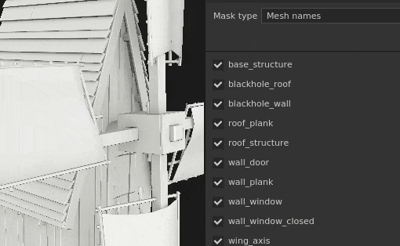
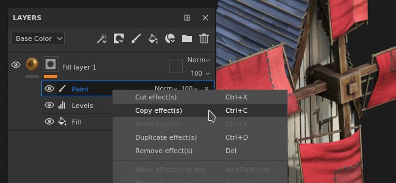
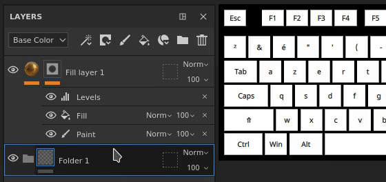
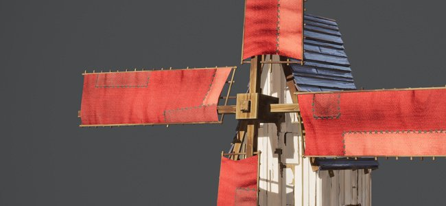
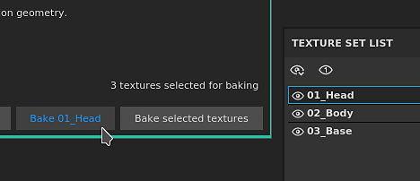
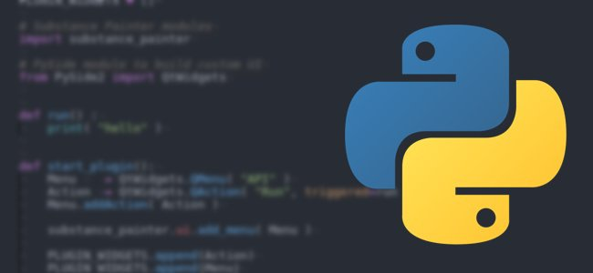

# 版本2021.1 (7.1.0)

**Substance Painter2021.1 (7.1.0)**&#x200B;引入了多项新功能和改进，如几何蒙版以及图层堆叠中的效果复制和粘贴。

版本数据： *2021年1月28日*

>[!NOTE]
>
> 此版本将Ubuntu和MacOS支持的最低版本分别提高到18.04和10.14。 有关详细信息，请参阅[技术要求](../../getting-started/system-requirements.md)。

## 主要功能

### 新几何形状蒙版

几何蒙版是图层堆叠中的新蒙版工具，允许根据网格名称或UV 平铺隐藏几何形状。 它是以前命名的UV 平铺蒙版的演变，根据UDIM数遮蔽了几何图形。

与常规绘画（或使用[多边形填充](../../painting/tool-list/polygon-fill.md)时）相比，此新工具是蒙版几何的更好方法，因为它受益于多种引擎优化。 它也是非破坏性的，因为它不存储几何信息（如脸部或顶点），而仅存储网格名称或UV 平铺编号，因此重新导入网格不会损坏蒙版。 另一个好处是，隐藏几何允许在纹理集内之前不可访问的表面上绘画，这避免了例如将对象分割为多个纹理集的需要。

* **在图层上新建几何蒙版**\
  几何蒙版可在[图层堆叠](../../interface/layer-stack/layer-stack.md)中的任何图层上自动使用。 默认情况下，它没有任何效果，表示图层完全可见。\
  几何图形蒙版有自己的上下文菜单，可用于快速选择或取消选择其所有项目，还可以将其值复制到另一个图层。

  

  

* **编辑几何图形蒙版属性**&#x200B;几何图形蒙版遵循与其他图层的上下文相同的逻辑（如编辑蒙版或实例化属性）。 要进入几何蒙版编辑模式，只需单击图层右侧的虚线方块即可。 要退出几何图形蒙版，请单击同一图层的内容或绘画蒙版。

  

* **按网格名或UV 平铺进行蒙版**\
  几何蒙版属性的顶部是一个控制蒙版模式的下拉菜单。 可以按UV 平铺号或按网格名称来选择蒙版。 仅当项目不使用网格工作流程时，此下拉列表才会被禁用并设置为“UV 平铺名称” 。

  

* **通过属性设置几何蒙版**\
  在编辑几何图形蒙版时，属性窗口将根据与当前纹理集相关的几何图形显示网格名称（或UV拼贴）的列表。

  * 该列表上方的数字表示在可用的总量中，未遮盖的网格/UV磁贴数。
  * 数字旁边的菜单提供快速控件，可选择所有项目或不选择任何项目，甚至可反转当前选区。
  * 下面的列表定义了哪些项目被蒙版或不被蒙版。 与应用程序中的其他列表一样，可以单击并拖动以同时启用/禁用多个项目，也可以使用&#x200B;**按住ALT键并单击**&#x200B;来隔离项目。

   

* **通过视口添加蒙版几何**\
  几何蒙版选区也可以在2D和3D视图中更改。 只需将鼠标移至应可见/隐藏的零件上，然后单击它以切换其状态。 在编辑几何图形蒙版时，蒙版几何图形会显示为灰色和对角线效果。 也可以通过单击并拖动一次选择多个项目来执行矩形选择。\
   

* **绘制隐藏/无法访问的几何图形。**\
  在几何图形蒙版中选择要遮盖的几何图形后，可以启用视口顶部的&#x200B;**隐藏/忽略排除的几何图形**&#x200B;按钮（或按&#x200B;**ALT+H**&#x200B;快捷键）。 启用后，将隐藏排除的几何（以及其他纹理集），以仅显示当前图层包含/可绘制的几何。 此选项允许绘画之前被阻止或无法访问的区域。 此选项也适用于任何类型的图层。

  >[!NOTE]
  >
  > 使用蒙版几何形状绘画将保持动态状态：如果某些阻止绘画的几何形状在画笔描边制作时最初处于隐藏状态，然后被取消蒙版，则会再次阻止之前制作的画笔描边。

  

### 新的图层堆叠效果复制和粘贴

现在，可以在图层和图层堆叠之间复制效果，方法与常规图层相同。

现在可以选择多项，并且提供一次复制和粘贴多个效果的可能性。

为方便起见，在图层上从蒙版复制或移动效果时，如果没有蒙版，则会自动添加效果。 这是因为图层内容和蒙版中的效果彼此不兼容。 这意味着将效果从蒙版复制到图层的内容将自动切换到蒙版（或创建一个）。

* **通过上下文菜单复制和粘贴**\
  右键单击图层堆叠中的任何效果，然后选择剪切或复制操作。 然后在任意图层上再次右键单击，选择“粘贴”以移动或创建所需效果的副本。 我们还借此机会重新制作上下文菜单，并允许访问更多功能：

  

* **使用键盘快捷键复制和粘贴**\
  与任何图层相同，键盘快捷键&#x200B;**CTRL+C**（复制）/**CTRL+X**（剪切）和&#x200B;**CTRL+V**（粘贴）可用于根据当前选区复制效果。 与图层一样，效果也会插入到当前选区的上方。

  

* **使用键盘快捷键快速复制效果**\
  使用&#x200B;**CTRL+D**&#x200B;复制当前选区，或在拖动&#x200B;**任何效果时按住** ALT键以将其复制到所需位置：

  

* **跨图层移动效果**\
  除了复制和复制之外，现在还可以通过将效果从一个图层拖放到另一个图层来移动效果：

  

### 新增的一般功能和改进

此版本中进行了一些改进：

* **为每个UV 平铺添加描述**\
  现在可以通过“UV 平铺列表”为每个纹理集添加描述。 这使得项目更易于导航，尤其是在导出和烘焙时，因为这些上下文中也可以看到描述。\
  要添加或编辑描述，只需单击“UV 平铺列表”窗口中的纹理集，然后进入“纹理集设置”窗口进行编辑即可。

  

   

* **新建图层堆叠缩略图**\
  优化的图层堆叠缩览图已得到改进。 现在会为填充图层显示材料球体，即使在使用[UV 平铺](../../features/uv-tiles/uv-tiles.md)工作流程时，也可以更轻松地导航和查看每个图层的主要属性。 缩览图是根据图层信息生成的，但不考虑效果，以免重新计算过于频繁。

  

* **图层堆叠中改进的几何蒙版退出**\
  事实证明，退出“几何形状蒙版”（以前称为“UV 平铺蒙版”）对于图层堆叠中的文件夹来说很困难，因为它没有蒙版。 这是因为除了选择另一个图层之外，没有其他上下文可供打开。 现在可以单击文件夹缩览图以退出“几何图形蒙版”。 在编辑几何蒙版时，也可以将材料或智能材质从工具架拖放到视口中。

  

  

* **在烘焙窗口中按住Alt键单击新选区**\
  现在，可以通过&#x200B;**按住Alt并单击鼠标**&#x200B;隔离烘焙窗口中的网格图列表，以隔离要烘焙的特定映射，而不必手动排除它们。 相同的快捷键可用于重新启用所有网格图。

  

* **“新建烘焙当前纹理集”按钮**\
  烘焙窗口的底部添加了一个新按钮，可以快速轻松地重新烘焙纹理集。 使用此按钮不会影响以前定义的自定义选择，而是烘焙整个纹理集（包括其所有UV 平铺，如果有的话）。

  

### 新Substance 引擎更新

该Substance 引擎已更新到版本8，以支持最新的Substance文件格式及其功能。

有关新Substance 引擎功能的更多详细信息，请查看[此文档页面](https://helpx.adobe.com/substance-3d/unlisted/documentation/sddoc/version-2020-2-10-2-0-200574252.html)。

### 新的Nvidia RTX 3000Iray支持

[Iray渲染器](../../features/iray-renderer/iray-renderer.md)已更新到最新版本，现在支持新的Nvidia Ampere GPU（RTX 3000系列和Quadro A系列）。

>[!NOTE]
>
> 此次更新后，不再支持Kepler GPU（GeForce 600和700系列），将改为在CPU上进行Iray渲染。

### 新内容

此版本中添加了三种新的缝合工具，可用于创建复杂的图案和逼真的缝合。 要查找它们，只需转到该工具架的“工具”部分并查找以下内容：

* 缝合复杂
* 缝合交叉接缝
* 笔直缝合

建议在上下文工具栏中激活[延迟鼠标](../../painting/lazy-mouse.md)功能，以提高绘画缝合的品质。

以下概述这些新工具中包含的所有预设：

{width="800px"}

### 新的Python功能

Python API收到了几项新功能。 为了便于理解和学习API，还对该文档进行了重新设计，尤其是其示例。

* **资源和工具架管理**\
  资源模块已改进，现在可以：
  * 创建和管理工具架。
  * 在工具架和项目中搜索或导入资源。
  * 了解是否正在对工具架进行爬网（从而了解资源何时可以使用）。
  * 将自定义缩略图分配给工具架中的资源。

* **UV 平铺信息**\
  现在可以查询纹理集的UV 平铺列表。 这样就有可能创建特定范围UDIM 平铺（例如）的自定义导出。

* **项目版本状态**\
  添加了一个新的函数和事件，以了解是否可以编辑项目。 这对于了解计算是否正在进行以及是否无法修改项目的属性非常有用。

>[!NOTE]
>
> Python API文档可从应用程序的帮助菜单访问。

## 教程

以下是我们的视频教程，其中介绍了新增功能：

## 发行说明

### 2021.1

*（2021年1月28日发布）*\
摘要：**主要版本、允许选择和绘画部分几何形状的新几何蒙版、图层堆叠中的复制/粘贴效果、UV 平铺工作流程改进、Iray、Baker、Substance 引擎和新内容的更新**

**已添加：**

* 新的几何图形蒙版并绘画几何图形的选定部分
* [几何图形蒙版]允许按网格名称绘画几何图形的选定部分
* [几何蒙版]两个视口中的矩形选区
* [几何蒙版]允许隐藏/忽略任何图层上的已排除几何形状
* [几何蒙版][属性]单击并拖动复选框即可快速选择
* [几何蒙版][属性][UI]在属性窗口中通过下拉菜单包含/排除所有内容
* [几何图形蒙版][属性]允许按ALT +左键单击快速选择列表中的项目
* [几何蒙版][属性]在“属性”窗口中悬停在视口名称/网格上时，叠加UV 平铺
* [几何图形蒙版][图层堆叠]将复制/粘贴选项添加到几何图形蒙版
* [几何蒙版]“隐藏/忽略排除的几何图形”按钮的新图标
* [几何蒙版]用于隐藏/忽略已排除几何的新工具提示
* [几何图形蒙版]键盘快捷键ALT+H可打开/关闭“隐藏忽略排除的几何图形”按钮
* [UV拼贴][图层栈栈]适用于UV拼贴和简化模式的新填充图层球面预览缩览图
* [UV磁贴][图层栈叠]允许轻松退出UV磁贴蒙版
* [UV拼贴][纹理集列表]允许为每个UV拼贴提供描述
* [UV拼贴][纹理集设置][UI]下拉菜单中新增了两个章节标题，用于更改UV拼贴分辨率
* [UV拼贴][视口]将素材拖入视口时退出UV拼贴蒙版
* [图层栈栈]添加效果的复制/粘贴选项
* [图层栈栈]允许将效果从一个纹理集复制/粘贴到另一个纹理集
* [图层栈栈]允许多选效果
* [图层栈栈]添加复制/粘贴选项作为图层效果的快捷方式
* [图层栈栈]将效果拖动到另一个图层时，自动在蒙版和内容之间切换
* [图层栈栈]从其他图层粘贴蒙版时自动创建蒙版
* [图层栈栈]在效果的上下文右键单击菜单中添加移动效果操作
* [图层栈栈]允许将效果从一个图层拖放到另一个图层
* [图层栈栈]将项目拖到文件夹上时，这些项目会放在文件夹的顶部
* 将Iray更新到版本2020.1.0
* [Bakers]将Bakers更新到2.5.4版
* [烘焙]在烘焙进度窗口中显示单个UV磁贴
* [烘焙][UI]允许使用新按钮快速烘焙当前的纹理集
* [烘焙师]允许用户按住ALT键并单击左键快速选择烘焙师之一
* 将Substance 引擎更新到8.0.8版
* [Substance 引擎]支持新.sbsar文件中的默认颜色
* [自动展开]性能改进
* [导出]添加可视反馈，指出哪个UV图块的分辨率与项目默认分辨率不同
* [导出]将场景大小因子添加到导出的着色器json文件中
* [语言]添加日语翻译
* [UI]更新具有内部依赖项版本化的“关于”窗口
* [脚本][Python]允许管理Shelf资源
* [脚本][Python]允许了解项目何时准备好进行烘焙和导出
* [脚本][Python]允许知道托架何时完成对磁盘上的资源的搜索
* [脚本][Python]允许查询每个纹理集的UV磁贴列表
* [脚本][Python]允许将自定义预览分配给Shelf资源
* [脚本][Python]允许管理自定义书架
* [脚本][Python]在文档中的每个子模块中添加方法索引
* [脚本][Python]文档的新样式
* [脚本][Python]资源和Shelf文档的改进
* [内容]三个用于制作拼接的新工具预设
* [托架]过渡到新的Substance share平台时暂时删除“导出到Substance share”

**已修复：**

* 使用具有不同分辨率的监视器时崩溃
* 与某些罕见项目Substance 引擎时崩溃
* 切换图层时，视口刷新失败，显示“隐藏/忽略排除的几何”
* [2D视图]某些项目上可能缺少2D视区
* [烘焙] “按网格名称匹配”忽略对象的某些部分
* [图层栈栈]单击图层效果可打开文件夹
* [几何蒙版]即使重新导入没有蒙版的网格，UV拼贴也仍会在蒙版中计数
* [几何图形蒙版]视区中的右键单击菜单无法提供正确的工具
* [引擎]特定项目严重滞后
* [脚本] Windows上的远程JSONPOST请求具有高延迟
* [Linux]使用特定的集成GPU时无法正确检测到Vram数量
* [自动展开]某些项目发生崩溃或长时间展开
