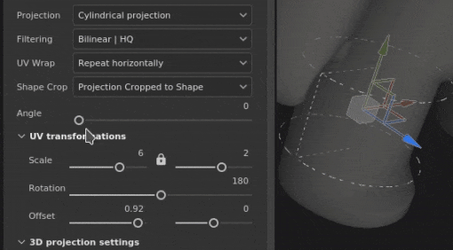
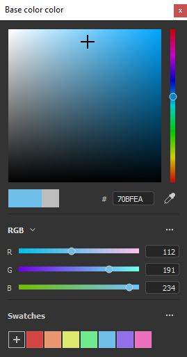
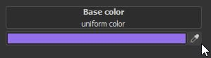

# 版本7.3

**Substance 3D Painter 7.3**&#x200B;为填充图层带来了使用新的变形和圆柱投影为网格添加纹理的新方法。

发行日期： *13 2021年10月*

## 主要功能

### 新建变形投影

此版本为填充图层和填充效果引入了新的3D变形投影。 此投影允许借助变形网格和可控制点来扭曲纹理或图像。

* **通过拖放进行快速设置**&#x200B;从“资源”库中选择素材、Alpha、纹理或过程，并将其拖放到网格的所需部分（快捷键&#x200B;**ALT**&#x200B;是素材所必需的）。 如果您的资源不是素材，则会弹出窗口询问您想要将其分配给哪个渠道。\
  创建图层后，您将看到自动选择新的&#x200B;*变形投影*。 图层具有标准3D投影模式控件，但也有新参数&#x200B;*投影深度*，允许设置变形投影的深度（用绿色箭头表示为视觉队列）。\
  您还可以在任何填充图层或效果上手动选择此投影模式，而无需将资源拖放到视区中。

  

* **使用曲面工具自动放置**&#x200B;新建变形图层后，您将看到将自动选择曲面工具。 这允许您移动图像，使其始终保留在网格表面上。 但是，您始终可以切换到任何其他机械臂并调整其平移（快捷键&#x200B;**W**）、旋转（快捷键&#x200B;**E**）或缩放（快捷键&#x200B;**R**）。 若要返回到曲面工具，请使用快捷键&#x200B;**SHIFT + W**。切换到&#x200B;*编辑顶点*&#x200B;模式时，表面工具也是默认选择，它将顶点移动捕捉到网格的表面。 但是，您可以通过&#x200B;**保持CTRL**&#x200B;来临时和快速覆盖曲面工具，这样您就可以沿任意方向移动选定点，而不仅仅是在曲面上。

* **可轻松编辑的变形网格**&#x200B;一旦图像的全局放置完成，也可以编辑变形网格本身，以实现更高的精度和灵活性。 要进入网格编辑模式，您可以使用新添加的变形菜单或快捷键&#x200B;**SHIFT + V**。这将允许编辑网格的现有顶点。\
  您可以将网格作为一个整体均匀地再划分，但请记住，如果您之前移动过顶点，则这些顶点将被重置为其原始位置。 网格细分可通过新的变形选项菜单来完成。\
  或者，可以添加单独放置的分割，这将允许仅在需要时才有更详细的细节。 要添加拆分，请在变形菜单中选择三个选项中的任意一个：交叉、水平或垂直。 选择其中一个时，将光标悬停在“变形”投影上，然后单击其中的任意位置将添加新的拆分。 这不会改变现有点的位置。

  
* **自动调整顶点方向**&#x200B;默认情况下，单个顶点的切线会调整到网格的曲面，这意味着无论将它们拖动到何处，它们始终会相对于网格正确定向。 此自动切线选项可通过上下文工具栏中的新按钮关闭，在这种情况下，方向将始终保持固定。

  

有关变形投影的设置和属性的详细信息，请参阅[专用文档页面](../../painting/fill-projections/warp-projection.md)。

### 新圆柱投影

此版本为填充层和填充效果添加了一种圆柱投影方法。 新的投影允许将图像或纹理贴合在诸如柱子、柱子之类的对象周围，或诸如角色手臂之类的更有机的形状周围。

* **在网格周围绕排图像**\
  通过使用填充图层或填充效果并在“投影”下拉菜单中选择&#x200B;*圆柱投影*，您可以轻松地将图像环绕圆柱表面。 如果不需要在投影Gizmo之外重复图像，则需要在“*形状裁剪*”中为“*UV环绕*”选择“*无*”以及“*裁剪为形状*”，以确保图像不会超出边界。 然后，只需要使用机械手将投影调整到所需的位置。

* **调整投影角度**\
  一旦图像准备就绪，即有新的“角度”设置可用。 此设置可用于调整图像是围绕圆柱形状一直投影，还是限制为某个角度。 它不会裁剪图像，但会减小其宽度。

  

有关详细信息，请参阅[专用文档页面](../../painting/fill-projections/cylindrical-projection.md)。

### 改进的拾色器

此版本改进了拾色器的几项生活质量。

* **新窗口布局**\
  重新设计了改进的拾色器窗口，以适应更垂直的布局，与Sampler的最新版本类似。 主要分为三个部分：主色域，包括当前和最后的选择、十六进制域、滴管和色相滑块；手动RGB/HSV滑块部分；以及色板。\
  

* **新的0-255RGB值**\
  除了移植现有输入颜色值的方法之外，改进的拾色器还允许处理0-255RGB值。 在滑块部分下拉菜单中取消选中&#x200B;*浮点值*&#x200B;时，此选项可用。

  
* **存储颜色色板**\
  颜色色板现在可以保存在Painter中！ 选择所需颜色后，可以按拾色器“Swatches”（色板）部分的“Plus”（加号）按钮，该颜色将存储在各个会话和项目中。 通过右键单击某个色板，可以清除该色板，或者可以通过此部分的下拉菜单同时批量删除所有色板。 可以保存的色板数量不受限制。

  
* **拾色器窗口仍然打开**\
  现在可以将拾色器窗口四处移动并放置在任意位置，甚至可以将它放在不同的屏幕上，并且只要没有上下文开关，它就会保持打开状态，这意味着当您在手绘纹理时在绘画图层之间切换时，可以将拾色器窗口保持打开状态以便于访问。

  

* **更易于使用的滴管**\
  现在，可以直接在色域旁边找到拾色吸管，但您仍然可以在拾色器中找到它。 更易于使用的滴管会保留所有以前的功能 — 您仍然可以单击并按住以从屏幕上的任何位置选取颜色。 可以在Painter中所有颜色字段的旁边找到此外露的滴管，而不仅仅是图层通道。

  

有关详细信息，请参阅[专用文档页面](../../interface/color-picker.md)。

### 其他功能和改进

* **资源拖放改进**\
  随着“变形”的引入，在保持ALT不变的情况下，可以从库中将资源拖放到视区的贴花功能也进行了一些重新处理。 现在，以这种方式创建贴花时，已不再使用“平面”投影，而使用“变形”投影。 自动选择“变形”投影可提高网格上贴花调整的速度和效率。\
  此外，现在不仅可以将素材，还可以将图像类型资源拖放到视区中。 当选择Alpha、纹理或过程时，无需使用ALT功能键。 可以将其拖放到网格上，这将提示一个菜单，该菜单提供选择是否应在蒙版或图层任何通道中使用此图像的选项。

  

* **自动保存增效工具改进**\
  在更长或更重的操作（如网格重新加载、烘焙或导出）期间，将不再触发自动保存功能。

* **性能改进**\
  对滑块操作和绘画性能进行了维护和优化。

* **Python API中的新函数**\
  Python API最近添加了一些功能，这些功能允许重新加载网格、更新资源以及通过脚本设置和查询UV磁贴的分辨率。

* **Substance引擎更新8.3.0**\
  除了一些修复和常规改进之外，此Substance引擎更新现在还考虑了新的图形类型。 也可以验证.sbsar文件版本，这应会改进适当Substance 3D Assets版本的使用和下载。

* **从CC桌面接收Substance 3D Assets**\
  现在可以从CC桌面应用程序访问素材、地图集和贴花等Substance 3D Assets。 此外，它们还可以直接发送到Painter Library。

## 发行说明

### 7.3.0

*（2021年8月13日发布）*\
摘要： **主要版本。 它包含新的3D变形投影、新的圆柱投影、拾色器的改进、Python API中的新功能和错误修复**

**已添加：**

* [投影][变形]将3D变形公开为新的投影模式
* [投影][变形]允许在视区中拖放贴花模式以用于Alpha、纹理和过程
* [投影][变形]使用带有贴花快捷键的变形投影(ALT)
* [投影][变形][工具栏]将变形作为整体或按顶点进行
* [投影][变形][工具栏]使用拆分变形横向、水平或垂直选项添加网格点
* [投影][变形][工具栏]用于重置操作的专用菜单
* 移动点时自动调整切线的[投影][变形][工具栏]选项
* [投影][变形][工具栏]网格版本的专用菜单（大小、重置、颜色和手柄大小）
* [投影][变形]切换全顶点变形版本模式的新键盘快捷键(SHIFT+V)
* [投影][变形]按住Click + Ctrl允许在曲面工具和其他工具之间切换
* [投影][圆柱]显示圆柱投影模式
* [投影][工具栏]组操纵器设置（大小、网格步长、角度步长）
* [拾色器]新的拾色器UI
* [拾色器]在拾色器构件中使用sRGB值
* [拾色器]允许保存和删除色板
* [拾色器]可通过颜色和常规插槽访问吸管
* [拾色器]允许编辑0到255值之间的动态颜色
* [拾色器]使HSV/RGB状态在应用程序中通用
* [拾色器]拾色器窗口是半持久的
* [拾色器]按Esc键可关闭拾色器窗口
* 提高了用户界面交互和绘画时的性能
* [引擎]更新到新的Substance引擎版本(8.3.0)
* [脚本][Python]允许重新加载当前项目的网格
* [脚本][Python]允许更新项目中的资源
* [脚本][Python]允许设置和查询UV磁贴的分辨率
* [互操作性]不适用于Steam和Substance版本
* [互操作性]从Bridge接收多个资源

**已修复：**

* 拾色器未显示正确的颜色
* [烘焙]纹理集列表未正确排序
* [FBX导入]未考虑3ds Max组透视变换
* [Substance 引擎]导入损坏的SBSAR时发生崩溃
* [MacOS]不同语言的项目配置选项不存在
* 自动保存功能可能会在较长的过程中冻结Painter

**已知问题：**

* [投影][变形]拆分完成后，“拆分”选项保持选中状态
* [投影][变形]当变换设置为世界空间时，“翻转”不起作用
* [投影][变形]在极少数情况下，曲面之间会出现伪影线
* [投影][UV]翻转投影时旋转点重置
* [Mac M1]智能素材无法正确显示
* [M1][回归]材质图层不起作用
