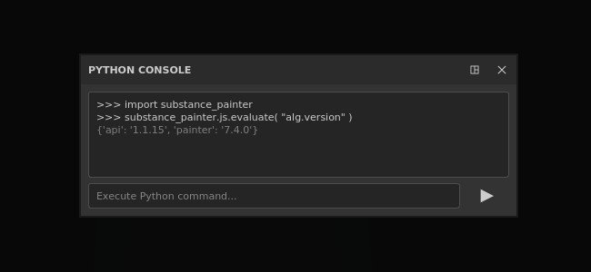

# 版本7.4

**Substance 3D Painter 7.4**&#x200B;通过引入新的色彩管理工作流程，增加了对OpenColorIO的支持。

发行日期： *2021年11月24日*

## 主要功能

### 全新色彩管理

此版本引入了支持[OpenColorIO](https://opencolorio.org/)（简称OCIO）版本2的色彩管理。

这一新的工作流程允许管理和校准从导入到导出以及视口内的颜色，从而更轻松地匹配不同应用程序之间的任何内容。

* **项目设置**\
  创建新项目时，现在可以启用色彩管理。 现有项目也可以通过项目设置启用色彩管理。\
  要启用色彩管理，请从&#x200B;**旧版**（默认）切换到&#x200B;**OpenColorIO**，然后使用默认配置之一或自定义配置。

  {width="400px"}

* **视口显示设置**\
  2D和3D视图的顶部有两个色彩管理控件：\
  **颜色按钮**：启用或禁用视区的颜色转换。\
  **显示变换下拉列表**：选择用于转换颜色的显示变换。

  {width="500px"}

* **拾色器设置**\
  启用色彩管理后，拾色器将提供新控件。 颜色可在配置指定的工作色彩空间中编辑。\
  在HSV/RGB滑块下方显示最终颜色值，该值从工作空间转换为显示色彩空间。

  

  

* **导入具有自定色彩空间的位图和Substance素材**\
  专用设置可用于指定应如何处理资源，包括应如何解释Substance素材输出。\
  还可以通过解析资源文件名来了解该资源使用的色彩空间。

  

* **导出设置**\
  导出纹理时，色彩管理的通道将在它们的文件名中显示借助新关键字&#x200B;**$colorSpace**&#x200B;使用的色彩空间的名称。

  {width="250px"}

  

>[!NOTE]
>
> 要详细了解应用程序内色彩管理的工作方式，请参阅[专用页面](../../features/color-management/color-management.md)。

### 新的2D和3D视口卸除

现在，可以取消停靠2D和3D视图，以将其移动到其他位置。 例如，将3D视图置于主屏幕上，而2D视图置于另一个屏幕上。

使用非停放视图可以更轻松地组织应用程序版面，并在不损失太多绘画区域的情况下密切关注事物。

* **取消停靠视图**\
  要取消停靠视图，只需打开视图菜单，然后选择两个选项之一。 每个选项都会打开一个新窗口，其中视图位于该窗口内，而其他视图则停放在主界面内。

  

* **甚至与未停靠视图交换**\
  取消停靠视图时，可使用视图菜单中的交换操作来交换它们。

  {width="500px"}

* **与色彩管理兼容**\
  非停放视图具有自己的色彩管理显示变换，因此可以更轻松地在不同的显示器中进行管理。

  {width="500px"}

### 3Dconnection对SpaceMouse®的新支持

**SpaceMouse®**&#x200B;是一款3D连接设备，允许以更直观、友好的方式操作3D视口摄像机。 现在，它支持通过Painter直接即插即用。

有关详细信息，请参阅专用的[文档页面](../../features/spacemouse-by-3dconnexion.md)。

>[!NOTE]
>
> * 适用于7.4.2及更高版本。
> * 确保安装最新的SpaceMouse®驱动程序，以受益于Painter控制方案。

### 新内容

已将一组新资源添加到应用程序可用的默认内容：

* 新贴花、工具预设和滤镜（由&#x200B;**Kay Vriend**&#x200B;创建）：
  * **贴花**
    * 平直的疤痕
    * 普通袖珍补丁
  * **预设**
    * 拉链高级磁带
    * 拉链高级停止
    * 拉链高级滑块
    * 紧绳花边
    * 收紧绳眼套
    * 金星闪烁
    * 闪亮派对
    * 闪亮点蜡笔
  * **生成器**
    * 膨胀收缩/环绕

* 新污渍位图（由&#x200B;**Emiel Sleegers**&#x200B;创建）：
  * 污渍石膏漆
  * 污渍石膏已淡化
  * 污渍油漆已脱落
  * 污渍湿度
  * 污渍绒毛
  * 污渍Cobweb
  * 污渍笔
  * 柔和污渍木
  * 污渍纸被撕破
  * 深处污渍破裂
  * 污渍拉丝Dust

### 改进的自动UV解卷

UV自动展开功能已更新，新增了一个可改善对具有扩展曲面的3D模型的支持的新选项。

名为&#x200B;**避免拉长的UV 岛**&#x200B;的新设置通过拆分可能太长的UV 岛来更好地利用UV空间。

以下是未使用新设置与使用新设置的示例：

{width="500px"}

### 改进了Python脚本

Python API提供了一种允许调用Javascript API的新方法。

通过这种新方法，可以更轻松地向新Python API迁移旧插件。 它还解锁了一些尚未在Python中公开的功能，如&#x200B;**烘焙**&#x200B;和&#x200B;**着色器**&#x200B;管理。

若要从Python运行Javascript命令，请从新的&#x200B;**js**&#x200B;子模块中使用&#x200B;**evaluate()**&#x200B;函数。 有关详细信息，请参阅API文档（通过应用程序的“帮助”菜单获得）。

## 发行说明

### 7.4.2

*（2022年3月8日发布）*

**已添加：**

* [SpaceMouse][Windows]支持3D视口中用于导航的3D连接SpaceMouse
* [SpaceMouse][Windows] 3D视口中Pro和Enterprise SpaceMouse模型的基本快捷键/键
* [SpaceMouse][Windows] 3D视口中的专用旋转中心图标
* [色彩管理]使用OCIO配置中的角色更改默认设置
* [色彩管理]颜色管理颜色构件的属性窗口
* [色彩管理]对材质预览的属性窗口进行色彩管理
* [色彩管理]拾色器中的色彩管理色板
* [色彩管理]添加用于定义标准sRGB色彩空间的设置
* [色彩管理]从拾色器显示选择器列表中的OCIO配置添加标准sRGB色彩空间
* [色彩管理]改进了色彩空间覆盖菜单
* [色彩管理]允许在“显示设置”中覆盖环境映射色彩空间
* [色彩管理]根据当前显示器绘制拾色器渐变
* [色彩管理]在颜色编辑器中默认固定HDR值
* [色彩管理]在旧版模式下对滤镜使用直通模式（无色彩空间）
* [色彩管理]限制颜色编辑器中显示的渐变以匹配[0-1]范围
* [色彩管理]在旧版模式下在拾色器中隐藏显示选择器
* [色彩管理]使拾色器十六进制字段始终位于sRGB色彩空间中
* [色彩管理]禁用数据通道的拾色器显示下拉列表
* [优化]变形网格仅重新计算覆盖的UV磁贴
* [导出]允许导出Sketchfab、USD和glTF的UV磁贴项目
* [脚本][Python]允许更改色调映射函数

**已修复：**

* [Sketchfab]更新现有模型最终将创建新模型
* [Sketchfab]搜索先前更新的模型时崩溃
* 导出为美元时崩溃
* 在几何图形蒙版中创建新的着色器实例时或在几何图形处于隐藏状态时崩溃
* [导入资产窗口]更改导入的资源类型时崩溃
* 在图层栈叠中使用时，会反转常规网格图
* [Substance]未将用户数据混合模式考虑在内
* [色彩管理]文件名中包含色彩空间的位图将作为UV拼贴序列导入
* [色彩管理]色彩图表的Substance管理输出在错误的色彩空间中
* [色彩管理]多边形填充工具显示错误的颜色
* [色彩管理] ACES调色板应用于处于独奏模式的通道
* [色彩管理]工具预览球面光照不进行色彩管理
* [色彩管理][导出]转换后的映射应用不正确的转换
* [脚本][Python][色彩管理]使用模板和OCIO环境变量创建的项目处于旧模式
* [脚本][Python]启动时无法使用JavaScript评估函数
* [3DAdobe版优惠]使用区域设置时，无法启动Painter，因为默认情况下不支持这些语言

**已知问题：**

* macOS不支持3D连接空格鼠标
* [UI]在某些情况下，新项目窗口中会显示带有色彩管理的水平滚动条
* [烘焙师]“平均法线”设置在UV磁贴项目中不起作用
* [Mac M1]智能素材无法正确显示
* [色彩管理]在投影模式下使用的资源在叠加中不受色彩管理

### 7.4.1

*（2021年12月14日发布）*

**已添加：**

* [色彩管理]在导出的文件名中使用数据角色
* [色彩管理]在新建项目和项目设置窗口中选择OCIO时，默认展开色彩管理部分
* [色彩管理]在旧模式下添加ACES调色板
* [色彩管理]调整默认配置设置
* [色彩管理][导出]在数据通道的文件名中填充$colorSpace
* [导出]将UV磁贴项目导出到Stager
* [互操作性]不适用于Steam和Substance版本
* [互操作性]允许将UV磁贴项目发送到Stager

**已修复：**

* [MacOS][崩溃] Painter不以Catalina开头
* [色彩管理][崩溃]在用户通道上播放数据类型/色彩管理时出现随机崩溃
* [色彩管理]在蒙版显示色彩空间新菜单中用作灰度的资源
* [色彩管理]在旧版模式+单独视图中，用户通道在视区中较暗
* [色彩管理]在iRay中使用时，环境映射始终是线性的
* [色彩管理]在旧版模式下，拾色器未为数据通道选择正确的值
* [色彩管理]在旧版模式下，拾色器在Substance内部损坏
* [色彩管理]使用下拉菜单时，在视区中的单独通道视图之间切换时会显示正确的色彩空间
* [色彩管理]在旧模式下，导出对色彩管理的用户通道应用错误的转换
* 切换回材质视图时，不显示以单独视图蒙版绘制的描边
* [导出]转换后的映射无法导出为色彩管理的通道
* [纹理集]重命名的用户通道上缺少具有原始名称的工具提示
* [Steam]使用Steam检查文件完整性时文件丢失

**已知问题：**

* [Mac M1]智能素材无法正确显示

### 7.4.0

*（2021年11月24日发布）*

**已添加：**

* [色彩管理]支持色彩管理OpenColorIO版本2
* [色彩管理]将色彩管理设置添加到项目设置
* [色彩管理]打开项目时显示有关色彩管理配置更改的警告窗口
* [色彩管理]如果选择了无效的OCIO配置文件，则显示错误消息
* [色彩管理]允许使用OCIO环境变量覆盖配置
* [色彩管理]默认情况下，多个OCIO配置与应用程序集成
* [色彩管理]从导入的位图文件名中提取色彩空间名称
* [色彩管理]允许在“属性”窗口中用配置中的一个色彩空间覆盖色彩空间
* [色彩管理]在纹理集设置中添加色彩管理选项
* [色彩管理][视口]允许分别对2D和3D视图进行色彩管理
* [色彩管理]加载环境映射并将其转换为工作色彩空间
* [色彩管理]使用当前色彩空间调整拾色器和编辑器
* [色彩管理]允许使用新的下拉菜单选择视区中的显示变换色彩空间
* [色彩管理]应用显示变换和光线渲染结果
* [色彩管理]导出具有不同色彩空间的纹理
* [色彩管理][Python]将环境变量(OCIO)中的色彩管理设置应用于新项目
* [视区]允许取消停靠2D或3D视区
* [自动展开]避免拉长岛的新选项
* [脚本Python]从Python API调用JavaScript函数
* [新建项目窗口]使导入的映射部分可折叠
* [投影][变形]允许在“变形”设置中将法线隐藏为一个选项
* [内容] 11个新污渍地图
* [内容] 8个新工具预设（拉链、拧紧线、闪烁）
* [内容] 8种新材料（伤疤、口袋……）
* [内容] 1个新生成器（膨胀收缩变形）

**已知问题：**

* [Mac M1]智能素材无法正确显示
* [色彩管理][崩溃]在用户通道上播放数据类型/色彩管理时出现随机崩溃
* [色彩管理]在旧版模式下，拾色器未为数据通道选择正确的值
* [色彩管理][射线]在视区中激活色彩管理时，以EXR或TIFF格式保存渲染，将始终以线性格式保存
* [色彩管理]在蒙版中用作灰度的资源显示错误的色彩空间菜单
* [色彩管理][Iray]在Iray中使用时，环境映射始终是线性的
* [色彩管理][导出]转换后的映射无法导出为色彩管理的通道
* [色彩管理][导出]忽略用户通道是否使用旧版模式进行色彩管理
