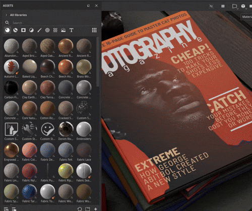
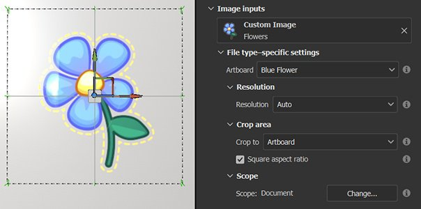
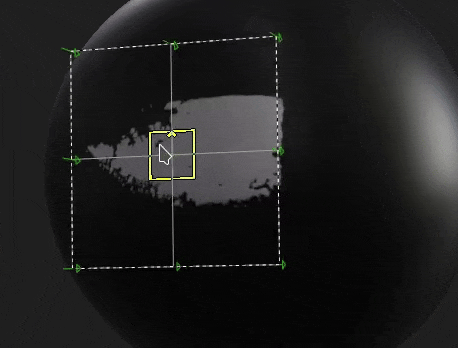

# 版本10.0

<b>Substance 3D Painter 10.0</b>提供了对Illustrator (.ai)文件的支持、集成了Substance 3D Assets、通过文本资源导入字体、在Python API中添加图层栈叠功能以及几项生活质量改进。

发行日期： *2024年5月16日*

## 主要功能

### 新建文本资源

此新版本引入了<b>文本资源</b>，它是一种加载字体文件以在不同上下文（画笔、填充投影、Substance图像输入等）中写入文本的方法 来装饰你的纹理。

* <b>在“资源”窗口中浏览您的字体</b>\
  字体现在会在“资源”窗口中在其自己的过滤器下列出。 它们从操作系统上的不同位置（以及库）收集。

  
* <b>像拖放任何其他资源一样拖放字体</b>\
  字体可以像任何其他类型的资源一样用作文本资源。 拖放它们可自动创建填充投影。 它们还可用于画笔中，或作为Substance过滤器的输入。

  
* <b>文本资源参数</b>\
  创建文本资源时，您可以微调一些参数来调整文本的外观：垂直和水平对齐、自动或手动大小、行距和字符间距、颜色等。

  
* <b>支持多种字符和功能</b>\
  文本资源支持从右到左书写以及[连字](https://en.wikipedia.org/wiki/Ligature_(writing))。 （要编写非拉丁字符，必须使用兼容的字体。）

  
* <b>导入自定义字体，如常规资源</b>\
  与任何其他资源一样，您可以将自己的字体文件直接导入到库或项目中。 不支持某些类型的字体，有关详细信息，请参阅此[文档页面](../technical-support/workflow-issues/shelf-issues/font-import.md)。

>[!NOTE]
>
> 有关<b>文本资源</b>的详细信息，请参阅[专用文档页面](../painting/text-resource.md)。

### 全新导入Illustrator文件(.Ai)

在支持<b>.svg</b>文件后，此新版本还添加了导入Illustrator文件(<b>.ai</b>)的功能。

* <b>Illustrator (.Ai)文件支持</b>\
  在此新版本中，现在可以在Painter中导入和渲染.ai文件，以便用作画笔、填充投影中的资源或作为Substance图像输入。
* <b>.svg和.ai文件共享公共设置</b>\
  SVG文档和Illustrator文档共享类似的设置，特别是分辨率、裁剪区域和范围选择参数。 这意味着矢量资源可以用类似的方式进行管理。

  
* <b>画板选择</b>\
  Illustrator文档支持画板，使用.ai文件时，还可以通过专用设置在不同画板之间进行选择。

  
* <b>改进了作用域选择</b>\
  在缩略图的支持下，范围选择窗口已得到改进，可以更轻松地浏览和仅选择特定元素。\
  出于性能原因，默认情况下缩略图处于关闭状态，可使用<b>显示缩略图</b>复选框来启用该选项。

  

>[!NOTE]
>
> 当前仅支持在Windows和MacOS上导入Illustrator (<b>.ai</b>)文件。

### 新的Substance 3D Assets集成

有一个新窗口可直接将Substance 3D Assets网站嵌入到Painter中。 通过此集成，您可以更轻松地直接在自己的库中浏览和下载资源。

* <b>新建Substance 3D Assets窗口</b>\
  界面上提供了一个新的停放区以浏览Substance 3D Assets。 如果程序坞不可见且已关闭，则可以在界面右侧的程序坞工具栏中再次找到该程序坞。

  
* <b>下载管理器</b>\
  您可以使用窗口左下方的按钮，通过专用管理器查看当前正在下载的资源。 可能无法下载的资源可以从此列表中再次启动。

  
* <b>轻松查找下载的资源</b>\
  窗口右下角的按钮可打开一个菜单，其中有一些操作可帮助浏览网站，还可以显示是否已下载资源。

  

>[!NOTE]
>
> 首次启动时，需要登录您的帐户以下载资源。 然后缓存此登录信息以供将来使用。

>[!NOTE]
>
> Steam版本中没有Substance 3D Assets坞站。

### Python API中的新图层栈栈模块

此版本将在Python API中添加新的图层栈栈模块。 此API允许您控制项目的图层栈栈，为创建高级图层栈栈插件和自定义工具打开了大门。

* <b>新图层栈栈API</b>\
  新的<b>layerstack</b>模块允许以多种方式控制项目的图层栈栈。 您可以：

  * 查询和设置图层和效果的选择。
  * 创建新图层、文件夹和效果（包括滤镜、锚点等）。
  * 实例化图层。
  * 获取和设置图层和效果的参数，将资源加载到其中。
  * 获取和设置Substance参数。
* <b>范围修改和暂停引擎</b>\
  操纵图层栈栈可能导致长时间计算，这就是为什么我们还会提供从API暂停和取消暂停引擎的可能性（就像在UI中）。 我们还使修改组合在一起成为可能，这既是为了提高性能，也是为了撤消一次多次操作。
* <b>基本色彩管理</b>\
  通过展现图层栈栈，我们需要在API中引入色彩管理的概念。 已添加新的<b>色彩管理</b>模块，用于创建、调整颜色和选择位图的色彩空间。 （此部分API尚未完成，将在未来版本中扩展。）
* <b>查询导出预设信息</b>\
  现在，导出预设显示在我们的API中，允许查询预设列表（预定义预设和自定义预设）。 也可以用与我们现有的导出纹理API类似的格式检索它们的内容。
* <b>前面有新的可能性！\
  </b> API的这一新部分允许执行许多新操作，如保存和恢复图层选区，或更改项目中所有资源的随机植入，例如：

  

>[!NOTE]
>
> 有关API的详细信息，请参阅该应用程序包含的文档（通过<b>帮助>脚本文档> Python API</b>），该文档包含许多代码片段，可帮助用户轻松入门。

>[!NOTE]
>
> 在我们的[在线文档](https://adobedocs.github.io/painter-python-api/)中也可以找到图层栈栈插件的示例。

### 改进的法线图绘画

在此版本中，我们重新设计了普通地图绘画工作流程。 我们特别改变了积累和混合正常画笔图章的方式。 进行此更改是为了解决与绘画流程图相关的问题。

* <b>固定累积问题</b>\
  在正常通道中的区域上方绘制将不再提高饱和度或固定并创建孔洞或伪像。 也不再需要将普通信道切换到RGB32F。

  
* <b>修复了还原断开绘制的描边</b>\
  撤消画笔描边不会再中断其他已绘制的描边。

  
* <b>零Alpha上的透明度</b>\
  使用Alpha值为零的纹理制作的画笔图章现在将绘制为透明。 下面的示例显示画笔图章（左图）与平面投影（右图）的对比。

  

>[!NOTE]
>
> 有关绘画流程图的详细信息，请参阅[文档页面](../painting/advanced-channel-painting/flow-map-painting.md)。

### 改进的变换操纵器

为了增强变换操作器的使用，已经做了一些改进。

* 带有CTRL的<b>精度模式</b>\
  在机械手上拖动时按住Ctrl键现在将进入新的精确模式，从而可以进行更精细的操作。 此更改适用于平移、旋转和缩放操作器。\
  以下是一个在拖动时按住CTRL键前后的示例：

  
* <b>新的缩放行为</b>\
  缩放强度现在基于当前缩放值本身，而不是场景大小。 这使得相对更改更易于执行，尤其是在较小值的情况下。 与精确模式相结合，缩放效果更令人愉快。\
  另一个更改是缩小值，直到0不再变为负值。 这避免了希望缩小投影，然后意外将其翻转的问题。

  
* <b>改进了表面操纵器旋转</b>\
  表面贴花机械手现在在围绕表面拖动时更加稳定。 在来回进行翻译时，它不会增加旋转角度。\
  以下是<b>旧</b>行为与<b>新</b>行为的比较：

  

  
* <b>拖放时相机对齐投影</b>\
  将资源拖放到视区中允许在网格曲面上直接创建变形投影。 此投影之前旋转不正确，现在与相机对齐。

  

此外还增添了一些其他改进，特别是：

* <b>更新的Tile Generator</b>\
  <b>Tile Generator</b>混合模式参数现在可以更改，并将按预期修改结果。 此资源已更新为<b>Substance 3D Designer</b>中可用的最新版本。
* <b>修复了某些滤镜的条带/质量问题</b>\
  多个滤镜在8位精度而不是16位时卡住，导致在使用时会出现条纹/伪像（如直方图扫描或方向模糊）。 此问题现已修复。
* <b>SBSAR输出中的色彩空间</b>\
  启用旧版或OCIO色彩管理工作流程后，SBSAR导出现在将在相应输出上引用项目中使用的色彩空间名称。
* <b>更快的资源发现</b>\
  随着<b>文本资源</b>的引入，我们添加了一个新的缓存，以便在下次启动时更快地搜索磁盘上的资源。 当资源安装在HDD上或库具有GB的资源时，这一点非常明显。 可以使用命令行禁用此新缓存，有关详细信息，请参阅专用的[文档页面](../pipeline-and-integration/configuration/command-lines.md)。

多亏网站[是阿拉伯语？](https://isthisarabic.com/) 在开发此版本时非常有帮助。

参考上述媒体中使用的图稿：

* Lucas Gouvea的[穿黑衬衫的男子](https://unsplash.com/photos/man-wearing-black-shirt-aoEwuEH7YAs)
* Pawel Czerwinski的[粉色和绿色](https://unsplash.com/photos/pink-and-green-abstract-art-ruJm3dBXCqw)
* [unDraw插图](https://undraw.co/illustrations)
* 克洛德·莫内

## 教程

## 发行说明

### 10.0.0

发行日期：<b>2024/05/16</b>\
摘要：<b>主要版本，使用Python API编辑图层栈栈，读取本机Illustrator文件，集成3D资源和新文本资源</b>

<b>已添加</b>：

* [Illustrator]在Painter中使用带有艺术讨论区的Illustrator文件
* [Illustrator][SVG]在范围选择中添加预览
* [Substance 3D Assets]直接在Painter中浏览、选择和下载3D资源
* [Substance 3D Assets][UI]新面板
* [Substance 3D Assets]支持环境地图和材料
* [Substance 3D Assets]允许重新加载、导航和打开新Substance 3D Assets面板中的位置文件夹
* [Substance 3D Assets]添加下载管理器
* [文本资源]允许使用可嵌入字体
* [文本资源]允许在网格上渲染字体/文本
* [文本资源]在“资源”面板中使用新类别显示用户和其他共享路径的字体
* [文本资源][属性]添加对高级字体属性的支持
* [文本资源]允许在迷你货架中搜索/查看字体
* [文本资源]导入不兼容的字体时添加错误消息/对话框
* 杂项
* [填充投影]在使用小值时改进“缩放”操纵器行为
* [操作者]按CTRL快捷键时添加新的精确模式
* [机械手]提高表面机械手平移时的稳定性
* [导出]在SBSAR输出中添加色彩空间名称
* [性能]缩短了磁盘上资源的库发现时间
* [Substance]更新至Substance引擎版本9.1.2
* [拖放]在视窗中放置时将贴花旋转对齐到摄像机
* [Python]图层栈栈的版本
* [Python]允许在UI中选择图层、效果、蒙版、地理蒙版
* [Python]允许获取/设置图层混合模式
* [Python]允许获取/设置填充图层投影设置
* [Python]允许从填充图层查询Substance素材颜色
* [Python]允许在图层和效果中查询和设置统一的颜色和资源
* [Python]允许在图层栈栈中创建和编辑文本资源
* [Python]允许编辑图层和效果上的活动通道
* [Python]允许批量操作进行单个撤消/重做
* [Python]允许加载/编辑矢量源参数
* [Python]允许使用色彩管理编辑图层和效果颜色属性
* [Python]允许查询和创建实例化图层
* [Python]允许添加颜色选择效果
* [Python]允许控制位图图像色彩管理
* [Python]允许暂停/取消暂停引擎
* [Python]允许导航到同级和父节点
* [Python]允许创建滤镜/生成器效果
* [Python]允许添加级别效果
* [Python]允许在图层上添加智能蒙版
* [Python]允许创建/编辑锚点
* [Python]允许在图层上获取/设置蒙版
* [Python]允许创建比较蒙版效果
* [Python]允许查询和使用Substance资源中的预设
* [Python]允许通过internal\_properties函数为Substance资源列出预设及其值
* [Python]允许列出预定义的导出预设
* [Python]允许列出库中可用的导出预设
* [Python]允许检索导出预设的内容

<b>已修复</b>：

* [崩溃]使用Ctrl-Z撤消删除“着色器实例”
* [崩溃]如果上次选择有效，请在空栈栈上创建图层
* [SVG]自定义裁剪区域值的问题
* [自动展开]仅重新计算打包而不对UV方向进行任何更改会导致崩溃
* [拖放]多次预加载外部资源导致的延迟
* [UI]拖放资源缩览图可在图层栈栈中隐藏警告消息
* [性能]仍然计算蒙版UV磁贴
* [USD]选择范围时突出显示错误
* [资源]位图图像在正常通道中绘画并保存项目后损坏
* [USD]支持左手顶点网格排序
* [Substance]重置为默认值后，角度构件始终归零
* [引擎]在模板中使用SVG绘画不起作用
* [引擎]还原后，“法线映射”画笔描边中断
* [内容]图形到素材滤镜的Alpha混合和色彩空间不正确
* [Content]Tile Generator上的混合模式不起作用
* [内容]在某些情况下，直方图扫描滤镜会生成条带
* [内容]风格化的烘焙光照不会将绘制Height考虑在内
* [Python]在着色器更改后检索实例化图层信息时出现意外错误

<b>已知问题</b>：

* [色彩管理]在Linux上使用ACE进行HDR色彩空间转换时，会产生固定颜色
* [崩溃][Linux][AMD]在Wayland操作系统上的图层栈栈中拖放资源
* [回归][UI]右键单击菜单在高清屏幕上过小
* [崩溃][Python]由TextureStateEvent触发美元导出
* [保存]当“另存为”失败时，Spp项目文件丢失
* [MacOS Intel]导入某些预设时崩溃
* [Illustrator]服务器崩溃后，如果不重新启动Painter，就无法导入Ai文件
* [导入]具有相同名称但扩展名不同的资源将被覆盖
