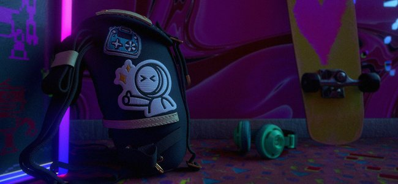

# 版本10.1

<b>Substance 3D Painter 10.1</b>添加了新的强大滤镜、改进的USD功能以及更新的VFX平台和Linux支持。

发行日期： *2024年9月17日*

>[!NOTE]
>
> 此版本的Painter现在使用Qt版本6，这影响了Python和JavaScript插件的支持。 有关详细信息，请参阅下文。

## 主要功能

### 新的默认过滤器

在此版本中，添加了多个新滤镜，以大大扩展纹理制作过程：

* <b>新刺绣贴花材料</b>\
  在“资源”窗口的素材部分中，您可以找到一种新的刺绣贴花素材。 将其拖放到网格上的任意位置，插入任意资源（如纹理甚至字体），您将能够轻松地创建新的结构详细信息。

  
* <b>新建填充区域颜色/蒙版滤镜</b>\
  这两个新滤镜允许填充任何闭合路径或轮廓。 例如，这对于快速填充3D路径非常有用。 由于它们是滤镜，因此也可用于手动画笔描边或其他情况。

  
* <b>新FXAA筛选器</b>\
  此新滤镜可以快速减少锯齿，特别是在硬边缘上（例如，在色阶之后可能会出现的硬边缘），或在使用颜色选择效果制作的蒙版上。

  
* <b>新的高反差滤镜</b>\
  使用此通用滤镜，您可以生成灰度纹理以使用它实现更高级的效果（如柔化、模糊或锐化细节）。

  
* <b>新建像素化筛选器</b>\
  像素化滤镜可以模拟分辨率的降低，这有助于风格化颜色和图案。

  
* <b>新的色调分离滤镜</b>\
  此滤镜可用于减少图像中的颜色数量，这有助于在形状中创建对比度和构建风格化效果。

  
* <b>新的阈值筛选器</b>\
  阈值滤镜是一种从灰度输入创建锐化二进制黑白蒙版的快速方法。

  
* <b>新的平滑步骤筛选器</b>\
  平滑步骤滤镜是另一种执行级别或对比度以优化灰度信息的方式。 此滤镜还向结果应用指数曲线，从而能够将线性渐变转换为平滑曲线。

  
* <b>改进的变换和镜像滤镜</b>\
  变换滤镜已更新，以支持非均匀缩放、水平或垂直翻转，并且更易于使用参数。 镜像滤镜也用更直接的参数更新。

  
* <b>已改进的图标</b>\
  为了使标准滤镜更清晰可见，更易于查找，重新制作了标准滤镜的图标。 色调为黄色的图标用于图层的内容，而灰度图标是一般图标，可在图层内容和蒙版中使用。

  
* <b>对滤镜的次要修复</b>\
  已调整其他几个滤镜以修复一些问题：

  * Height调整滤镜会影响图层的Alpha，因此在某些情况下难以使用。
  * 模糊滤镜在旧版色彩管理模式下不使用线性色彩空间，混合/混合其输入时创建错误的颜色。

### USD和VFX平台支持更新

在此版本的Painter中，许多第三方组件已得到改进和更新：

* <b>使用Adobe标准素材导出纹理（美元）\
  </b>将纹理从Painter导出为美元文件时，您现在将获得其中的Adobe标准材质属性。 这使这些USD文件准备好在支持这些属性的应用程序中使用。
* <b>从USD文件导入纹理</b>\
  现在，导入USD文件也会将其纹理导入到创建的项目中，从而更轻松地在应用程序之间来回切换。 如果USD文件使用Adobe标准素材，则还会配置着色器设置，使视口中的结果与其他源应用程序匹配。
* <b>Gltf更改\
  </b>在USD更新后，需要对GLTF格式的行为进行一些更改以确保奇偶校验。 导入gltf文件时，Painter现在将假定法线图将采用OpenGL格式。\
  某些gltf文件可能会改用DirectX格式。 因此，新项目窗口中添加了一个新设置以考虑该设置（请注意，也可以从图层栈栈覆盖普通格式）。

  
* <b>已更新的依赖项</b>\
  Painter使用的几个库已更新，特别是为了与VFX平台参考相匹配。 以下是Painter 10.1中使用的新版本：

  * Qt 6.5.6（和PySide6 6.5.6）
  * Substance 引擎9.1.3
  * OpenEXR3.2
  * Python 3.11
  * OCIO 2.3.2
  * OpenSubdiv 3.6.0
* <b>更新了Linux支持\
  </b>现在，此新版本的Painter至少支持Red Hat Enterprise Linux (RHEL) 8.6版，但也应该与9.x版兼容。

### 改进了性能

应用程序的一些方面已得到一些性能改进：

* <b>改进了项目的打开时间\
  </b>在Painter中打开使用大量画笔描边的项目现在应速度更快。 这些项目的节省时间也应稍加改进。\
  在我们的一些测试项目中，我们观察到打开项目时的加载时间从50s缩短到仅6s。 打开旧项目并将它们转换为最新版本时的内存消耗也得到了改进。
* <b>改进了镶嵌性能\
  </b>现在，当着色器设置中启用了镶嵌时，我们使用自动优化。 小于屏幕上的像素的三角形将不再进行镶嵌，从而减少绘制的三角形，进而加快渲染时间。\
  此更改不会产生视觉差异，也不会影响网格导出过程。
* <b>简化缩览图现在是默认值</b>\
  在6.2版中，我们为UV拼贴项目引入了简化缩览图以提高性能，但常规项目仍然可以使用旧的计算图层缩览图的方法。 此行为是通过应用程序设置控制的。\
  此设置现在默认为优化的缩览图，以帮助提高任何项目的性能。 如果需要，可在主首选项中恢复该操作。

  

### Painter 10.1迁移说明

>[!NOTE]
>
> * 在更新到Qt6后，可能需要更新Python增效工具。 有关更多详细信息，请参阅[此页面](https://adobedocs.github.io/painter-python-api/guides/qt6-migration/)。
> * <b>JavaScript </b>插件现已移至User Documents目录下的子文件夹中。 现有插件将不再出现在应用程序中，因为它们需要手动移入该文件夹。
> * 在Steam/Ubuntu上，需要系统库才能使Painter正常工作。 在启动应用程序之前，请确保libxcb-cursor已安装。

## 发行说明

### 10.1.0

发行日期：<b>2024/09/17</b>

摘要：<b>主要版本，新内容：填充区域蒙版/颜色滤镜、刺绣贴花滤镜和六个通用Substance滤镜，导入具有材质和着色器属性的美元，性能改进，符合VFX平台2024并迁移到Linux RedHat</b>

<b>已添加</b>：

* [内容]添加新的填充区域蒙版/颜色滤镜
* [内容]添加新的刺绣贴花滤镜
* [内容]添加6个新的通用Substance滤镜（FXAA、像素化、高通、色调分离、平滑步骤、阈值）
* [USD]导出具有定义的ASM材料的USD图层
* [USD]导入具有材质和着色器属性的美元
* [性能]默认情况下启用优化的图层栈栈缩览图
* [性能]减少项目文件打开时间和内存消耗（数据解码）
* 符合VFX平台2024标准
* [VFX Platform 2024]更新到Python 3.11
* [VFX Platform 2024]更新至OpenEXR3.2
* [VFX Platform 2024] [USD]更新OpenSubdiv 3.6.0
* [VFX Platform 2024][色彩管理]更新至OCIO 2.3.2
* [Linux]迁移到Linux RedHat
* [Linux]将Nvidia驱动程序的最低版本更新为535.171.04
* [导入]在导入GLTF网格时添加用于翻转法线图的选项
* [UI]使用操作系统默认值作为拖动事件检测距离
* [Substance 引擎]添加调用条函数以从可执行文件中删除符号
* [初始屏幕]更新为新的初始屏幕格式
* 将Substance 引擎更新到版本9.1.3
* [Python]在图层栈栈文档菜单中显示示例链接
* [JavaScript]将JavaScript插件移动到javaScript/plugins子文件夹中

<b>已修复</b>：

* [Illustrator]在特定情况下导出带有.ai图形的UV图块时崩溃
* [动态笔触][路径]每个描边随机不适用于路径
* [UI][属性]拼贴非均匀时启用锁定
* 双击Painter项目时创建&#x200B;调试TXT文件
* [USD][Export]部分纹理可能丢失
* [ASM]散布颜色通道忽略金属质感
* [内容]模糊滤镜在“工作”色彩空间中不起作用
* [内容]Height调整滤镜也会修改图层的Alpha

<b>已知问题</b>：

* [色彩管理]在Linux上使用ACE进行HDR色彩空间转换时，会产生固定颜色
* [Win][崩溃][ACE]未使用sRGB ICE色彩空间进行显示变换
* [回归][UI]右键单击菜单在高清屏幕上过小
* [崩溃][Python]由TextureStateEvent触发美元导出
* [MacOS Intel]导入某些预设时崩溃
* [崩溃]重新定位资源并保存项目
* [引擎]使用仿制工具在正常通道中绘画时颜色转换不正确
* [Python] Ghost小组件似乎已被删除，因为脚本仍在运行
* [RedHat]拾色器问题
