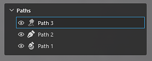
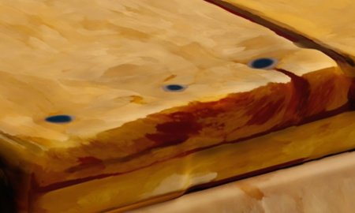
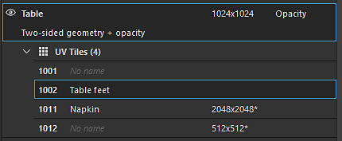
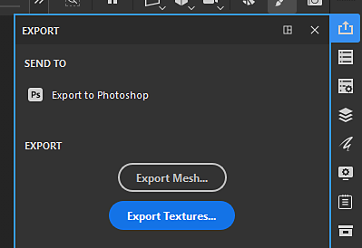

# 版本11.0

<b>Substance 3D Painter 11.0</b>添加了一个新的自动资源更新工作流程、一个填充路径工具以及路径的一般改进、一个用于烘焙的自动cage和几个用于创建风格化纹理的新滤镜。

发行日期： <b>2025年3月11日</b>

>[!NOTE]
>
> 此版本的Painter不再支持Mac Intel配置。 有关详细信息，请参阅下文。
> 
> 此版本还将Windows 10的最低支持版本提高到22H2。
> 
> 有关详细信息，请查看我们的[系统要求页面](../getting-started/system-requirements.md)。

## 主要功能

### 新的资源自动更新

现在，新的自动更新工作流程可让库和项目始终使用资源的最新版本。 使用此新流程，Painter可以监视磁盘上的资源以查找更改并自动重新加载资源，然后将其替换为您的库和项目。

* <b>在“资产”窗口中启用自动更新</b>\
  现在，“资源”窗口右下方提供了一个按钮和菜单，用于配置自动更新系统（小双箭头图标）。 启用选项<b>“资源”面板</b>以监视库并重新加载库。

  
* <b>正在更新项目中的资源</b>\
  重新加载资源将不会自动通过图层栈栈、显示设置、着色器设置等更新项目内使用的版本。为此，请确保同时启用<b>项目中使用的资源</b>选项。

  
* <b>更新频率</b>\
  可通过专用设置，在几分钟内定义Painter查找资源更新的频率。 使用0分钟将使应用程序每隔几秒钟刷新一次。 但请注意，此类较低的值可能导致性能问题。 应用程序在重新获得焦点时也会自动刷新。
* <b>手动资源更新</b>\
  刷新和更新过程也可以通过使用“自动更新”菜单底部的专用按钮手动触发。 这比使用和等待自动过程启动更加方便。

  
* <b>日志窗口中不匹配和错误</b>\
  更新资源可能会导致问题，尤其是新旧版本之间的差异很重要时。 例如，由于Substance资源上的参数缺失/更改，纹理结果可能会发生很大变化或中断。 这就是默认情况下启用<b>当资源参数不匹配时跳过资源</b>的原因。 将在日志窗口中报告问题。\
  要强制更新，只需禁用此设置。

  

  
* <b>在Python API中可用于自动进行项目维护</b>\
  自动更新工作流程也已向Python公开。 新增了新功能，帮助列出并替换过时的资源。\
  有关更多信息，请通过应用程序帮助菜单查看专用文档。

>[!NOTE]
>
> 有关详细信息，请参阅[专用文档页面](../features/auto-update.md)。

### 新的填充路径工具

填充路径工具是一种新型的路径工具，它允许在用统一颜色填充的3D模型表面创建形状。 它使复杂图案的创建成为可能。

* <b>用于创建具有填充颜色的路径的新工具</b>\
  “路径”菜单中提供了一个名为<b>填充路径</b>的新工具。 闭合时，此工具可填充路径的内部区域。 使用纹理集每个通道的统一颜色完成填充。

  
* <b>自动适应表面</b>\
  “填充路径”工具可以适应任何类型的曲面，不受平面区域的限制。 它可以跨越间隙和对象边界。

  
* <b>与镜像和径向对称兼容</b>\
  此新工具还支持对称属性，这提供了创建复杂形状的可能性。

  
* <b>在路径工具之间轻松切换</b>\
  “属性”窗口中添加了一种在不同类型的路径工具之间进行切换的新方法。 这样可以更轻松地试用工具和复制路径。 例如，您可以创建一个路径轮廓，然后复制它以将其转换为填充路径，这样就可以快速创建一个带有轮廓的形状。

  

### 改进了路径工具，包括对齐、直线等

在此新版本中，添加了许多行为和生活质量改进，以使路径工具更易于使用：

* <b>路径预览（使用Shift+P切换）</b>\
  编辑路径时，将出现一条新的虚线，指示在曲线末尾添加新点时路径将做出何种反应。 这样可以更精确地预测更改。 可通过专用设置菜单或使用<b>Shift+P</b>键盘快捷键禁用此预览。

  
* <b>直线和角度对齐</b>\
  <b>Shift </b>键盘功能键现在可用于自动在点之间创建直线。 保持<b>Ctrl </b>也可用于应用角度对齐，这有助于构建几何形状。\
  角度对齐设置可以通过上下文工具栏中的路径设置菜单进行修改。

  
* <b>将路径点对齐到网格多边形</b>\
  为了更轻松地放置点，可以启用新的对齐（磁铁图标）。 此选项允许将点放在3D模型顶点上并跟随曲面或边。\
  对齐方式有三种：

  * 对齐顶点
  * 对齐边缘
  * 对齐边缘中心

  所有这些模式都可通过上下文工具栏中的路径设置菜单获得。

  

  
* <b>单击最后一个顶点时自动关闭</b>\
  为使<b>填充路径工具</b>更易于使用，在选中最后一个顶点时单击第一个顶点，现在将自动闭合路径。 若要选择点而不是闭合路径，可以使用<b>CTRL </b>键。 （此行为在早期版本中反转。）

  
* <b>将路径顶点位置从内容复制到蒙版</b>\
  现在可以在素材模式下执行<b>复制</b>路径，然后在蒙版中使用路径上的<b>粘贴所有顶点</b>。 这样可以在素材和蒙版之间同步不同的路径。

  
* <b>改进了显示/隐藏UI显示行为</b>\
  现在，按视口操纵器键盘快捷键（<b>W</b>、<b>S</b>或<b>D</b>）即可实时切换它们。 还可通过上下文工具栏专用按钮启用/禁用它们。 此更改使您可以快速显示或隐藏这些视觉效果，而无需隐藏视区中的其他视觉效果（如路径曲线和点）。

  
* <b>现在可在路径顶点上访问旋转和缩放</b>\
  在此版本中，现在可以在选择多个顶点时使用<b>旋转</b>和<b>缩放</b>工具。 通过它，可以一起调整和对齐顶点。

  
* <b>在“属性”窗口中显示路径信息</b>\
  当选择路径工具时，“属性”窗口现在会有一个新部分。 此新部分将路径特定的信息和操作重新分组，如路径长度、投影深度以及在类型之间切换的操作。

  
* <b>从某个角度查看时改进了Tangent版本</b>\
  编辑自定切线可能很困难，具体取决于视图角度。 现在已经对此进行了更改，以便切线将受限于它们自己的计划。

  
* <b>在图层之间保持路径列表打开</b>\
  在不同绘画图层和效果之间切换时，如果视口中的“路径”面板已关闭，则在其他图层上它也会保持关闭状态。 面板现在将保持打开状态，以便更方便地来回切换。

  
* <b>聚焦当前选定的路径</b>\
  编辑路径时，按<b>F</b>键盘快捷键现在将专注于路径，而不是整个3D模型。
* <b>删除具有退格空间的路径</b>\
  现在可以通过按键盘快捷键<b>退格键</b>快速删除路径。

### 新的Substance滤镜和纹理生成器

新版本引入了几个新的滤镜以及一些程序模式。

<b>筛选器：</b>

* <b>风格化</b>\
  此新滤镜可用于将现有纹理转换为更风格化的版本。 它可以模拟3D空间中的画笔描边，并可应用一些其他效果来实现绘画般的外观。 它包含几个预设，使用起来很方便。

  
* <b>量化</b>\
  量化滤波器可用于减少图像中的颜色数量并创建具有硬限制的平坦区域。 它还可以用于对纹理进行风格化处理。

  
* <b>各向异性科威特语</b>\
  此滤镜应用[Kuwahara滤镜](https://en.wikipedia.org/wiki/Kuwahara_filter "https://en.wikipedia.org/wiki/Kuwahara_filter")，此滤镜还可用于降噪和纹理风格化。

  
* <b>方向距离</b>\
  这是一个简单的滤镜，用于在2D空间中按指定方向拉伸像素。 它可用于涂抹画笔描边或轻松创建漏口。

  
* <b>斜面平滑</b>\
  此斜面平滑是斜角滤镜的新版本，提供了更好的结果和控件。 除现有过滤器外，此选项可用。

  
* <b>灰度转换</b>\
  此新滤镜可用于方便地将图像或通道转换为灰度，提供了对红色、绿色和蓝色通道的控制（如果需要）。

<b>纹理生成器和噪声</b>：

* <b>Scratches生成器</b>\
  一种改进的划痕生成器，其模拟具有各种随机性控制的细线。
* <b>Triangle Grid</b>\
  通过三角形连接构建的杂色，带有随机性和Smoothness控件。
* <b>平铺随机</b>\
  一种针对建筑拼贴图案定制的纹理生成器。
* <b>Voronoi和Voronoi分形噪声</b>\
  这些新的2D版本已可用作3D噪声，可用于在2D或UV空间中工作和拼贴。
* <b>已将噪音更新为来自Designer </b>的最新版本\
  Painter中的大多数噪音都已使用Substance 3D Designer的最新版本进行了更新。 噪音参数不再隐藏在组中，以使它们可以更快地编辑。

### 新型烘烤自动保持架（试验）

将高多边形网格烘焙到低多边形网格上时，现在可在指定保持架模式时选择新的<b>自动</b>选项。 该方法首先计算一个自动网格模型，该网格模型能很好地拟合高多边形网格，从而避免网格模型产生伪影。

* <b>公用烘焙参数中的新设置</b>\
  在常用烘焙参数中，笼形参数已替换为三个选项之间的选择：\
  <b>基于距离</b>：默认的正/后距离设置。\
  <b>自动（实验性）</b>：新的自动笼。\
  <b>自定义文件</b>：以前将自定义网格文件加载为Cage的方法。

  

>[!NOTE]
>
> 这一特征被认为是实验性的。 我们计划在以后的版本中对该算法进行改进。 另外，我们也在寻找关于结果质量以及可能存在的错误的反馈。

### 在Mac操作系统上使用Metal进行渲染

在此版本中进行了与Mac平台相关的具体更改：

* <b>现在使用Metal图形API，而不是Mac </b>上的OpenGL\
  从此版本开始，Painter现在在Mac上使用<b>Metal </b>图形API，用于渲染视口和计算纹理。 该开关极大地提高了应用的性能和稳定性。 将来还会更容易集成新功能，因为OpenGL在MacOS上已被弃用。
* <b>删除Mac操作系统</b>上对Intel体系结构的支持\
  在此版本中，已删除与MacOS上的Intel CPU的兼容性。 ARM架构（M1、M2等） 现在是唯一受支持的版本。

### 杂项

此版本中还添加了其他一些功能：

* <b>仅在新的填充图层/效果上启用基本颜色通道</b>\
  现在，在默认情况下，创建新的填充图层或效果时，将仅启用基本颜色通道。 （在拖放可创建填充图层/效果的资源时，此更改不适用。）\
  在社区反馈的基础上，我们进行了此更改，通过避免触发对之后被禁用的通道的计算，来提高性能。 当使用高分辨率或UV磁贴时，这有助于响应度。\
  请注意，在保持<b>ALT </b>键盘快捷键不变的同时，单击“基色”按钮可快速重新启用所有通道。

  
* <b>重命名UV磁贴以导出纹理</b>\
  在“纹理集”列表窗口中，不能在UV拼贴上添加自定义名称。 与说明相反，可以通过专用标记<b>$uvTileName</b>在导出预设中检索自定义名称。\
  这一新功能允许在导出期间将UDIM编号替换为特定名称。

  
* <b>可在停靠工具栏中使用新的“导出”按钮</b>\
  允许导出到其他应用程序的<b>发送到</b>操作已移入一个专用窗口，现在可以从应用程序右侧的“停靠”工具栏使用该窗口。

  
* <b>改进复制/粘贴路径和图层的命名</b>\
  在复制或复制/粘贴图层和路径时，图层的命名方案已改进，以便更加一致和可预测。

  

## 教程

## 发行说明

### 11.0.0

发行日期：<b>2025/03/11</b>\
摘要：<b>主要版本、新的自动更新功能、填充路径工具和其他路径改进，以及新的滤镜和烘焙用的实验性自动调整笼生成</b>

<b>已添加</b>：

* 自动更新
* [自动更新]在“资源”面板中自动更新修改的资源
* [自动更新]自动更新整个项目中修改的资源
* [自动更新]默认情况下将自动更新保持关闭状态
* [自动更新]如果资源参数不匹配(.sbsar、.glsl、.ai、.svg)，则使更新可选
* [自动更新]添加环境变量以禁用自动更新功能
* [自动更新][SBSAR]如果资源参数不匹配，请使更新可选
* 填充路径
* [路径][填充]添加新工具以创建填充路径
* 路径改进
* [路径]创建对齐到多边形的路径
* [Path]允许切换路径类型
* [路径]允许在内容和蒙版之间复制粘贴路径顶点数据
* [路径]创建新点时允许限制角度
* [路径]允许将点创建限制到线条
* [路径]单击即可关闭形状
* [路径]显示路径信息
* [路径]允许缩放和旋转路径顶点
* [Path][UX]使变换Gizmo更易于访问
* [路径]添加路径预览
* [路径]使用Shift + P禁用路径预览
* [路径]从侧视图改进正切版本
* [路径]允许将焦点放在3D路径上
* [路径]在关闭和再次打开UI时，顶点应保持选择状态
* [Path]允许使用退格键删除路径
* [路径]如果用户展开路径列表，请将其保持为打开状态
* [Path][Layer Stack]复制/粘贴时正确重命名重复项
* [路径] UI和工具提示改进
* Performance
* [性能]在使用高镶嵌级别时提高视口性能
* [性能]仅在新的填充图层/效果上启用第一个通道
* [性能]并行画笔描边计算
* Baking
* [烘焙]添加用于烘焙高多边形网格的全自动笼形生成选项（实验性）
* 内容
* [内容]添加6个新滤镜：风格化、量化、各向异性科威特图、斜面平滑、方向距离、灰度转换
* [内容]从Designer将噪音和邋遢更新到最新版本（使用新的2D Voronoi）
* [Content]添加3个新的纹理生成器（平铺随机、Triangle Grid、Scratches生成器）
* [内容]重命名Unreal Engine模板和导出预设
* Python
* [盘架][Python]将智能素材或智能蒙版从Python保存到磁盘
* [Python]将烤箱自动笼添加到Python API
* [Python]允许编辑纹理集/UV拼贴名称和说明
* [Python]在矢量和字体源上共享分辨率设置
* [自动更新][Python]在Python中显示项目自动更新功能
* 杂项
* [导出]使用新面板让“发送到”选项更易于访问
* [Nvidia]添加有关最新Nvidia驱动程序(572.16)的警告
* 角度对齐应受“对象/世界”空间选择的影响&#x200B;。
* [纹理集列表]允许将自定义名称添加到UV磁贴并在导出时使用它们
* Mac
* [Mac]使用Metal而不是OpenGL进行图形渲染
* [Mac]停止支持Mac Intel

<b>已修复</b>：

* [Nvidia][烘焙]环境遮蔽烘焙结果存在伪影
* [崩溃]按住Alt键单击以在禁用的纹理集上切换可见性会导致崩溃
* [烘烤]考虑笼架的低多边形作为高多边形参数
* [烘焙] ID map Baker的材质颜色无法与USD文件格式配合使用
* [性能]视区渲染缓慢，存在网格和大量重叠对象
* [Qt]自定义构建的拾色器没有色彩管理设置
* [视口]启用“消除锯齿”后3D机械臂会闪烁
* 蒙版块画笔状态中橡皮擦的灰度槽
* [Log]导入网格时未报告很长的错误消息
* [内容]顶纹工具预设内的预设名称列表中出现拼写错误
* [Python]用另一个文件替换SVG/Ai文件不会更新其属性
* [Python]从Python查询矢量资源画板ID时，某些情况下为空
* [Python]日志中打印的错误有时会返回大量行

<b>已知问题</b>：

* [色彩管理]在Linux上使用ACE进行HDR色彩空间转换时，会产生固定颜色
* [回归][UI]右键单击菜单在高清屏幕上过小
* [崩溃][Python]由TextureStateEvent触发美元导出
* [引擎]使用仿制工具在正常通道中绘画时颜色转换不正确
* [Python] Ghost小组件似乎已被删除，因为脚本仍在运行
* [RedHat]拾色器问题
