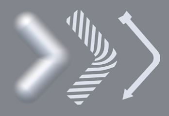
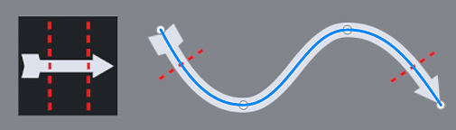
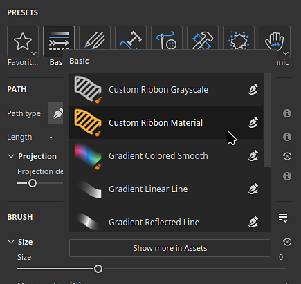

# 版本11.1

<b>Substance 3D Painter 11.1 </b>带来了新的功能区路径工具，它具有专用内容、填充图层和效果上的对称性、位移的物理大小以及对Vulkan图形API的支持。

发行日期：<b>2025年11月18日</b>

>[!NOTE]
>
> 此版本的Painter将图形API从OpenGL切换为Vulkan。 此更改可能会影响应用程序支持的GPU，特别是基于GPU的光线跟踪技术。
> 
> 有关详细信息，请查看我们的[系统要求页面](../getting-started/system-requirements.md)。

## 主要功能

### 新建功能区工具

<b>功能区路径</b>是路径工具系列中的新工具。 “功能区”将沿路径变换和重复纹理，而不会进行任何剪切，同时对“起始”和“结束”以及锐角的选项进行额外的控制。

这一新工具为诸如沿路径放置文本、沿路径放置完美的渐变以及轻松创建自己的高级修剪以在网格周围绕排等新行为打开了大门。\
简而言之，功能区是一种更整洁的工具，可用于更精确地绘制路径。

* <b>其他类似路径的工具旁边有新的功能区工具可用</b>\
  新的“功能区”工具位于界面中其他路径（如工具）旁边。 可以从工具栏或从路径文字快捷键中选择它。

  

  
* <b>功能区是跨所有表面工作的连续路径</b>\
  它功能区是一种工具，允许您沿路径重复或拉伸纹理。 它可在任何类型的曲面和几何形状上运行，即使未连接网格零件也是如此。

  
* <b>制作重复图案和渐变</b>\
  此新工具能以各种方式重复图像，无接缝或切口，适用于渐变和干净的图案。

  
* <b>使用自定义起始和结束拉伸图像</b>\
  <b>在偏移之间伸缩</b>设置允许隔离图像的某些部分，以将其用作路径上的起始部分和结束部分，同时中间部分沿路径的其余部分伸缩。 这有助于快速使用简单的位图并将其放置在没有扭曲（如箭头）的路径上。

  
* <b>可用的角类型</b>\
  破断切线以创建转角时，根据需要提供几种形状 — 从经典破断到平滑车削。

  
* <b>拉伸和平铺控件</b>\
  图像可自动或手动沿功能区路径重复或拉伸。

  
* <b>沿路径文本</b>\
  可以在功能区路径上直接使用字体资源。 文本会自动调整到路径，以便沿其曲线变形。 对齐设置可用于更好地调整文本以适应任何情况。

  
* <b>长宽比和非方形资源</b>\
  非方形资源会自动调整以适合功能区路径的长度，这使它成为重复装饰和修剪等拉长图案的理想选择。

  
* <b>与动态笔触工作流程兼容</b>\
  功能区路径还兼容基于Substance的动态笔画系统，可生成复杂的效果。 一个显着的示例是能够自定义起始/结束和左/右转角。\
  系统还提供了名为<b>自定义功能区灰度</b>和<b>自定义功能区材质</b>的两个新工具预设，以便轻松访问这项功能。

  
* <b>与对称兼容</b>\
  与其它类型的工具一样，该功能区路径也兼容对称功能。

  
* <b>自重叠时的混合模式</b>\
  当功能区路径超越自身时，可能会导致意外结果。 专用的Alpha、正常和Height信道混合模式有助于获得更好的效果。

  

对所有路径工具进行了其他改进：

* <b>路径上每个顶点的大小和不透明度分开</b>\
  现在，可以调整路径上每个顶点的大小和不透明度，并且不再与压力参数关联。 现在，这两个属性使用界面中的专用滑块单独处理。

  
* <b>“属性”窗口</b>中的参数分组\
  Painter中的大多数工具现在都有可折叠的参数组。 此更改使实时隐藏参数和缩短窗口长度变得更加容易。

  

>[!NOTE]
>
> 有关<b>功能区工具</b>的详细信息，请查看[专用文档页面](../painting/tool-list/ribbon-tool.md)。
> 
> 有关<b>动态笔触</b>的详细信息，请查看[专用文档页面](../painting/dynamic-strokes/dynamic-strokes.md)。

### 功能区工具的新内容和类别

此版本包括75种新的工具预设，这些预设利用了新的“功能区”功能。 为使预设更易于发现，已在<b>属性</b>窗口中添加了新的预设类别。

* <b>在“属性”窗口中新建预设类别快捷键</b>\
  在使用任何路径工具时，<b>属性</b>窗口的顶部现在有一系列新按钮。 每个按钮都可以访问按类别排序的工具预设。 收藏夹类别将您选择的预设重新分组。

  

  单击其中一个按钮可快速访问某些预选预设。 单击<b>“在资源中显示更多”</b>将在<b>“资源”</b>窗口中显示更多路径工具预设。

  
* <b>在预设之间快速切换</b>\
  为了更轻松地在预设之间切换，单击预设不再取消选择当前编辑的路径。

  
* <b>新内容</b>\
  此版本中添加了专门用于功能区工具的75种新工具预设，作为默认内容的一部分。 这些预设可直接在<b>资源</b>窗口画笔部分下使用，或通过<b>属性</b>窗口中的新类别快捷键使用。\
  这些预设包括：

  * <b>服装</b>：改进了接缝褶皱和顶针预设，以及拉链和织物撕裂。
  * <b>基本</b>：线条和虚线等简单描边，还有渐变和基于<b>动态描边</b>系统的<b>自定义功能区</b>预设。
  * <b>污渍</b>：用于模拟各种表面损坏的3种裂缝。
  * <b>硬表面</b>：抓取图案、面板和活板细节、胶带和焊接以使用或机械对象。
  * <b>有机</b>：用于包裹皮肤和其他表面的清洁和肮脏绷带。
  * <b>绘画</b>：基于画笔的渐变和水线预设。
  * <b>文本</b>：快速预设，使用功能区沿路径设置具有不同对齐模式和拉伸的文本。
* <b>用于在“资源”窗口中搜索的新工具关键字</b>\
  现在可以在<b>资源</b>窗口中键入“功能区”、“绘画”、“路径”甚至“涂抹”，这有助于查找与相应工具匹配的预设。

  

### 填充图层和效果的新对称性

填充图层和效果现在支持其3D投影模式的对称性。 这可以通过上下文工具栏中的“对称”菜单或通过<b>属性</b>窗口中新添加的对称部分来启用。

* <b>填充图层上的对称性</b>\
  在填充效果和图层中使用基于3D的投影模式时，现在可以启用对称功能。 镜像对称和径向对称都可用。

  
* <b>通过上下文工具栏或“属性”窗口启用对称功能</b>\
  对称可以通过<b>上下文工具栏</b>菜单（类似于绘画工具）或通过<b>属性</b>窗口（带有新的专用部分）来激活。

  

  
* <b>翻转文本和徽标的输入资源</b>\
  与允许翻转输入图像或X/Y轴的新选项相比，填充图层和效果对称性也有好处。 例如，这允许镜像文本，但仍使其两侧均可读。

  
* <b>改进了对称设置界面</b>\
  对称设置的界面经过重新设计，更易于阅读，使用更快速。 例如，轴滑块都有自己的线条，这有助于提高精确度。 此外，还缩小了径向显示尺寸，以占用更少的空间。

  

有关<b>对称</b>的详细信息，请参阅[专用文档页面](../painting/symmetry/symmetry.md)。

### 物理尺寸

现在可以使用特定单位定义位移。 此更改便于对齐和匹配其他应用程序间的置换几何。

* <b>位移设置中新增缩放单位选项</b>\
  在<b>着色器设置</b>窗口中，调整位移强度时，有新的缩放单位设置可用。 此设置提供以下选项：

  * <b>规范化</b>：默认值，与Painter先前的行为匹配。 此大小基于当前项目内的网格定界框。
  * <b>场景</b>：使用网格文件中存储的单位作为参考点。
  * <b>物理尺寸(cm)</b>：使用<b>项目配置</b>窗口中定义的项目单位。

  

### 适用于Windows和Linux的全新Vulkan图形后端

我们之前在Mac操作系统上从OpenGL切换到Metal，现在，此新版本在Windows和Linux平台上使用<b>Vulkan</b>，在此之前的工作基础上继续进行。

* <b>现在，在Windows和Linux上使用Vulkan图形API代替OpenGL</b>\
  Painter现在使用Vulkan graphics API在视区中进行渲染并计算纹理。 此开关应能改善应用程序的总体性能。 这还将使今后更容易整合新功能。
* <b>通过Vulkan烘焙的GPU 射线追踪</b>\
  DirectX光线追踪(DRX)和Optix已替换，改为通过我们的面包师中的Vulkan图形API进行光线追踪。 此更改意味着基于GPU的光线追踪现在可在AMD GPU和Linux操作系统上使用。\
  切换到Vulkan还可以改善烘焙渲染时间，特别是在高分辨率下。

### 杂项

此版本中添加了其他功能和改进：

* <b>Substance解析覆盖</b>\
  在“工具”和“填充图层/效果”中使用Substance资源时，可以使用新的<b>分辨率</b>参数组。 这些设置可用于更改应用程序选择的默认分辨率。\
  出于质量或性能原因，这对于提高或降低Substance生成时的分辨率非常有用。

  可用设置包括：

  * <b>分辨率</b>：定义用于计算分辨率的模式和上下文。 默认值为“自动”，但可以设置为<b>纹理集</b>或<b>自定义</b>。
  * <b>因子</b>：对分辨率的额外控制，以创建相对差异。 例如：使用给定上下文分辨率的一半。
  * <b>输出大小</b>：根据之前的设置计算的最终分辨率。

  
* <b>改进了单个大三角形的性能</b>\
  直到现在，Painter还会在非常低的多边形网格或具有非常大和/或长三角形的网格上苦苦挣扎。 现在情况已经不同了。 使用单个四边网格（例如，创建拼贴纹理）应该已经不再是个问题。
* <b>改进了默认画笔形状</b>\
  已使用新设置更新默认画笔形状，以便在考虑硬度行为的同时控制其大小和圆度。

  

## 教程

以下是介绍我们的新功能的最新教程：

## 发行说明

### 11.1.0

发行日期：<b>2025/11/18</b>\
摘要： <b>此更新是一个主要版本，它包含具有专用新内容的新功能区工具、填充图层的对称支持、位移的物理尺寸参数、通过更新的烘焙器改进了性能、对Windows和Linux的完全的Vulkan支持以及其他改进。</b>

<b>已添加</b>：

* 全新功能区工具
* [工具]添加新的功能区工具以制作无缝路径
* [功能区]在“属性”窗口中添加功能区预设快捷键
* [功能区]允许更改路径上每个顶点的功能区不透明度
* [功能区]允许更改路径上每个顶点的功能区大小
* [功能区]删除路径闭合时在Substance中定义的开始/结束
* [功能区]在“属性”窗口中删除绘画/橡皮擦/涂抹路径工具的路径/材质预览
* [功能区]在自重叠时为Alpha和某些通道添加混合模式
* 填充对称
* [填充]添加对填充图层和效果上对称性的支持
* [填充][UI]在填充图层和效果的属性窗口中公开对称设置
* [填充]在视口菜单和属性窗口中重做对称设置UI
* [填充]在变形模式下投影时正确调整正常纹理方向
* 位移
* [位移]使用物理尺寸作为位移单位
* 性能提升
* [性能]改善大三角形上小画笔笔触的渲染
* [性能]缩短着色器编译时间
* [性能]完全支持Windows和Linux Vulkan
* [性能]更新了面包师，具有更快的GPU渲染和对AMD光线追踪的支持
* [UI]默认情况下，将工具属性重新组织为组并折叠一些属性
* [引擎]将Substance 引擎更新到版本9.2.5
* [Substance]在“工具”和“填充”中显示Substance资源的分辨率覆盖
* [导出]更新网格图导出预设以导出灰度纹理
* Python
* [烘焙][Python]指示在烘焙器更新后的更改日志中断更改
* [Python]在Python中公开填充对称设置
* 内容和新内容
* [内容]为功能区工具添加75个新工具预设
* [内容]更新渐变生成器资源以便与功能区兼容

<b>已修复</b>：

* [崩溃]在启用路径对齐时加载另一个项目可能会崩溃
* [崩溃]在路径面板中单击鼠标右键并显示剪贴板中其他会话的信息时可能会崩溃
* [UI]创建路径时，界面在工具属性中向上滚动
* [UI]隐藏路径视口可视化时，鼠标光标消失
* [路径]在“路径”面板中复制/粘贴不同的工具属性会导致属性不稳定
* [工具]橡皮擦和涂抹工具预设不会始终更新通道选区
* [工具]在蒙版中加载颜色工具预设后，已绘制值为灰色，但UI显示白色
* [工具]从蒙版创建的预设保留从其他预设加载的通道值
* [Substance]图形中定义的常规色彩空间覆盖未考虑在内
* [Content]默认画笔形状资源使用过时的Substance

<b>已知问题</b>：

* 着色器实例历史记录未正确跟踪
* [功能区] UV磁贴出现性能问题
* [功能区]在某些情况下，路径在拐角后可能会意外地自动重叠
* [功能区]当点靠近路径端点时，切线会创建不需要的环
* [崩溃][功能区]在Ribbon中创建超长文本可能会崩溃
* [工具]在蒙版中使用投影时，材质预览不起作用
* [烘焙]启用“按名称匹配”后，忽略多个自遮蔽集的AO设置“纹理”
* [烘焙]正常的AO由于缺少内边距而在边缘有伪像
* [色彩管理]在Linux上使用ACE进行HDR色彩空间转换时，会产生固定颜色
* [回归][UI]右键单击菜单在高清屏幕上过小
* [崩溃][Python]由TextureStateEvent触发美元导出
* [引擎]使用仿制工具在正常通道中绘画时颜色转换不正确
* [Python] Ghost小组件似乎已被删除，因为脚本仍在运行
