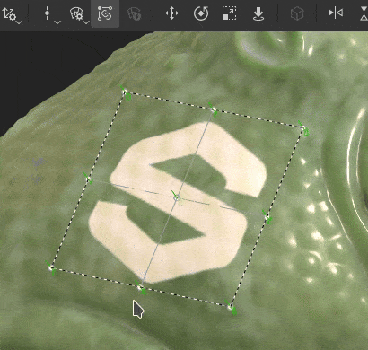

# 版本12.0

<b>Substance 3D Painter 12.0</b>在图层栈栈中直接提供纹理拼合、全新的自动变形投影模式、一组改版的后处理效果以及改进的项目创建和设置工作流程。

发行日期：<b>2026年3月9日</b>

>[!NOTE]
>
> 在此版本中，已改进对具有<b>统一/共享内存</b>的<b>集成GPU</b>的支持。 可以预期对视频内存进行更好的检测，这将带来更好的性能和更少的图形问题。

## 主要功能

### 新的图层拼合

现在，图层栈叠的右键单击上下文菜单中提供了新的<b>拼合</b>操作。 通过将多个图层编组(<b>Ctrl/Cmd + G</b>)并创建拼合副本(<b>Ctrl/Cmd + M</b>)，可快速合并这些图层。 源组将自动禁用，选择是将其删除，还是将其另存为<b>智能素材</b>以供日后编辑。

图层栈栈的拼合元素也可以直接导出到磁盘，以便在其他应用程序中快速迭代。 可通过图层栈叠的右键单击菜单，单独或批量导出组、图层或蒙版。

* <b>直接在图层栈栈中拼合纹理</b>\
  通过按<b>Ctrl/Cmd + M</b>或选择右键单击上下文菜单中的<b>拼合组</b>条目，任何组都可以拼合。 这将在自动禁用源组的同时生成选定内容的合并副本，保持原始图层不变，直到决定移除或恢复它们为止。

  
* <b>拼合纹理并将其导出到磁盘</b>\
  右键单击菜单中的专用导出操作可生成图层、蒙版或组的拼合结果，并将其直接保存到磁盘。 如果要将烘焙内容传输到其他应用程序，而无需通过完整的纹理导出管道，此功能非常有用。
* <b>批处理操作</b>\
  可以一次选择多个图层、组或蒙版，并在单个操作中单独拼合或导出，从而高效地一步处理图层栈栈的大部分内容。

  

>[!NOTE]
>
> 有关拼合图层的详细信息，请参阅[专用文档页面](../interface/layer-stack/flatten-layers.md)。

### 投影的全新变形到几何模式

贴花现在可以自动适应复杂表面，从而减少手动调整的需要。 当“变形”投影处于活动状态时，可在上下文工具栏中使用<b>几何变形</b>切换开关。

* <b>上下文工具栏中的新参数</b>\
  每当变形投影模式处于活动状态时，上下文工具栏中都会显示新的<b>几何变形</b>切换开关。 可以随时将其关闭，而无需重置当前的投影设置。

  
* <b>自动环绕到网格表面</b>\
  启用后，变形投影将自动遵循基础网格的曲率和拓扑。 将投影拖过曲面将使投影平滑地符合几何，从而显着减少将贴花放置在复杂或弯曲形状上时所需的手动微调量。

  
* <b>保留本地变形</b>\
  在编辑变形投影网格顶点时，变形到几何模式将尝试保留预定义变形，以确保始终投影相同的形状。

  

>[!NOTE]
>
> 有关变形投影的详细信息，请查看[专用文档页面](../painting/fill-projections/warp-projection.md)。

### 新后期效果

现在，可通过<b>显示设置</b>窗口中提供的一组全新的后期处理效果来增强Painter中的渲染。 新添加项（如<b>镜头光晕</b>和<b>胶片颗粒</b>）现已可用，同时还有改进的<b>场深度</b>和<b>光晕</b>效果等。

以下是您可以使用新效果获得哪些效果的示例：

* <b>新的后期处理效果</b>\
  可以在<b>显示设置</b>窗口中单独启用和配置所有后期处理效果。 效果按栈叠顺序应用，每个效果都可以单独打开或关闭，从而便于组合和试验不同的效果。

  
* <b>新效果列表：</b>

  * <b>场深度</b>：模糊焦点范围之外的对象以模拟相机镜头聚焦。
  * <b>开花</b>：添加从图像的明亮区域散发出来的柔和光芒。
  * <b>眩光</b>：在光源周围产生光线。
  * <b>镜头光晕</b>：模拟明亮光线在相机中照射时镜头的光学反射。
  * <b>横向色差</b>：模拟镜头瑕疵在图像边缘产生的彩色边纹。
  * <b>晕影</b>：使画面的角部和边缘变暗，以将焦点吸引到中心。
  * <b>锐化</b>：增加边缘对比度，使渲染的图像看起来更清晰。
  * <b>胶片颗粒</b>：叠加细微的杂色以复制模拟胶片的纹理。
  * <b>色调映射</b>：将HDR明亮度值重新映射到可显示的范围，以获得更具有电影效果的外观。
  * <b>颜色校正</b>：调整对比度、饱和度、亮度和色温以微调整体色彩平衡。

>[!NOTE]
>
> 有关新效果的更多信息，请参阅[专用文档](../features/post-processing/post-processing.md)。

### 改进的新项目和设置窗口

“新建项目”窗口和“项目设置”对话框经过重新设计，更加易于导航。 参数已重新排序和分组，以提高可读性，并且改进了网格重新导入工作流程，以减少迭代项目时的重复步骤。

* <b>改进的新项目窗口</b>\
  新项目窗口中的参数经过重新组织和排序，以便最常用的设置更加突出。 现在，可以更轻松地扫描整体布局，从而减少配置新项目所需的时间。
* <b>在项目设置中重新导入网格的新工作流程</b>\
  项目设置中的新复选框<b>重新导入网格</b>允许更轻松地重新导入项目网格，因为当前正在自动保存和预填充以前加载文件的文件路径。

  

## 发行说明

## 版本12

### 12.0.0

发行日期：<b>2026/03/09</b>\
摘要： <b>这是一个主要版本。 此版本包含拼合图层、几何变形、新后期效果、新项目窗口改进和其他改进功能。</b>

<b>已添加</b>：

* [拼合图层]拼合图层栈叠内的图层
* [拼合图层]将拼合的图层导出到磁盘
* [几何变形]向变形投影添加新的自动变形功能
* [后期效果]使用新效果替换后期效果
* [Post-effects]更新色调映射器
* [Post-effects]为Post-effects资源添加新用法
* [Content][Post-effects]在库中集成默认的后效果资源
* [新建项目]改进用于项目创建的UI
* [新建项目]对重新导入网格功能的更改
* [新项目]允许打开\*.geo.usd文件
* [项目配置]改进项目配置的UI
* 将美元库更新到版本25.05
* 将Substance 引擎更新至版本9.3.4
* 将适用于AMD GPU的最低驱动程序数量提高至25.3.1/25.Q2
* 将季度更新至6.8.6
* [脚本]将JavaScript API更新到版本1.1.20
* 将Python更新到3.13

<b>已修复：</b>

* [崩溃]在蒙版中更改素材通道输出时可能会崩溃
* [导入]导入USD文件时，EXR纹理被强制导入sRGB而不是线性格式
* [UV拼贴]单个图像的图像序列还填充其他UV拼贴
* [烘焙] CPU和GPU烘焙AO不同
* [色彩管理][MacOS]视口基色与拾色器不匹配
* [USD]在某些情况下，不会导入统一值
