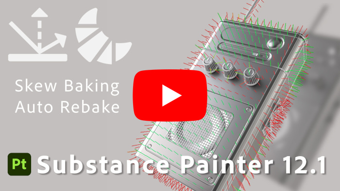

# 版本 12.1

<b>Substance 3D Painter 12.1</b>改进了烘焙工作流程，具有自动重新烘焙和倾斜校正绘画，支持OpenPBR素材定义，并提供了新的UV自动展开硬表面模式。

发行日期：<b>2026年6月22日</b>

>[!NOTE]
>
> 此版本将支持的最低macOS版本提高到13.0 (Ventura)。 有关详细信息，请查看我们的[系统要求页面](../getting-started/system-requirements.md)。

## 主要功能

### 改进的倾斜绘画烘焙工作流程

烘焙工作流程经过重新设计，以支持连续烘焙、网格上倾斜校正绘制、边缘保护以及重新设计的网格映射列表。

* <b>自动重新生成</b>

  网格图在调整其烘焙参数时可以连续地被重新烘焙，消除了每次改变后手动触发烘焙的需要。 为每个地图切换自动重新生成，并一次应用于一个地图。 这对于倾斜绘画工作流程尤其方便，而且在调整常规烘焙设置时也是如此。

  

* <b>倾斜校正绘画</b>

  当保持架设置为<b>基于距离</b>模式时，可以直接将倾斜校正绘制到低多边形网格上，以控制烘焙期间使用的投影方向。 画笔、橡皮擦和多边形填充工具可用，带有紧凑的灰度值选取器、对称和常用画笔控件（<b>Ctrl +右键单击</b>调整画笔大小，<b>X</b>反转绘制值）。 倾斜绘画操作可以撤消。

  

* <b>边缘保护</b>

  绘画倾斜校正时，新的边缘保护选项会保留投影到硬边缘上的高多边形柔和度。 其结果受<b>边缘距离</b>和<b>边缘对比度</b>参数控制。

  

* <b>重新设计的网格图列表</b>

  网格映射列表提供每个映射控件：将映射切换为视区<b>预览</b>、<b>快速生成</b>单个映射、在纹理集之间切换其<b>自动生成</b>和<b>同步</b>其设置（当项目具有多个纹理集时可用）。 悬停时，每个控件都有一个工具提示。

  

* <b>简化的烘焙按钮</b>

  视区烘焙按钮已被单个<b>烘焙</b>按钮替换，该按钮显示要烘焙的映射数（纹理集x UV平铺x选定的网格映射）。

  

>[!NOTE]
>
> 有关烘焙的更多信息，请参阅[专用文档页面](../baking/baking.md)。

### OpenPBR 支持

Painter现在支持OpenPBR着色模型，并将其用作默认工作流程，从而提供可在各个应用程序间传送的标准化材质定义。

* <b>新的OpenPBR着色器和默认工作流程</b>

  默认情况下，可以使用实现OpenPBR1.1规范的着色器。 无模板创建的新项目使用OpenPBR着色器，新项目窗口的第一个条目现在标记为<b>OpenPBR</b>而不是<b>ASM</b>。 其中包括了用于OpenPBR的新项目模板，并且已更新示例项目以使用它。

  

* <b>导入时从项目模板中选择着色器</b>

  导入USD或GLTF文件时，将从项目模板设置着色器，而不是从文件内容猜测着色器。 当素材和模板使用不匹配的工作流程时，会在日志中报告一条消息。

  

* <b>导出的OpenPBR命名约定</b>

  <b>导出纹理</b>窗口有一个新的下拉菜单，用于选择命名约定。 当项目中至少有一个着色器使用它时，默认设置为OpenPBR，并且选定的方案会反映在每个纹理集的地图列表中。

  

* <b>USD和MDL支持</b>

  通过USD格式支持OpenPBR材料。 还添加了一个新的MDL，以允许在Iray中渲染OpenPBR材料，从而提供更准确的材料表示。

>[!NOTE]
>
> 自定义着色器可能需要更新。 已将着色器 API更改为支持OpenPBR，有关详细信息，请参阅应用程序的“帮助”菜单中提供的更改日志。

### 新型硬表面自动开包

增加了一种针对硬表面资产的自动展开模式。

* <b>硬表面展开模式</b>

  自动展开设置中有<b>硬表面</b>选项可用。 它可最大限度地减少UV扭曲并生成正交排列的UV版面，使其更适合机械和硬表面网格。

  

>[!NOTE]
>
> 有关自动展开的详细信息，请参阅[专用文档页面](../features/automatic-uv-unwrapping.md)。

### 杂项

此版本中添加了其他功能和改进：

* <b>一次添加或删除多个通道</b>

  在引入OpenPBR后，可从<b>纹理集设置</b>访问的新窗口允许一次选择多个通道，这在设置OpenPBR工作流程使用的大通道列表时很方便。

  * 可以通过<b>添加或删除通道</b>按钮，在纹理集设置中访问新窗口。

    

  * 该窗口概述了可在Painter中使用的所有渠道。

    

  * “<b>应用于所有纹理集</b>”按钮可用于同时编辑所有纹理集的通道配置。

    

* <b>拼合纹理集中的所有实例</b>

  实例化图层和组上提供了一个新的<b>拼合所有实例</b>选项。 它会在实例出现的每个纹理集中沿整个实例树向下生成拼合的结果，并记录为一个撤消步骤。

  

* <b>统一的撤消历史记录</b>

  现在，烘焙和绘画模式共享相同的还原历史记录。 在“烘焙”模式和“绘画”模式之间切换会记录为无法执行的步骤，因此动作只能在发生动作的模式下还原。

## 教程

查看我们在Youtube上的最新教程：

## 发行说明

### 12.1.2

发行日期：**2026/08/03**

摘要： **次要版本**

**已修复：**

* \[崩溃\]某些Substance可能会导致渲染时崩溃
* \[崩溃\]在烘焙模式下重新导入网格
* \[崩溃\]无法初始化图形显示可能会导致崩溃
* \[崩溃\]更新日志时，导出纹理有时可能会崩溃
* \[崩溃\]在某些情况下，加载/更新环境映射时，烘焙模式会崩溃
* \[烘焙\]修改高多边形文件后重新启动烘焙会导致冻结
* \[发送到Photoshop\]无法导出图层的蒙版
* \[Engine\]锚点结果不会在蒙版和颜色通道之间渲染

### 12.1.1

发行日期：<b>2026/07/09</b>

摘要：次要版本

已添加：

* [倾斜烘焙]公开倾斜基底正常模式：网格或按三角形
* [属性]使统一颜色始终重置为通道的默认值
* [OpenPBR]在导出纹理窗口中按类别对通道进行重新分组，以创建输出模板
* 将Substance引擎更新到9.4.5版

已修复：

* [项目]打开和保存某些项目所需的时间可能比平时长
* [崩溃]重新加载多个网格会导致崩溃
* [崩溃]在蒙版视图模式下删除通道会导致崩溃
* [崩溃]某些Substance可能会导致渲染时崩溃
* [绘画倾斜]切换到“绘画模式”后，在绘画倾斜中选定的工具将保持选中状态
* [烘焙公共设置] Cage距离设置不会更新笼线框和着色器可视化
* [引擎] UV填充“3D空间邻近”模式在细三角形上无法正常使用
* [引擎]锚点结果未在蒙版和颜色通道之间渲染

### 12.1.0

发行日期：<b>2026/06/23</b>

摘要： <b>此更新是一个主要版本，它包含一些烘焙改进，包括新的烘焙默认UI状态、绘画倾斜映射、自动重新烘焙、用于硬表面网格和OpenPBR的自动UV展开的新选项。 有关详细信息，请参阅完整的发行说明。</b>

<b>已添加</b>：

* [倾斜烘焙]倾斜绘画工具
* [斜切烘焙]在绘制斜切地图时添加斜切预览着色器和斜切方向矢量视觉对象
* [斜面烘焙]添加边缘保护选项
* [倾斜烘焙]自动重新烘焙
* [斜切烘焙]返工网格图列表UI
* [斜切烘焙]拆分网格图/公共烘焙设置+将公共设置移出网格图列表基色或仅蒙版
* [倾斜烘焙]更改视区工具栏按钮
* [倾斜烘焙]在顶部工具栏中显示画笔的对称切换开关
* [倾斜烘焙]网格映射列表同步菜单中的重命名选项
* [斜面烘焙]更新同步和已检查状态对话框
* [倾斜烘焙]创建灰度拾色器变体
* [斜面烘焙]更新烘焙模式图标
* [自动展开]“集成硬曲面”选项
* [OpenPBR]添加对OpenPBR1.1的支持
* [OpenPBR]将OpenPBR设置为默认工作流程和着色器
* [OpenPBR]通过美元导入OpenPBR材料和纹理
* [OpenPBR]通过美元导出OpenPBR材料和纹理
* [OpenPBR]更新“导出纹理”窗口以显示OpenPBR命名惯例
* [OpenPBR]添加有关支持OpenPBR更改的文档
* [OpenPBR][Iray]添加新的MDL以在Iray中支持OpenPBR1.1
* 美元出口有几项细微改进
* [UI]尝试在其他纹理集上绘画时，在视口中添加警告
* [拼合]允许跨纹理集拼合所有实例化图层
* [纹理集设置]允许通过新窗口一次选择多个通道
* [历史记录]更新“值”撤消条目措辞以反映参数名称
* [图层栈栈]使蒙版中的填充效果默认为白色(1.0)
* [Substance]添加新的“mesh_hard_edges_triangle”引擎映射输入
* [Substance]添加新的“mesh_hard_edges”引擎映射输入
* [着色器]阻止着色器实例共享相同的名称
* [着色器]导入USD或GLTF文件时使用项目模板中的着色器
* 将Adobe 颜色引擎更新到7.0版
* 将MacOSX最低版本升级到13.0 (Ventura)
* [内容]适用于OpenPBR的新项目模板
* [Content]更新示例项目以使用新的OpenPBR着色器
* [Python]扩展几何蒙版API，以允许在UI等中使用包含和排除模式

<b>已修复</b>：

* [崩溃][网格映射设置]将设置应用于其他纹理集
* [崩溃]在不使用世界空间法则的情况下从地图生成曲率时
* [崩溃][烘焙]启用自定义笼状结构但未选择文件时崩溃
* [崩溃]正在取消AO烘焙
* [自动保持架]高多边形文件路径无效时的无限负载
* [Linux][Windows]拾色器有时可能完全为黑色或不显示
* [多边形填充工具]该工具不适用于非PBR
* [[Paint]删除基色通道不会删除以前绘制的颜色
* [USD]未正确检测到所有着色器实例
* [Substance]仅考虑输入/输出节点的首次用法
* [Shader]使用不同的混合方法两次使用“遮蔽集”应用环境纹理
* [引擎]具有空蓝色通道（黑色）的正常纹理可能会导致错误混合结果
* [GLTF导入]每个Alpha集上均启用了纹理混合
* [GLTF导出]导出时始终启用Alpha混合
* [导出]导入GLTF文件时始终禁用双面几何
* [Javascript]修改着色器设置对撤消历史记录没有帮助
* [示例]在符合Mat的显示设置中，未启用次表面散射
