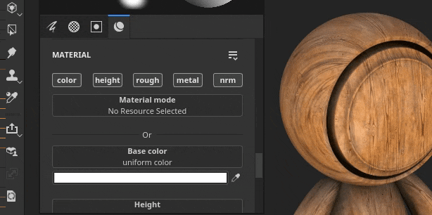
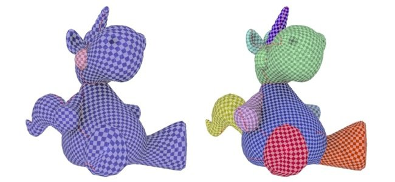

# 版本8.1

**Substance 3D Painter 8.1**&#x200B;集成了Adobe 颜色引擎(ACE)，并支持ICC配置文件、新烘焙工具、新3D噪点和20张污渍图以及改进的吸管。

发行日期： *2022年6月7日*

## 主要功能

### 带Adobe 颜色引擎的全新色彩管理（支持ICC）

在此新版本中，色彩管理系统在Adobe 颜色引擎(ACE)的支持下得到了扩展，解锁了ICC配置文件的使用。 这一新系统支持在包括Photoshop在内的多种应用程序间进行颜色匹配。

* **新项目设置**\
  创建新项目时，现在可以使用新添加的&#x200B;**Adobe 颜色引擎** (ACE)指定色彩管理引擎。

  {width="400px"}

  ACE带有以下工作色彩空间：

  * **线性sRGB**
  * **ACEScg**
  * **线性Adobe RGB**
* **监视ICC配置文件支持**\
  您可以使用ICC配置文件来调整视口外观，并使颜色与显示器匹配。

  {width="400px"}

* **导入和导出嵌入了ICC配置文件的图像**\
  导入位图时，可以自动提取ICC配置文件。 也可以在图层属性中覆盖该配置文件。\
  导出时，可以指定将嵌入到纹理文件中的目标ICC配置文件。

  {width="400px"}

* **新建json模板设置**&#x200B;要在项目间共享和重复使用设置，可以指定预设文件。 要了解有关预设规范的更多信息，请参阅[专用文档](../features/color-management/color-management-with-adobe-ace-icc.md)。

>[!NOTE]
>
> 有关详细信息，请参阅[色彩管理](../features/color-management/color-management.md)文档。

### 对Substance材料的新物理尺寸支持

Substance素材内的大小现在可用于驱动其缩放和在填充图层投影内拼贴。 根据表面材料的实际大小，无需猜测，这是正确匹配表面材料的有用工具。

* **新建填充图层参数**\
  如果素材定义了物理尺寸，则填充图层（或效果）包含用于控制素材拼贴/重复的新参数。 这些新参数仅适用于3D投影。

  {width="400px"}

* **新视区网格**\
  为了使物理尺寸更易于理解和可视化，现在可以通过[显示设置](../interface/display-settings/display-settings.md)窗口激活3D视口中的网格。\
  启用后，网格将根据缩放级别自动细分。 网格单位显示在视区的左下角。

  {width="400px"}

  {width="400px"}

>[!NOTE]
>
> 有关详细信息，请参阅[专用文档](../features/physical-size.md)。

### 新烘焙师

这三项新增功能缩小了Designer和Painter之间的差距，从而扩展了纹理和渲染的可能性。

它们已添加到烘焙列表，但默认情况下，它们处于禁用状态：

新的面包师是：

* **弯曲法线烘焙器**&#x200B;弯曲法线烘焙器允许烘焙一个遮蔽方向（作为矢量，类似于法线图）。 通过在[着色器设置](../interface/shader-settings/shader-settings.md)窗口中启用&#x200B;**弯曲法线**&#x200B;设置，可使用此纹理改善视口中的着色。 弯法线大大提高了视口着色的实时精度。\
  对于&#x200B;**漫射着色**，它可以提供更准确的遮蔽，甚至看起来像近似的全局照明（下面第一个示例）。\
  对于&#x200B;**Specular反射**，它允许模拟自阴影并减少光泄露，使物体感觉更接地，尤其是金属表面（下方的第二个示例）。

  {width="350px"}

  {width="400px"}

* **Height的烘焙师**\
  该Height烘焙器允许将低多边形网格和高多边形网格之间的差异作为灰度纹理烘焙，然后该灰度纹理可被用于在镶嵌网格上产生位移。 例如，在对平面生成扫描信息时。

  {width="400px"}

* **不透明度烘焙器**\
  不透明度烘焙器生成黑白贴图，显示高多边形网格中的洞。 例如，它可用于烘烤栅栏甚至织物表面内的孔。

### 新内容

此版本中添加了各种新内容，包括：

* **包含超过100个预设的新的和改进的3D噪声**\
  对现有三维噪声进行了改造，增加了三个新的三维噪声。 每个预设现在都包含预定义设置，通过这些设置，可在7个噪声中实现总共105个预设。 可以使用这些预设作为处理其参数并获得特定外观的起点。 与3D噪声一样，它们也是无缝的，可以非常方便地重复而不会有明显的图案。

  要查找3D噪声，只需转到“资源”面板的“过程”部分：

  {width="400px"}

  噪音提供了非常广泛的可能性，例如&#x200B;**3D Voronoi Fractal**&#x200B;中提供的预设：

  {width="300px"}

* **20个新污渍位图和2个布图案**\
  添加了一组带有默认内容的新邋遢，以扩展现有的图案范围。 可在&#x200B;**Procedurals > Grunges Bitmap**&#x200B;下找到它们。\
  在&#x200B;**过程>结构**&#x200B;下还提供了两种布料图案。

  {width="400px"}

>[!NOTE]
>
> 某些3D噪声在首次使用期间可能需要几秒钟的时间进行计算。

### 改进的滴管及材料拾取器

对滴管进行了一些改进，以更轻松地提取和管理颜色。

* **新的领料模式**\
  在选取颜色时，无需在移动鼠标时再按住鼠标单击。 现在可以单击吸管，将鼠标移动到所需位置，然后再次单击以捕捉颜色。

* **新建滴管按钮**\
  在颜色按钮旁边，有一个新的吸管图标可用于捕捉颜色，而无需先打开拾色器。

  {width="400px"}

* **新的滴管键盘快捷键**\
  拾色器窗口打开时，您也可以按&#x200B;**I**&#x200B;进入滴管模式，无需单击专用图标，这样更容易在选取和绘画之间快速迭代。

* **滴管时显示新预览**\
  使用吸管选取颜色时，鼠标旁边不会显示新的预览。 此预览也是进行色彩管理的。

  

* **直接到渠道中新领料**\
  使用新的吸管行为，现在可以直接拾取到网格上的通道中。 为此，只需按住SHIFT键以直接从通道中选取颜色。 通道取决于滴管开始的位置。 此方法绕过任何在色彩管理中非常重要的颜色变换，以检索准确的颜色。 此时将显示工具提示，指示从哪个通道捕捉颜色。

  

* **捕捉颜色时的新色彩空间设置**\
  启用色彩管理后，拾色器中会出现一个新设置，用于指定捕捉颜色时使用的色彩空间。 此设置对于Painter会话是全局性的，并且还将应用于属性窗口中颜色按钮旁边的滴管按钮。

  

* **改进了材质选取器行为**\
  现在，“工具”工具栏（键盘快捷键P）中的材质选择器会考虑属性窗口内的通道选择。 它将不再通过通道本身启用。

  {width="400px"}

### 改进的自动展开

UV自动展开过程现在提供了更自然的分段。

现在，使用一种方法可将网格切割成单独的UV 岛，这种方法更接近手工操作，尤其是在有机网格上。

## 发行说明

### 8.1.0

*（2022年6月7日发布）*

**已添加：**

* [色彩管理]添加对带有Adobe 颜色引擎(ACE)的ICC配置文件的支持
* [色彩管理]添加对“Adobe98RGB”的支持作为ICC的工作色彩空间
* [色彩管理]允许通过配置文件配置ACE/ICC设置
* [色彩管理]允许在旧版模式下在拾色器中输入线性颜色值
* [色彩管理]允许指定用于在UI外选取颜色的颜色配置文件
* [色彩管理]记住在视区中选择的上一个“显示”值
* [色彩管理][Substance]使用色彩管理使生成器/滤镜正常工作
* [色彩管理][Substance]添加新的色彩空间覆盖关键字$working和$standardsrgb
* [物理尺寸][引擎]从网格中提取物理尺寸信息
* [物理尺寸][引擎]物理尺寸计算
* [物理尺寸]显示可在UI中使用物理尺寸的选项
* [物理尺寸]在视区中添加视觉帮助程序
* [烘焙]添加Height烘焙器
* [烘焙]添加弯曲的法向烘焙
* [烘焙]添加不透明度烘焙器
* [吸管]全新拾色器预览
* [吸管]重新打开拾色器面板时，拾色器面板会在其最后一个位置重新出现
* [滴管]材质选取器的新图标
* [吸管]颜色管理拾色器的通道预览
* [吸管]向吸管添加单击以选择功能
* [吸管]材质选取器不再激活非活动通道
* [滴管]允许使用带有快捷键的滴管
* [滴管]吸管工具将拾取相关通道（如果适用）
* [吸管]进入拾色器模式会停用所有快捷键
* [滴管]删除十六进制字段的自动选择
* [吸管]使用材质选择器时不要关闭面板
* [吸管]当通道不可选择时新的禁用状态
* [导出]将正切属性添加到glTF导出
* 将Substance 引擎更新到8.4版
* 将自动展开更新为0.9.0
* 更新到Qt 5.15.8
* 更新到Python 3.9
* [着色器]添加对弯曲法线着色的支持
* [MacOS]支持3DConnection SpaceMouse
* [Python]记录API中使用的Python版本
* [内容]使用105个预设添加6个新的3D噪声
* [内容] 20个新污渍图和2个布褶图案
* [内容]更新“网格图”导出预设以使用新的烘焙器
* [Content]模糊斜率和变形滤镜取决于纹理集分辨率
* [内容]更新示例项目以使用3个新烘焙师

**已修复：**

* [glTF]无法打开包含特殊字符的glTF
* [引擎]禁用各向异性和SVT的对象
* [MacOS][M1]智能素材无法正确显示
* [网格处理]无法从Modeler导入网格
* [UI]启用色彩管理的新项目窗口中的水平滚动条
* [色彩管理]某些OCIO配置的拾色器中缺少工作空间值
* [色彩管理]视区中的画笔预览未进行色彩管理
* [SpaceMouse]透视不会立即随着焦点更改而更新，有时还会超出模型
* [Export][USD]导出的USD文件具有错误结构
* [USD]导出时出现环境遮蔽问题
* [内容]更新缩略图的网格以匹配“预览球体”示例项目

**已知问题：**

* 使用扩散填充导出纹理时，会渲染黑色映射
* 正常/环境遮蔽混合中断
* [MacOS]在极少数情况下启动Iray时崩溃
* [预览缩览图]使用锚点时简化缩览图不会更新
* [色彩管理]在Linux上使用ACE进行HDR色彩空间转换时，会产生固定颜色
