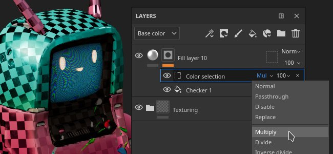
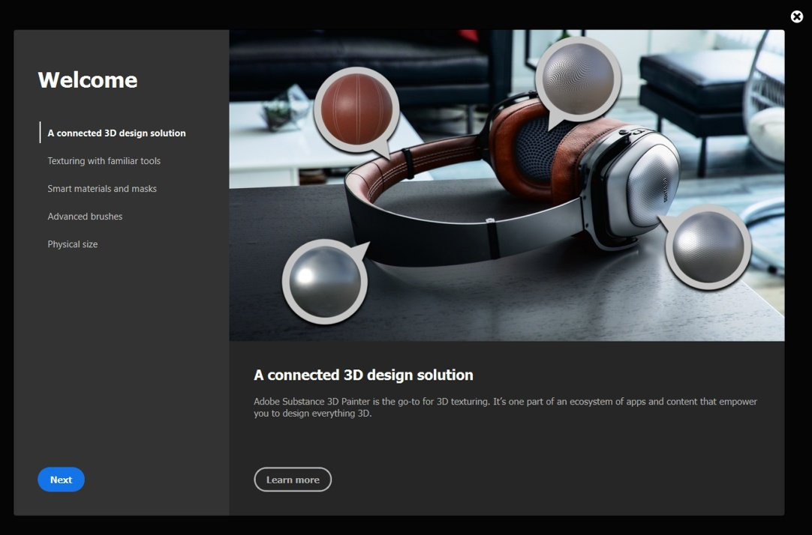
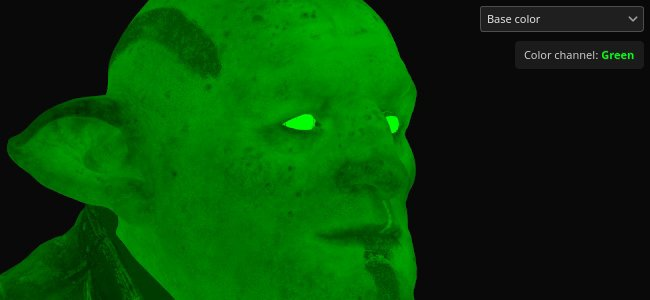

# 版本8.2

**Substance 3D Painter 8.2**&#x200B;侧重于在应用程序的一些方面提供专用功能的大量生活质量改进。

发行日期： *6 2022年10月*

## 主要功能

### 应用混合模式和不透明度的新选项

添加了一些快捷键和操作，可以快速轻松地在图层栈叠中的多个通道之间复制和应用混合模式和不透明度。

* **右键单击混合模式或不透明度控件**\
  右键单击混合模式或不透明度时，请选择操作&#x200B;**应用于所有通道**&#x200B;以在图层的所有其他通道上使用此混合模式。 此操作也适用于具有混合模式和不透明度控件的效果。

  

* **右键单击图层并选择“混合选项”**\
  也可以右键单击图层（或效果）并选择以下操作之一：

  * **将混合应用于所有通道**：将当前通道混合模式应用于当前图层/效果的所有其他通道。
  * **对所有通道应用不透明度**：将当前通道不透明度应用于当前图层/效果的所有其他通道。
  * **同时应用于所有通道**：将当前通道混合模式和不透明度应用于当前图层/效果的所有其他通道。
  * **复制通道混合设置**：将当前图层/效果的所有混合模式和不透明度值复制到剪贴板。
  * **粘贴通道混合设置**：将剪贴板中当前的混合模式和不透明度值应用于目标图层/效果。

  

### 滤镜和颜色选择效果上新的混合模式和不透明度

现在，滤镜和颜色选择效果可以使用混合模式和不透明度控件。

* **滤镜上的混合模式和不透明度**\
  滤镜现在可以使用混合模式和不透明度值。 它们默认为&#x200B;**替换**&#x200B;以保持与之前相同的行为并避免将Alpha组件信息加倍。 滤镜上的混合模式允许计算效果并直接在图层上组合其结果，从而避免使用锚点和填充效果来实现相同结果。 这还可以避免在滤镜本身中手动实现混合模式。

  

* **颜色选区上的混合模式和不透明度**\
  颜色选择效果已经过修改，以支持混合模式和不透明度控件。 以前，此效果是输出Alpha结果，为了使混合模式按预期工作，已添加新设置以指定正在输出的背景色。 它设置为黑色而非透明（这是旧版行为）。

  

  

* **简化的效果栈栈**\
  以前，当需要以某种方式（例如，在混合模式的帮助下）组合效果时，使用锚点和填充效果是必要的。 现在，将混合模式直接放在滤镜上，不再能显着降低效果栈栈的复杂性。

  {width="400px"}

### 对文件夹的新效果

文件夹内容（图层的颜色部分）现在可以接收任何类型的效果。 在必须创建复杂图层配置（如穿透图层或锚点）才能获得相同结果之前。

### 新的Substance存档(SBSAR)导出

Substance存档(SBSAR)文件格式现在可用于导出纹理。 SBSAR是一种能够在Substance集成中打开的容器，它可以快速而轻松地“即插即用”自定义纹理。

* **导出Substance存档(SBSAR)**\
  现在可以从&#x200B;**导出纹理**&#x200B;窗口的文件格式列表中指定SBSAR文件格式。 这将导出包含所有指定纹理的单个SBSAR文件。 输出节点的命名及其使用情况根据选定的导出预设及其通道类型来定义。

  

* **混合导出具有PSD和SBSAR文件格式的预设**\
  导出预设现在可将输出映射指定为PSD或SBSAR，以及所有其他图像格式。 PSD和SBSAR格式被视为“容器”，这意味着可以在其中存储多种纹理。 当导出预设同时指定容器格式和独立图像格式时，模板中针对SBSAR文件的每个输出将组合在一起，而其他输出将导出为单个文件。

  

### 用于照亮3D模型下方的新环境选项

[显示设置](../interface/display-settings/environment-settings.md)中的新设置允许将环境地图与相机对齐，从而可调整光照角度和3D模型下方的照亮部分。

若要使用此新设置，请转到[“显示设置”](../interface/display-settings/environment-settings.md)并更改&#x200B;**“环境对齐方式”**&#x200B;设置：

* **世界**：环境地图与场景对齐。
* **本地**：环境映射与相机对齐。

阴影将根据此设置的配置自动调整。

### “新建收藏夹”和“资源”窗口中的删除/重新加载

已向[资源](../interface/assets/assets.md)窗口添加新操作以使资源管理更方便。

* **常用资源可快速找到它们**\
  右键单击“资源”窗口中的任意资源以收藏（或取消收藏）该资源。 收藏资源始终显示在搜索查询的第一行，在角落有一个小星形标记，这使它们脱颖而出并且可以访问。 同时还添加了专用搜索查询，以便轻松查看所有您喜爱的资源。

  {width="350px"}

* **删除并重新加载磁盘上的资源**\
  现在可以删除、重新加载或重命名用户库中的资源（包中的资源部分，如Substance图形或ABR画笔除外）。

### 其他功能和改进

此新版本中添加了许多其他小的改进和功能：

* **“新欢迎”和“新增功能”窗口**\
  为了随时了解应用程序新增的功能，我们现将在启动应用程序时引入新的“欢迎”和“新增功能”窗口。 这些窗口可以轻松关闭，并且不会在下次启动时再次出现。 始终可以通过&#x200B;**帮助**&#x200B;菜单重新打开它们。

  {width="400px"}

  {width="400px"}

* **用于快速重新导入3D模型的新操作**\
  已添加新的键盘快捷键（默认情况下为&#x200B;**CTRL+SHIFT+R**），它允许快速重新导入当前项目的3D模型。 这样可更轻松、更快速地迭代资源。 如果找不到源文件，将在日志中引发一条错误消息。 还向&#x200B;**编辑**&#x200B;菜单添加了操作。

  

* **改进的HDPI支持**\
  修复了多个HDPI屏幕和系统缩放问题。 我们现在支持中间缩放值(例如 125%)，这应避免在某些屏幕上界面过大或过小。 在具有不同缩放值的HDPI屏幕之间移动窗口的行为也应该正确。

* **将Substance图形参数重置为默认值**\
  在所有使用Substance图形的地方（作为Alpha、材质、滤镜等） 现在可以将其参数重置为默认值。

  * **重置所有参数**：使用参数列表下方的“恢复默认值”按钮重置整个Substance资源。
  * **右键单击**：右键单击特定参数，以打开包含此参数特有的重置操作的菜单。

   

* **查看视口中的单个RGBA组件**\
  在查看视区中的通道时，**显示设置>通道显示**&#x200B;下有一个名为&#x200B;**颜色通道**&#x200B;的新设置，允许单独查看RGBA组件。 这对于分析纹理或隔离用户通道中的特定组件非常有用。

  

  {width="450px"}

* **拼贴超过128的填充图层和效果**\
  填充图层和效果的拼贴参数已修改为具有柔和范围。 这样即可键入任何所需的拼贴值。 滑块的默认范围还从[-128,128]缩小到[-32,32]，以便更轻松地拖动。

  

* **新的16f和32f EXR纹理导出设置**\
  以前，EXR纹理导出在接口中被强制为32f位，但在实际文件中，它将产生16f位数据（半浮点）。 此问题现已修复，在16f和32f位之间有明确的可能性可供选择。 旧项目和使用EXR作为文件格式的导出预设将默认为16f位，以遵从旧行为（主要是为了避免生成比以前更大的文件）。

  

* **导出并重新加载UI布局**\
  可以在&#x200B;**Windows**&#x200B;菜单中找到用于保存和重新加载UI布局的新操作。 这样可以更方便地在不同版面之间切换，或跨计算机保存和重新使用UI。 当前两种Painter模式 — 渲染和绘画 — 都有其自己的布局。 Python中还提供了一些功能，用于保存和重新导入UI布局（请参阅下文）。

  

* **重新组织的文件菜单**\
  我们通过将几个高级存储功能组合在一起，清理了“文件”菜单。 其中一些行动也已重新命名，以阐明其行为。

  

* **改进了打开过新的项目时的错误消息。**\
  现在，当打开使用更新版本的应用程序创建的项目时，会显示一条更有用的消息。 该消息现在包括项目和应用程序版本，以便更好地了解所需的版本。

  {width="400px"}

### 改进了Python脚本

Python API中添加了多项新功能。 有关完整的详细信息，请查看应用程序的“帮助”菜单中提供的文档。

* **substance\_painter.resource**\
  **substance\_painter.resource.Type**&#x200B;现在允许标识更多种类的资源，特别是Substance和Photoshop画笔包。\
  资源对象现在可以列出其父级和子级，允许在Substance包和Substance图形之间导航，例如。

* **substance\_painter.textureset**\
  已添加两个新函数（和一个枚举）来获取和设置纹理集设置中的网格映射： **get\_mesh\_map\_resource()**&#x200B;和&#x200B;**set\_mesh\_map\_resource()**。

* **substance\_painter.ui**\
  添加了一些功能以保存和重新加载UI布局。 请注意，布局还取决于当前的应用程序模式（“绘画”或“渲染”）。

* **substance\_painter.event**\
  已添加新的&#x200B;**TextureStateEvent**，以帮助跟踪纹理集图层栈栈中的修改以及其他参数更改。 此事件触发绘画描边或添加/删除通道。

## 发行说明

### 8.2.0

*（发布日期：2022年10月6日）*\
摘要：**包含新入门面板（新的“欢迎”面板和“新增功能”面板）的主要版本、导出到SBSAR、文件夹效果、生活质量的几项改进和错误修复。**

**已添加：**

* [入职]入门面板欢迎新用户

  当新的CC用户首次打开Painter时，添加了一个新的欢迎屏幕。
* [用户引导]新增功能面板，可提高新功能的可发现性

  添加了一个新的新增功能屏幕，其中显示了主要的新增功能。 在重大更新后，首次打开Painter时，它会自动显示，并且可以通过“帮助”>“新增功能”再次访问。
* [入职]重命名旧版欢迎使用“主屏幕”

  旧版欢迎屏幕已重命名为“主屏幕”，以避免与新版欢迎屏幕混淆。
* [UI]解决高DPI屏幕的缩放问题

  改进了高清屏幕上带有自定义显示缩放的Painter UI适应。
* [UI]避免在UI中出现持久的错误消息

  以前项目中的错误消息现在已从底部状态栏中删除。
* [UI]返工保存菜单

  其他存储选项现在分组到一个子菜单中，并且为了保持一致性，会重命名一些选项。
* [UI]保存和导出/共享UI布局

  “窗口”菜单内有一些新的操作，可将UI布局保存到文件中并重新加载它们。 绘画和渲染布局将单独保存。\
  “substance\_painter.ui”中添加了多种功能，用于保存、重置和加载UI布局。
* 为图层的混合模式/不透明度添加复制/粘贴操作

  在图层右键菜单中添加了一个新条目“混合选项”。 可以将一个图层中所有通道的混合模式和不透明度复制并粘贴到另一个图层。
* 将混合模式/不透明度应用于图层的所有通道

  向图层的混合模式和不透明度添加了右键单击功能，允许将当前单击的设置应用于所有通道。
* 使用键盘快捷键重新加载网格(CTRL+SHIFT+R)

  添加了一个可编辑的快捷键，以便使用上次可用的设置重新加载网格文件。 也可以通过“编辑”>“重新导入网格”访问。
* 将Substance参数重置为默认值

  在.sbsar资源底部的“属性”中添加了一个新按钮，允许将资源重置为默认值。
* 将画笔重置为默认值

  向“属性”中的“画笔”部分添加了新菜单，允许重置为默认基本画笔。
* 右键单击以将单个Substance参数重置为默认值

  增加了通过右键单击重置.sbsar资源中单个参数的可能性。
* [资源面板]将收藏资源“固定”到显示在资源面板顶部

  向库资源添加了一个新的右键单击选项，该选项允许将资源作为收藏夹固定到面板顶部。 您还可以通过“保存的搜索”查看所有收藏的资源。
* [资源面板]删除、重新加载和重命名资源

  添加了右键单击菜单选项，以删除、重新加载和重命名用户库中的资源。 它们会直接从磁盘上的库位置删除，并从原始位置重新加载。 无法单独编辑属于包(如.abr或.sbsar)的资源。
* [颜色选区]向颜色选区效果添加混合模式
* [图层栈栈]在滤镜上添加混合模式和不透明度
* [图层栈栈]允许拼贴值大于128用于填充图层/效果
* [图层栈叠]填充图层/效果中圆柱投影的圆柱盖

  填充图层属性中的圆柱投影现在可以选择删除圆柱盖。
* [日志]在尝试创建UV磁贴项目时，如果网格部件在负空间中，则显示错误消息

  在无法创建UV磁贴项目时，添加了更清晰的错误消息，因为UV部件位于负空间中。
* [Project]打开项目时，在错误消息“数据太新”中指示版本

  当打开应用程序最近打开的项目时，错误消息现在将指示项目的版本，以便更容易地确定正确的应用程序版本。
* [视区]允许从下方点亮网格

  在显示设置>相机>环境设置中添加了新的环境对齐参数，以便在设置为“本地”时将环境映射光照与相机对齐。
* [视区]在视区中查看R、G、B和Alpha（单独显示模式）

  在“Display Settings”（显示设置）>“Viewport Settings”（视口设置）>“Channel display”（通道显示）下，有一个新的“Color channel”（颜色通道）设置，当处于单显示模式时，此设置仅允许显示通道的R、G、B或Alpha分量。
* [Shader]允许在素材图层着色器中将用户通道设置为RGBA

  现在，在用于材质图层的着色器内设置“纹理集”通道配置时，可以指定通道格式以偏离默认值。 这尤其允许您请求彩色用户通道，而不是仅请求灰度。
* [导出]允许将纹理导出为SBSAR

  通过“文件”>“导出纹理”窗口导出纹理时，可以选择SBSAR（Substance存档）文件格式将它们重新组合在一起。 SBSAR的内容由所使用的输出模板驱动。\
  也可以在导出预设中设置SBSAR文件格式。 使用混合配置（SBSAR +其他格式）时，目标SBSAR的纹理将组合在一起，而其余的纹理将一起导出。
* [导出]显示EXR文件格式的16位选项

  导出EXR纹理文件时，现在可以在导出纹理窗口中选择16f位（半浮动）或32f位（浮动）（用于导出设置和导出预设）。 旧项目和旧导出预设将默认为16f位，以反映旧行为。
* [Python]添加事件以了解何时修改纹理集

  通过新的“substance\_painter.event.TextureStateEvent”，可了解何时由于绘画描边、添加新通道或移除通道而修改了纹理集。
* [Python]允许在纹理集设置中获取和设置网格映射资源

  在“substance\_painter.project”模块中添加了新的函数，用于获取和设置网格映射资源。 这些函数可用于更新纹理集设置所引用的网格图。
* [插件]删除获取其他JS插件的选项

  删除了获取Javascript插件的选项，因为它们托管在损坏的共享网站上。
* [内容]添加新的Roblox模板并导出预设

  添加了一个新的Roblox“材质变体”和“表面外观”项目模板以及导出预设，以便更轻松地将PBR纹理导出到Roblox。 可通过“文件”>“新建项目”窗口访问该模板。
* 将Substance 引擎更新到上一个版本(8.6.3)
* [Steam]针对Apple Silicon芯片组(Apple M1/M2)的优化构建

**已修复：**

* 使用16k exr时崩溃
* [崩溃]删除着色器实例后按住Ctrl Z键
* [Iray]对于某些着色器，IoR被阻止为1
* [Win][烘焙]某些高多边形无法加载
* [色彩管理]使用滤镜的UI中的色彩空间名称不正确
* [Python]导入函数返回的资源对象没有类型

  在Python中导入Substance包时，函数返回的是包而不是其图形。 资源模块现在提供用于检索Substance包的图形的功能和参数。

**已知问题：**

* [色彩管理]在Linux上使用ACE进行HDR色彩空间转换时，会产生固定颜色
* [图层栈栈]未按图层存储输入源
* [绘画]在某些情况下，时间消除锯齿会导致绘制伪像
* [导出] 2DView导出随机一致的映射
