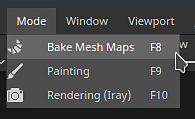
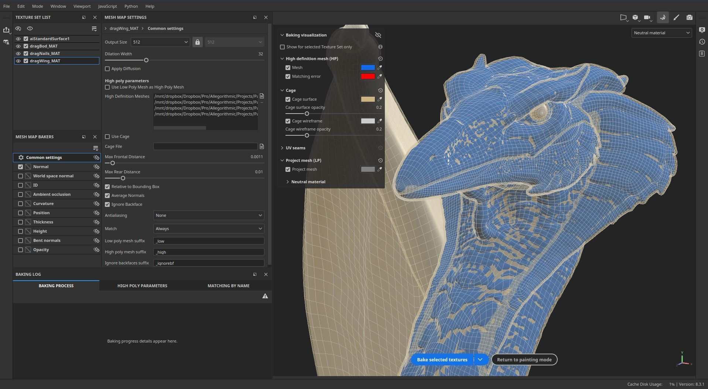
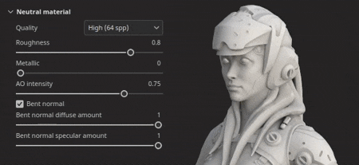
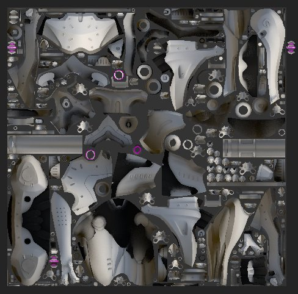

# 版本8.3

**Substance 3D Painter 8.3**&#x200B;引入了全新的烘焙模式、USD文件导入和对UV 投影模式下物理尺寸的支持。

发行日期： *2023年1月10日*

## 主要功能

### 新烘焙模式

旧式烘焙窗口已由具有若干新功能的专用模式取代，特别是视窗可视化，例如保持架的显示和匹配错误。

* **访问和切换模式**\
  除了应用程序现有的绘画和渲染模式之外，烘焙现在是一种新的独立模式。 要进入烘焙模式，只需使用上下文工具栏中的小羊角面包图标。 除此之外，还可以通过使用模式菜单或键盘快捷键在模式之间切换。 要返回其他模式，只需使用该模式的专用图标（此外，[纹理集设置](../interface/texture-set/texture-set-settings.md)中的&#x200B;**烘焙网格映射**&#x200B;按钮仍可用于进入新模式）。

  

  

* **新模式界面**\
  传统的烘焙窗户已经转变为带有专用停放的模式，特别是：

  * **纹理集列表**&#x200B;可用于定义项目的哪些部分将被烘焙。
  * **网格图烘焙器**&#x200B;允许在常用烘焙设置和烘焙器设置之间进行选择。 此外，您还可以在此处指定将启动哪个烘焙流程。
  * **网格映射设置**&#x200B;是所有面包师和常用设置所在的位置，可以根据前两个窗口中的选项进行修改。
  * **烘焙日志**&#x200B;将有关烘焙过程的不同信息重新分组，特别是错误消息。
  * **烘焙可视化**：此面板位于视区中，用于控制与显示低多边形网格和高多边形网格相关的几个选项。

  {width="500px"}

* **直接从视区启动和取消烘焙过程**\
  现在，用于启动或取消烘焙过程的按钮位于视区的底部。 也可使用小箭头指定烘焙模式：基于“纹理集”列表选择或使用当前活动的“纹理集”。

  

  

* **在视区中显示高多边形网格**\
  在烘焙设置中指定高多边形网格时，它现在也会载入视口中（除非禁用了专用可视化设置）。 这可以检查低多边形网格几何和高多边形网格几何是否匹配良好。

  {width="400px"}

* **将缺失区域显示为错误的视区中的网格显示**\
  轿厢网格也可以显示在视区中。 不使用专用网格文件时，将显示隐式保持格，且它将对“最大正面距离”参数做出反应。 调整保持架大小时，在保持架外部的高多边形网格的任何部分在默认情况下都显示为红色，从而易于找到烘焙过程将遗漏的网格部分。

  

* **加载和烘焙时查看网格**\
  加载网格和烘焙不再冻结应用程序，这意味着在这些操作过程中可以与视区交互。 这对于调查正在进行的烘焙、尽早发现问题并取消烘焙非常有用，这有助于最终节省时间。 同样，现在将首先烘焙视区中最可见的纹理集，这有助于提前查看特定区域的效果。

  

* **中性素材和视区设置**\
  为了帮助专注于烘焙结果并查找问题（如有），烘焙模式不显示绘制的纹理，而是使用中性素材。 此中性素材的设置可在视口内的烘焙可视化面板中调整。

  

* **显示缺少UV接缝的硬边缘**\
  烘焙时产生伪影的一个原因是硬边缘不存在UV接缝。 这可能导致出现可见线条并破坏着色的Smoothness。 为此，添加了可视化设置，以在3D和2D视图中突出显示它们，否则它们很容易被忽略。

  {width="450px"}

  {width="300px"}

* **同步和取消同步参数**\
  新的同步操作允许您指定在纹理集之间同步烘焙设置的哪个部分。 否则，以相同的方式多次配置设置将是繁琐的。 有时，使用具有专用设置的纹理集非常有用，最好让它们保持不同步。 例如，现在保持“公用”设置的分隔允许使用“最大正面距离”、“分辨率”和/或每个“纹理集”具有不同的高多边形网格的列表。

  {width="400px"}

  {width="400px"}

* **按名称检查器匹配**\
  **烘焙日志**&#x200B;中的&#x200B;**按名称匹配**&#x200B;选项卡可帮助在烘焙前查找匹配过程中的错误，从而更容易注意到不匹配的网格。 匹配网格将组合在一起，而其他网格将隔离并以红色显示。

  {width="450px"}

>[!NOTE]
>
> 此新模式中包含更多新设置。 要了解更多信息，请参阅[专用文档页面](../baking/baking.md)。

### 全新导入和导出美元文件

此新版本添加了[通用场景描述(USD)](https://graphics.pixar.com/usd/release/intro.html)文件格式的支持。 现在可以启动Painter项目，使用USD格式导出网格和纹理，这样可实现跨应用程序工作流更一致。

* **导入具有变体、外观和特定帧的USD文件**\
  在创建项目或在项目内重新导入网格时，可以使用USD文件格式。 USD文件通常可能是复杂场景，因此范围和变体选择器也可用于仅导入文件的子集。

  {width="400px"}

  {width="400px"}

* **将USD导出为新文件或链接到项目中使用的原始USD**\
  纹理制作就绪后，您可以使用&#x200B;**文件>导出纹理**&#x200B;窗口将您的美元文件与纹理文件一起导出。 只需启用&#x200B;**导出USD资源**&#x200B;设置即可执行此操作。 这将生成若干个USD文件，之后可轻松集成到管道中。 如果使用非USD文件或没有UV的USD文件，则除了纹理映射和USD材质文件之外，还将导出新的USD几何文件。\
  此外，也可以使用&#x200B;**文件>导出网格**&#x200B;将项目几何形状导出为USD文件。

  

  {width="400px"}

### 改进了UV模式下对物理尺寸的支持

对嵌入物理尺寸的Substance材料的支持已扩展到基于紫外线的投影。

* **在UV模式下物理尺寸**\
  现在，可以使用UV 投影模式在填充图层和填充效果中将缩放模式设置为物理尺寸而不是拼贴。 UV的大小根据UV展开后的三角形平均大小自动计算。

  {width="400px"}

* **自动切换到物理尺寸**&#x200B;添加了新项目设置，用于在创建素材时（例如，为“资源”窗口拖放资源时）自动将缩放设置设为物理尺寸。 这允许在项目间使用一致的大小调整，而无需在每次创建新填充图层时手动切换设置。 要在现有项目中启用该功能，请转到&#x200B;**编辑>项目配置**，并启用&#x200B;**在分配材质时将填充图层缩放切换为物理尺寸**。 创建新项目时也可以启用此设置。

  

## 平台支持信息

在此版本中，我们将Steam上Painter的最低支持版本提高到Ubuntu 20.04。

## 教程

要发现并了解新的烘焙模式，请查看我们的最新教程：

## 发行说明

*（发布日期：2023年1月10日）*\
摘要： **具有新烘焙模式、新导入和导出USD文件以及物理尺寸支持UV 投影的主要版本**

**已添加：**

* [烘焙模式]专用于烘焙过程的新烘焙模式
* [烘焙模式]设置快捷键以切换到烘焙模式为F8
* [烘焙模式]在视区中添加“开始”和“取消”烘焙按钮
* [烘焙模式]在“纹理集”列表中添加烘焙选择
* [烘焙模式]添加新的网格图烘焙器窗口以选择烘焙器
* [烘焙模式]添加新的“网格映射设置”窗口以编辑烘焙设置
* [烘焙模式]添加新的烘焙日志窗口以遵循烘焙过程
* [烘焙模式]向历史记录窗口添加烘焙参数和撤消操作
* [烘焙模式]在网格映射设置中添加面包屑
* [烘焙模式]在网格图烘焙器窗口中添加网格图缩览图
* [烘焙模式]在3D视口中添加可视化设置可折叠菜单
* [烘焙模式]添加可视化设置以显示/隐藏高多边形网格
* [烘焙模式]添加可视化设置以显示/隐藏笼形网格和线框
* [烘焙模式]添加可视化设置以显示/隐藏低多边形网格
* [烘焙模式]添加可视化设置以将没有UV接缝的硬边显示为错误
* [烘焙模式]如果烘焙日志不可见，则在视窗中通知有关网格和烘焙错误的信息
* [烘焙模式]添加操作以在所有纹理集之间同步烘焙设置

  在“网格映射烘焙器”窗口中，通过单击每个烘焙器名称旁边的链接图标，可以在纹理集之间同步每个烘焙器（以及常用设置）。 此操作将打开一个窗口，允许您选择哪些纹理集将共享相同的参数。
* [烘焙模式]添加操作以复制和粘贴烘焙器设置

  通过窗口顶部的专用菜单或右键单击上下文菜单，可以在“网格贴图烘焙器”窗口中执行操作，以跨纹理集复制和粘贴每个烘焙器设置。
* [烘焙模式]在烘焙日志中添加按钮，以便从错误跳转到正确的设置

  当烘焙器失败或网格未正确加载时，烘焙日志中会显示错误消息。 通过消息旁的按钮，可以更改“网格图标记”和“网格图设置”窗口以显示相关设置。 这有助于更轻松地找出问题的根源，以便能够对其进行修复。
* [烘焙模式]添加菜单以管理纹理集和烘焙器选择

  在“纹理集列表”和“网格映射烘焙器”窗口中都添加了一些操作菜单，以帮助复制、反转选区。
* [烘焙模式]按纹理集拆分烘焙器选择列表
* [烘焙模式]每个纹理集拆分公共设置
* [烘焙模式]加载高多边形和笼形网格而不冻结界面
* [烘焙模式]使用视口进度栏显示网格加载
* [烘焙模式]在烘焙日志中添加网格加载状态
* [烘焙模式]允许在烘焙期间在视区中翻转网格
* [烘焙模式]根据当前网格视口可见性设置烘焙顺序
* [烘焙模式]在视区中显示隐式烘焙笼

  不使用定制的cage网格文件时，将生成自动的cage网格并在视区中显示。 其大小将基于烘焙公共设置中的“最大正面距离”参数。 用保持架网格表示低多边形与高多边形之间匹配的距离。
* [烘焙模式]在烘焙日志中显示要按名称匹配的网格名称的匹配列表
* [烘焙模式]使用中性材料以在视区中显示3D模型
* [烘焙模式]在烘焙模式下禁用引擎计算
* [烘焙模式]在烘焙过程中退出应用程序时显示警告
* [Bakers]更新消除锯齿设置标签

  消除锯齿设置值已重命名为“超采样”，并带有显式乘数以阐明其行为。
* [Bakers]将Bakers更新到2.5.7版。
* [USD]导入和导出通用场景描述(USD)文件
* [USD]选择USD文件时将USD选项添加到“新建项目”窗口
* [USD]添加新的“范围和变体”选择窗口

  导入USD文件时，单击“新建项目”或“项目配置”窗口中的“更改”按钮允许选择要导入USD文件的部件和变体。
* [USD]添加细分级别选项

  在使用包含子分割的USD网格文件创建新项目时，可以使用滑块选择子分割级别。 将使用细分的网格创建项目。 可通过“项目配置”修改该级别。
* [USD]在特定帧处导入USD外观网格

  在使用包含动画的USD网格文件创建新项目时，可以使用反映嵌入时间轴序列的滑块来选择帧。 可以通过“项目配置”修改该框架。
* [USD]&#x200B;[Export]添加导出USD文件的选项

  “导出纹理”窗口中新增了“导出美元”复选框。 选中后，即可使用任意模板导出美元文件和纹理图。
* [USD]&#x200B;[导出]将USD文件格式添加到网格导出
* [USD]将现有的“USD PBR Metal Roughness”（USD PBR金属粗糙度）导出预设重命名为更明确

  仍然可以通过导出纹理>输出模板> USDz (Apple AR)访问之前称为“USD PBR金属粗糙度”的美元导出模板。
* [自动展开]为打包添加锁定方向

  用于“自动展开”设置的新选项，允许您在使用UV 岛功能时保留现有打包的方向。 可通过新建项目>自动展开选项>UV 岛方向访问该页面。
* [物理尺寸]添加设置以自动在填充效果/图层中使用物理尺寸

  添加了一个新选项，可在使用嵌入物理尺寸的材质时自动切换到物理尺寸缩放。 可以通过新项目或在分配材质时通过“编辑”>“项目配置”>“物理尺寸”>“将填充图层缩放切换到物理尺寸”为每个项目启用该功能。
* [物理尺寸]显示UV 投影物理尺寸

  物理尺寸缩放现在适用于UV 投影 — 它可根据网格物理尺寸为材质启用自动调整大小。 可通过“填充图层”或“效果属性”窗口中的“缩放”>“物理尺寸”来选择它。
* [脚本]&#x200B;[Python]允许查询应用程序版本
* [脚本]&#x200B;[JavaScript]更新API以匹配新的生成参数
* [脚本]&#x200B;[Python]烘焙模块：编辑烘焙参数
* [脚本]&#x200B;[Python]烘焙模块：启动/取消烘焙
* [脚本]&#x200B;[Python]烘焙模块：选择曲率方法
* [脚本]&#x200B;[Python]烘焙模块：烘焙师/uv磁贴的选择
* [脚本]&#x200B;[Python]烘焙模块：在所有纹理集之间同步烘焙器设置
* [SVT]在AMD GPU上启用稀疏硬件支持

  现在可使用AMD GPU启用稀疏虚拟纹理系统的硬件加速。 此设置会在常规首选项中自动启用。
* [投影]重命名圆柱投影参数

  参数“Cylinder Cap Culling”已重命名为“Backface Culling”，以更好地表示其作用。 相关的工具提示已相应调整。
* [Project]将应用程序版本保存在项目中，并通过脚本检索它

  从版本8.2开始，应用程序版本现在在存储时存储在spp文件中。\
  可以在Python API的项目模块中使用函数last\_saved\_substance\_painter\_version()检索此版本号。\
  对于在8.2之前创建的项目，返回的值将为null。
* [导入]改进3D模型的常规导入时间

  改进了网格的通用导入时间。 例如，减少载入用于烘焙的高多边形网格时的等待时间。 此优化尤其适用于OBJ文件的加载。

**已修复：**

* [崩溃]更改具有特定栈栈的滤镜上的通道
* [Mac]&#x200B;[M1]创建填充图层并离开图层栈叠时崩溃

  此问题可通过更新到Mac OS 13 (Ventura)来修复。
* [脚本]&#x200B;[Python]将ui.add\_dock\_widget()用于错误类型时崩溃
* [烘焙]烘焙失败时日志中的错误消息不完整
* [烘焙]烘焙完成后不会释放内存
* [引擎]更改效果可见性时，纹理缓存不会更新
* [导出] 2DView导出随机一致的映射
* [Project]保存大网格项目时出现内存分配错误
* [视区]在某些情况下，TAA会导致绘制伪像

**已知问题：**

* [色彩管理]在Linux上使用ACE进行HDR色彩空间转换时，会产生固定颜色
* [图层栈栈]未按图层存储输入源
* [导出] 2D视图可随机导出统一映射
