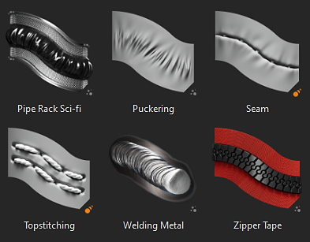

# 版本9.0

<b>Substance 3D Painter 9.0</b>引入了一种新方法，可在3D视口中使用可重新编辑的路径绘制描边，并刷新默认内容。

发行日期： *2023年6月20日*

## 主要功能

### 在3D视区中沿路径新绘画

<b>沿路径绘制</b>工具是在3D视区中绘制描边的新方法。 与其他应用程序类似，您可以创建由3D对象表面上的点驱动的基于贝塞尔曲线的曲线来绘制图案。 结合Substance材料，这种新工具可以开启许多新的可能性。

* <b>用于创建由具有点的路径驱动的绘画描边的新工具</b>\
  该工具的工具栏内部有一个专用于路径工具的新图标。 此新工具允许在3D模型表面绘制曲线以创建绘画描边。 这些描边始终可以重新编辑。 当工具处于活动状态时，只需单击网格曲面即可添加点。 单击现有点并按delete键将其删除。

  

  
* <b>拖动并移动网格曲面上的点</b>\
  要编辑路径的形状，只需单击并拖动一个点即可沿3D模型表面移动。

  
* <b>关闭路径以创建无缝图案</b>\
  也可以通过闭合路径来创建环，这对于例如围绕特定区域创建重复图案都非常有用。

  

  
* <b>使用路径面板重新编辑路径（及其属性）</b>\
  选择路径工具后，在当前绘画图层内创建的路径列在3D视口顶部的专用路径面板中。 此面板允许选择、删除路径或将路径重命名为

  

  
* <b>与其他绘画功能（如对称、几何蒙版、动态笔触等）兼容。</b>\
  常规绘画描边中的许多设置都可以与路径工具一起使用：

  * 启用对称允许绘制路径多次，而仅管理一条路径。
  * 已启用几何图形蒙版的图层上的路径可以在隐藏几何图形下绘制

  
* <b>使用橡皮擦或涂抹等其他工具进行绘画</b>\
  路径工具还与橡皮擦和涂抹工具兼容，解锁更高级的绘画和组合笔触方式以及操作路径点的简单且可重新编辑的方式。

  

* <b>保存并重复使用带有预设的路径属性</b>\
  使用路径工具时，也可以将画笔属性保存为预设。 这允许保存工具预设，当从“资源”窗口中选择时，这些预设将自动切换到路径工具。

>[!NOTE]
>
> 有关详细信息，请参阅[专用文档](../painting/tool-list/path.md)。

### 与沿路径绘画功能一起使用的新内容

此版本中包括一些新的工具预设，以利用新的沿路径绘画功能：

* 管架科幻
* 起皱
* 接缝
* 顶纹效果
* 焊接金属
* 拉链磁带

### 改进了“沿路径绘画”功能的动态笔触

我们利用新路径工具的机会，向动态笔触系统添加新属性。 这些新属性解锁了以前不可能实现的新类型描边，如图像上的箭头，它具有不同的开始和结束视觉效果。

* <b>新的Start/Middle/End属性</b>\
  可以定义一个新属性，以指定描边内的图章是第一个、最后一个还是中间的，还是Substance图形。 这样就可以创建起点和终点，这对创建拉链非常有用。 （<b>注意</b>：结束状态仅适用于路径工具。）
* <b>新大小和间距属性</b>\
  利用size和spacing属性，可根据当前图章状态调整Substance图表的输出。
* <b>新的描边长度属性</b>\
  沿路径的距离和路径的最大距离允许更好地控制某些效果何时重复，而不是直接提供归一化值。\
  利用此功能，可同时构建一个增长描边作为示例，以及一个具有基于绘制的距离（而不是绘制的图章总数）的重复图案的描边。

>[!NOTE]
>
> 有关详细信息，请参阅[专用文档](../painting/dynamic-strokes/creating-custom-dynamic-strokes.md)。

### 更新的默认材质

在此版本中，我们决定在图库中执行一些清理操作，因此更改了默认基础材质，以使其对每个人更有用。 这些素材是由同一团队在[Substance 3D Assets](https://substance3d.adobe.com/assets)上传递内容而制作的。

>[!NOTE]
>
> 已删除的内容在[Substance 3D社区资源](https://substance3d.adobe.com/community-assets?q=painter23update&u=painter23update)上可用。

## 教程

要发现并了解新的路径工具，请查看我们的最新教程：

## 发行说明

### 9.0.0

发行日期：<b>2023/06/20</b>\
摘要：<b>沿路径绘画的主要版本允许绘制3D曲线、新的基础材质以及对旧材质的清理和3D曲线的新预设</b>

<b>已添加：</b>

* [路径]添加新的沿路径绘画工具
* [路径]为路径工具添加一个空快捷键
* [路径]允许向现有路径添加新点
* [路径]添加快捷键以退出当前路径创建
* [路径]允许编辑路径的画笔属性
* [路径]放置点时自动调整切线
* [路径]移动点时重新计算切线
* [路径]将新创建的点与网格曲面对齐
* [路径]允许编辑每个顶点的压力
* [路径]从邻近点调整新创建点的压力
* [路径]允许将点转换为平滑/圆角（切线断点）
* [路径]允许立即移动新添加的点
* [路径]允许从现有路径中删除点
* [路径]允许反转路径的方向
* [路径]允许在视区中选择路径
* [路径]允许使用选框选择路径点
* [路径]引入CTRL-A快捷键以选择路径的所有点
* [路径]允许闭合路径
* [路径]允许在“属性”中指定路径上轴
* [路径]将顶点控制菜单添加到上下文工具栏
* [路径]向路径工具引入绘画/擦除/涂抹模式
* [路径]为视区中的路径创建可视反馈
* [路径]添加路径方向的可视指示器
* [Path]将线条Thickness添加到路径显示设置
* [路径]允许隐藏路径UI
* [路径]添加“路径”面板以列出当前选定图层的路径
* [路径]将鼠标悬停在“路径”面板中的路径上时，添加视觉反馈
* [路径]每次选择“路径”工具时都显示“路径”面板
* [路径]允许在“路径”面板中重命名、删除、复制、剪切、复制路径
* [Path]尝试在2D视口中与“路径”工具交互时显示消息
* [库]集成新内容（路径工具和基础材质）
* [动态笔触]为动态笔触添加距离属性
* [动态笔触]向动态笔触添加大小和间距属性
* [动态笔触]为动态笔触添加start/middle/end属性
* [Python][USD]公开USD格式的项目配置参数
* [Python][USD]公开USD格式的项目创建参数
* [导出][USD]在导出的USD文件中添加项目路径信息
* [GLTF]重新加载GLTF文件时更新库中的纹理
* [着色器]减少具有不同方向的UV 岛的接缝伪影
* [Engine]更新到Substance引擎版本9.0

<b>已修复：</b>

* [导入]在Painter中，某些具有纹理的GLB无法获取纹理
* [AMD]所有3D投影填充的边框上存在伪像
* [引擎]切换图层可见性时，纹理中断
* [引擎]更改混合模式时，某些位置的纹理为空
* [引擎]在某些情况下，“纹理/投影”为空变形模式
* [Iray]保存渲染时，迭代重置为0
* [日志]执行“文件”>“新建”操作时出现USD错误消息

<b>已知问题：</b>

* [色彩管理]在Linux上使用ACE进行HDR色彩空间转换时，会产生固定颜色
* [图层栈栈]未按图层存储输入源
