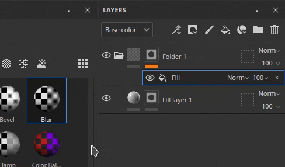
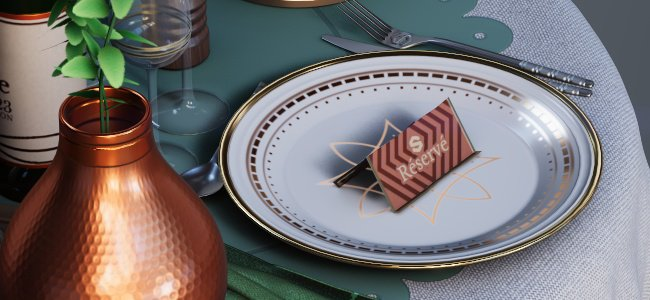

# 版本9.1

<b>Substance 3D Painter 9.1</b>添加了路径工具的正切控件、SVG文件格式支持、通过拖放导入和应用资源的功能以及对视口中translucency的支持。

发行日期： *7 2023年11月*

## 主要功能

### 新的正切控制和路径工具的改进

在此新版本中，我们继续开发路径工具（在9.0版中引入），以添加社区要求的缺失位和功能。

* <b>手动控制路径点正切</b>

  现在可以手动设置正切上特定点的路径。 这可以覆盖自动行为以创建新形状。

  
* <b>通过操纵器编辑路径点</b>

  有时，仅滑动对象表面的点是不够的。 操纵器允许将点移动到曲面之外。 一次移动多个点可能非常有用，例如，当网格重新导入后它们距离曲面太远时。

  
* <b>单独切换路径可见性</b>

  现在，可以通过专用视口面板更改每个路径的可见性。 禁用路径将从最终纹理中移除其贡献，而无需将其删除。

  
* <b>复制和粘贴路径位置和属性</b>

  复制和粘贴路径已扩展为只能复制路径点位置或其属性。 现在可以按不同方式同步路径，从而更轻松地创建复杂效果（通过位置）或跨不同位置共享特定外观（通过属性）。

  

  

>[!NOTE]
>
> 有关路径工具的更多信息，请参阅[专用文档](../painting/tool-list/path.md)。

### 对视口中的translucency、透明度和吸收的全新支持

<b>Adobe Standard Material</b> (ASM)着色器（创建新项目时的默认属性）已更新为支持<b>Translucency</b>、<b>透明度</b>和<b>吸收</b>属性。 这意味着现在可以在实时视口（以及Iray渲染器内部）中查看这些渲染行为的结果。

因此，现在可以直接在视口中看到具有细吸收光的创作材料，例如<b>玻璃</b>、<b>叶子</b>或<b>塑料</b>。 由于ASM定义，导出到其他Substance 3D应用程序也会导致匹配的外观。

* <b>新的ASM着色器设置</b>

  已更新ASM着色器以支持新功能，可以通过[着色器设置](../interface/shader-settings/shader-settings.md)窗口修改这些功能：

  * <b>透明度</b>（不透明度）：是否不再需要切换到其他着色器以获得透明表面（如叶子）。 而是应在<b>几何>Alpha 值混合处理</b>组下启用<b>Alpha测试</b>或<b>不透明度</b>参数。 常规设置（如仿色）也可用。
  * <b>Translucency</b>：此新属性允许创建玻璃等表面，使形状透明，同时保持Specular反射。 要使用它，请在项目中添加一个Translucency声道，并在<b>内部</b>组下启用<b>Translucency</b>参数。
  * <b>吸收</b>：此新属性允许模拟光线通过对象并被吸收，这可用于以比使用次表面散射更好的方式模拟塑料或液体。 要使用它，请在<b>内部</b>组下启用<b>吸收</b>设置。
* <b>改进了着色器设置UI和工具提示</b>

  在着色器的重新制作中，我们借此机会改进了参数的UI，并添加了许多新的工具提示，以更轻松地了解如何激活它们。

  参数的顺序还应与其他Substance 3D软件更匹配，以便在试用设置时更易于来回操作。

  
* <b>用于演示Adobe Standard Material的新示例项目</b>

  一开始可能很难处理新的ASM属性，因此添加了一个新的示例项目，演示了该着色器的多个功能，以便更容易地学习这些功能。

  此项目名为<b>French Restaurant Table</b>，可通过<b>文件>打开示例</b>菜单找到。 它还可以使用很多小技巧，因此可以成为一个很好的学习资源来发现新的纹理创建方法。

  
* <b>Translucency通道现在默认为黑色</b>

  为了使新的着色器属性更易于使用并避免在视口中出现意外结果，通道Translucency的默认颜色已更改为黑色（而不是白色）。

  如果此声道已在您的项目中使用，您只需在图层堆叠底部添加一个填充图层，并将声道值设置为白色，即可获得以前的行为。 您可能希望在着色器参数中启用设置<b>使用translucency作为散射蒙版</b>，以及重新应用通道对子表面散射结果的贡献。

### 新增了对矢量图形文件的支持(SVG)

此版本添加了SVG文件的支持，作为可用于图层、绘画工具等的资源。

SVG文件非常适用于精确地表示徽标或形状，同时重量非常轻。 在Painter中，它们可以按所需分辨率进行渲染并轻松更新，使其成为非破坏性工作流程的理想选择。

* <b>导入SVG文件</b>\
  SVG文件可以像导入任何其他资源一样导入到项目中、库中，等等。可以导入SVG<b>，最高版本为1.1</b>，不支持来自新版本的功能。

  在此版本中，导入也变得更加容易（请参阅下文），因此只需将资源从Painter外部直接拖放到网格或图层堆叠上，即可使用SVG文件。
* <b>专用SVG设置</b>\
  使用SVG资源时，有一些设置可用于控制其外观：

  * <b>分辨率</b>：使用自动分辨率、在文件中定义的分辨率或自定义值。
  * <b>裁剪区域</b>：定义要使用的SVG画布的特定区域。
  * <b>范围</b>：选择SVG的整个内容或仅选择某些元素。

  
* <b>新SVG已定制材料</b>

  添加了3个新资源，以帮助在添加纹理时使用SVG文件：

  * <b>自定义喷涂绘画</b>：允许模拟单个输入图像在墙上绘制的贴花。
  * <b>自定义贴纸</b>：在表面创建塑料贴纸。 它具有多种设置以模拟损坏和折叠。
  * <b>图形到材质</b>：允许通过单个图像输入创建多个材质属性。 将SVG文件拖放到视区中时，会自动插入此资源。 此资源提供了一种跨多个渠道共享其输入透明度的简单方法，使其非常适合简单的贴花。

  

  

>[!NOTE]
>
> 有关SVG格式和设置的详细信息，请参阅[专用文档](../painting/vector-graphic-svg.md)。

### 通过拖放新建资源导入

此版本允许将外部文件拖放到应用程序的不同上下文中以自动导入并使用资源。 这个新流程允许跳过与导入文件相关的繁琐步骤。

* <b>通过拖放到视口导入</b>

  将外部文件拖放到视口中，以便能够将其直接放在网格上。 此操作将自动创建新图层。 根据资源的性质（图像、Substance素材、Substance筛选等） 结果将相应调整。
* <b>通过拖放导入图层堆叠</b>\
  与将外部资源文件拖放到视口中的方式相同，将文件拖放到图层堆叠中允许直接创建包含其中的资源的图层或效果。
* <b>通过拖放到资源插槽中导入</b>

  也可以将资源直接导入图层或工具。 如果已存在使用正确设置的填充图层或效果，只需将外部文件拖放到“属性”窗口的某个声道槽中即可导入并应用它。

>[!NOTE]
>
> 有关导入资源的详细信息，[请参阅专用文档](../content/importing-assets/import-drag-and-drop.md)。

### 新资源拖放行为

拖放改进不仅限于导入资源。 现在可使用从“资源”窗口拖放资源来动态创建新图层、效果甚至蒙版。

* <b>拖放多种类型的资源</b>

  现在可以直接将资源类型拖放到视口或图层堆叠中。 以下类型的资源现在可以（几乎）在任何地方拖放：

  * Alpha
  * 纹理
  * 程序
  * 材质
  * 智能材质
  * 智能蒙版
  * 生成器
  * 滤镜
  * 环境图
* <b>将资源作为新图层或效果删除</b>

  通过选择放置资源的位置，Painter将自动创建新图层或新效果：

  
* <b>拖动时在“内容”或“蒙版”效果堆叠之间进行选择\
  </b>

  将资源拖动到缩览图上时，Painter将自动切换到关联的效果堆叠。 之后，很容易将资源放置在该堆叠内的精确位置。 这避免了预先切换到右堆叠的需要。

  
* <b>动态创建新黑色蒙版</b>

  拖动资源时，新图标会出现在任何没有蒙版的图层上。 当资源被放到此幽灵掩码上时，它将自动创建新掩码并添加新资源。 这是一种快速设置新蒙版的方法，可以避免取消拖放操作来手动添加蒙版。

  
* <b>放入视口以创建新图层</b>

  还可以在视口中拖放资源以创建新图层。 根据资源的类型，结果可能会发生变化。 滤镜将在直通模式下创建绘画图层，而智能蒙版将使用新蒙版创建填充图层。

  

  
* <b>对高级行为使用键盘修饰符</b>

  删除资源时，保持键盘修改键CTRL或ALT可以启用其他行为：

  * <b>CTRL</b>放入<b>图层堆叠</b>时：使用黑色蒙版中的资源创建新图层。 对于强制材料放入蒙版等操作很有用。 或者跳过带有Alpha字符的下拉菜单。
  * 在<b>图层堆叠</b>中放置时按<b>ALT</b>：仅在放置到图层缩览图上时适用。 按ALT键将删除以前的所有效果。 这可以作为一种快速试用其他资源（特别是智能蒙版）的方法，而无需先手动删除它们。
  * <b>CTRL</b>放入<b>视口</b>时：使用黑色蒙版中的资源创建新图层。 资源将置于<b>Color ID Selection</b>效果下，此效果将根据在视口中完成的选择进行设置。
  * 在<b>视口</b>中放置<b>ALT</b>时：与之前相同，将强制资源处于贴花投影模式。

### 其他改进

此版本中还添加了几项次要功能和改进。

* <b>16位图像的无损压缩</b>

  从现在起，项目中包含的位深度为16的任何图像都将采用无损算法压缩，从而可以在不损失质量的情况下减小图像大小。 另外，项目文件已压缩自己的数据。

  此更改主要针对<b>纹理</b>，这通常是项目文件在磁盘上可能很重的原因。 平均而言，我们看到项目<b>在磁盘</b>上的大小减少了30%到50%。

  在尚未压缩的资源上保存任何项目（旧项目或新项目）时，会自动应用此压缩。 这意味着，对于旧项目，在此新版本中首次保存可能需要比平时多一点时间。 完成此操作后，节省时间应恢复正常。
* <b>UV 集填充投影模式的新UV 集</b>

  已向投影</b>添加了一个名为<b>UV 集的填充图层/效果新UV 集模式。 它可用于根据项目内网格上可用的不同UV投影纹理。 它可用于执行更高级的纹理传输，而无需依赖外部工具。

  <b>UV 集0</b>是Painter用于绘画的默认UV。 如果有其他UV 集可用，则可在设置<b>源</b>的下拉列表中找到它们：

  
* 默认情况下，<b>在任何新项目上启用随机采样抗锯齿</b>

  创建新项目时，“显示设置”窗口中可用的<b>随机采样抗锯齿</b>设置现在默认启用，以提高视口中的渲染质量。
* <b>新的Python API改进</b>

  Python API在此版本中收到了一些新增功能：

  * 可使用新的<b>substance\_painter.application.close() </b>函数通过Python关闭/关闭Painter。
  * 现在可以通过API修改主相机。 这包括其位置、旋转以及其他属性，如视角、光圈等。为了更轻松地将相机定位到与网格相关的位置，API现在还会公开场景定界框。
  * 现在可以通过“导出”网格导出项目，无论是否使用三角剖分和位移。
  * 现在还可从API检索项目导出纹理路径。
* <b>发送到After Effects (Beta)的新功能</b>

  提供了一个新的“发送到”操作选项，可用于将网格及其纹理导出到After Effects，以便更方便地迭代视觉效果。 此功能需要访问至少After Effects 24.1 Beta版。

## 教程

## 发行说明

### 9.1.0

（发行日期：2023年11月7日）\
摘要：<b>主要版本引入了SVG和透明度支持以及拖放和路径工具改进</b>

<b>已添加：</b>

* [SVG]允许导入矢量文件(SVG)
* [SVG][UI]添加对SVG特定属性的支持
* [SVG]添加一个选项以轻松保留原始图像比例
* [SVG]允许自动对透明度使用SVGAlpha
* [互操作]允许将带纹理的网格发送到After Effects (Ae 24.1 Beta)
* [互操作]添加“发送到After Effects”的设置
* [QoL][Assets][UI]拖放到UI插槽时自动导入资源
* [QoL]允许将外部资源拖放到图层堆叠中
* [QoL][图层堆叠]将纹理从“资源”面板拖放到图层堆叠中
* [QoL][视口]允许在网格上拖放生成器、过滤器
* [QoL][视口]允许将外部资源拖放到网格上
* [QoL][投影]将新UV 集添加到UV 集投影模式
* [QoL]将智能蒙版作为新图层拖放到视口和图层堆叠中
* [QoL]在蒙版中使用时，为具有多个输出的生成器添加选择器
* [QoL]允许在填充效果上拖放单通道图像
* [QoL][图层堆叠]使用带有拖放操作的CTRL/ALT修饰符来指定创建效果/图层的位置/方式
* [路径]在“路径”面板中单独切换路径可见性
* [路径]允许对路径点使用变换操纵器
* [Path]允许手动控制每个顶点的正切
* [路径]复制/粘贴路径属性
* [Path]引入一个空的快捷键用于中断正切按钮
* [着色器]在ASM着色器中添加对不透明度和Translucency度的支持
* [着色器]添加对使用ASM着色器的吸收色通道的支持
* [着色器]改进ASM着色器参数工具提示
* [着色器]将Translucency通道默认颜色更改为黑色
* [显示设置]默认情况下启用随机采样抗锯齿
* [显示设置]默认情况下启用“子表面散射”设置
* [Substance]从图形输入/输出添加对ColorSpace属性的支持
* [Substance]将Substance引擎更新到9.0.3版
* [UI]即使应用程序窗口很小，也使上下文工具栏按钮可访问
* [自动展开]使用纹理密度控制UV 平铺编号
* [烘焙]默认情况下，在AMD GPU上停用GPU 射线追踪
* [性能]对16位图像应用无损压缩以减少项目占用空间
* [Python]允许在3D 视图中操纵默认相机
* [Python]公开通过脚本导出网格的功能
* [内容][样本]添加新的样本项目“法式餐厅餐桌”
* [内容]将Substance徽标alpha更新为新版本
* [内容]添加三个以SVG为中心的材料滤镜（自定义贴纸、自定义喷色和图形到材料）

<b>已修复：</b>

* [崩溃]未使用操纵器工具时更改对称大小
* [崩溃] [图层堆叠]在未选择任何内容的情况下创建图层
* [Project]删除未使用的资源后，网格图可能会损坏
* [Project]重新导入或重新烘焙图像后资源损坏
* [Assets]重新加载资源会将该资源从收藏夹中移除
* [导入]当资源面板中“未找到结果”时，无法导入资源
* [UI]在某些情况下，不会显示上下文工具栏箭头
* [Substance]不支持布尔值的并排按钮
* [级别]在蒙版中使用时通道标签错误
* [Export][glTF]从Painter导出的glTF/GLB文件没有物理尺寸单位
* [内容]模糊滤镜强度被固定为16
* [内容]颜色匹配滤镜“目标颜色”图像输入不可见

<b>已知问题：</b>

* [色彩管理] HDR色彩空间与Linux上的ACE转换生成固定颜色
* 在图层堆叠中拖放资源时，在AMD上使用Linux Wayland进行[崩溃][Linux]
* [崩溃][Mac]在Monterey操作系统上更改各向异性筛选值
* [崩溃] Exr用作图像输入
* [崩溃]使用16K环境图
* [自动展开]文本密度控制的UI问题
* [回归][UI]右键单击菜单在高清屏幕上过小
* [Python]导出USD的崩溃由TextureStateEvent触发
* [QoL]在贴花模式下拖放Alpha资源可在蒙版中创建UV 投影
