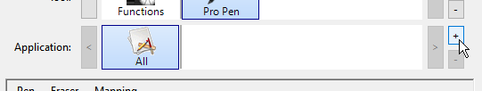
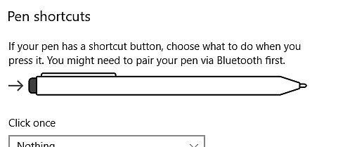

# 配置笔和平板电脑

本页列出了在Windows上配置图形输入板笔以提高其与应用程序兼容性的多个建议。

## 什么是Windows Ink？

Windows Ink是一种软件/服务，可处理手写笔或图形平板电脑上的笔等笔。 它提供了各种应用程序（如便笺和草图），以便与计算机上的笔进行交互。

自版本2019.3以来，应用程序依靠它来处理图形平板电脑。 在此版本之前改用Wintab（并非所有图形平板电脑型号都支持的旧版服务）。

## 在平板电脑驱动程序设置中启用Windows Ink

要确保正确识别笔压力，必须在图形输入板的驱动程序设置中启用Windows Ink。

>[!NOTE]
>
> 虚拟机不支持Windows Ink，因此图形输入板事件不会转发到应用程序。 因此，此配置不支持笔压力。

### 为Wacom平板电脑启用Windows Ink

1. 打开&#x200B;**开始**&#x200B;菜单。
1. 键入&#x200B;**Wacom Tablet属性**，然后单击第一个搜索结果。
1. 在&#x200B;**Wacom绘图板属性**&#x200B;窗口中，单击笔列表中的&#x200B;**工具**。\
   
1. 单击加号&#x200B;**&quot;+&quot;**&#x200B;按钮以添加应用程序配置文件。\
   
1. 在新窗口中单击&#x200B;**浏览**&#x200B;按钮，以查找Substance 3D Painter可执行文件。\
   
1. 单击&#x200B;**确定**&#x200B;以验证并创建配置文件。\
   
1. 单击&#x200B;**映射**&#x200B;选项卡。\
   
1. 在窗口的左下角，确保已启用&#x200B;**“使用Windows Ink”**。\
   

>[!NOTE]
>
> 启用Windows Ink后，重新启动应用程序以确保正确考虑更改。

### 为Huion平板电脑启用Windows Ink

1. 打开&#x200B;**开始**&#x200B;菜单。
1. 键入&#x200B;**Huion绘图板**，然后单击第一个搜索结果
1. 在&#x200B;**Huion Tablet**&#x200B;窗口中，单击&#x200B;**数字笔** 。\
   
1. 在窗口的左下角，确保已启用&#x200B;**启用Windows Ink**。\
   

## 如何访问Windows Ink设置

可以在常规Windows设置中访问Windows Ink设置：

1. 打开&#x200B;**开始**&#x200B;菜单。
1. 单击&#x200B;**设置**&#x200B;图标。\
   
1. 在“设置”窗口中，单击&#x200B;**设备** 。\
   
1. 在&#x200B;**设备**&#x200B;窗口中，单击&#x200B;**笔和Windows Ink**（仅在连接了图形输入板的情况下可用）。\
   

## 推荐的Windows Ink设置

下面是Windows Ink设置以及每个设置的建议配置。

>[!NOTE]
>
> 即使在遵循本指南后，某些与Windows Ink相关的视觉效果仍然可见。 很遗憾，Microsoft没有在Windows中提供用于禁用它们的设置。
> 
> 其余视觉效果为：
> 
> * 右键单击时显示&#x200B;**圆圈**。
> * 按修改键（Ctrl、Alt或Shift）时鼠标下方的&#x200B;**工具提示**。

### 笔设置

| ***设置*** | ***描述*** |
| --- | --- |
| **选择要用哪只手写** | 推荐： **右侧**&#x200B;此设置控制如何识别笔方向。 将此设置设为左侧会导致调整参数时出现某些UI冻结。 |
| **显示视觉效果** | 建议： **已禁用**&#x200B;此设置控制各种笔交互期间显示的视觉效果。 禁用此选项可以在单击时隐藏波纹圈效果： 

 |
| **显示光标** | 推荐： **已禁用** |
| **允许我在某些桌面应用程序中将我的笔用作鼠标** | 建议： **已启用**&#x200B;此设置允许图形输入板笔发送常规鼠标输入。 如果禁用此设置，则可能会导致UI参数出现一些交互问题。 |

### 手写设置

| ***设置*** | ***描述*** |
| --- | --- |
| **直接写入文本字段时的字体大小** | 推荐： **中（默认）** |
| **使用手写时的字体** | 推荐： **Segoe UI（默认）** |
| **使用笔点击文本域时，请使用手写输入文本** | 推荐： **仅在平板电脑模式下**&#x200B;此设置控制手写文本输入窗口显示的方式和时间。 如果未设置为“仅在平板电脑模式下”，则每次在用户界面中选择文本字段时，都会显示该窗口。 例如，在滑块中键入特定值时。 |
| **允许我在某些桌面应用程序中将我的笔用作鼠标** | 建议： **已启用**&#x200B;此设置允许图形输入板笔发送常规鼠标输入。 如果禁用此设置，则可能会导致UI参数出现一些交互问题。 |
| **用指尖在手写面板中写字** | 推荐： **已禁用** |

### 笔快捷键设置

| ***设置*** | ***描述*** |
| --- | --- |
| **单击一次** | 推荐： **无** |
| **双击** | 推荐： **无** |
| **按住（仅某些笔支持）** | 推荐： **无** |
| **允许应用覆盖“快捷键”按钮行为** | 推荐： **已启用** |
| **如果可用，从存储中移除笔后显示油墨工作区** | 推荐： **已禁用** |

## 如何访问笔和触控设置

可以在控制面板中访问笔和触控设置：

1. 打开&#x200B;**开始**&#x200B;菜单。
1. 键入&#x200B;**控制面板**，然后单击第一个搜索结果。
1. 将控制面板&#x200B;**显示模式**&#x200B;切换为&#x200B;**小图标** 。\
   
1. 单击&#x200B;**笔和触控**&#x200B;设置。\
   

## 推荐的笔和触控设置

为了改善绘画行为和相机操作，建议使用以下设置。

要访问设置，请单击窗口中的&#x200B;**笔操作**&#x200B;之一，然后单击&#x200B;**设置**&#x200B;按钮。

| ***设置*** | ***描述*** |
| --- | --- |
| **点击** | 无参数。 |
| **双击** | 推荐： **默认值。** |
| **按住** | 建议： **禁用设置“启用按住以右键单击”**&#x200B;禁用此设置将允许在不激活Windows拖动圆圈的情况下正常拖动任何元素： 

 |
| **使用“笔”按钮作为右键单击等效操作** | 推荐： **已启用** |
| **使用笔顶部擦除油墨（如果可用）** | 推荐： **已启用** |
