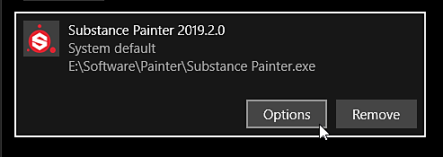

# Painter无法在右侧的GPU上启动

在Windows上，应用程序在启动时可能未使用正确的GPU，这可能导致性能和稳定性问题。 下面列出了常见问题及其解决方案，以确保该软件使用正确的GPU。

要了解使用了哪个GPU，可以检查[日志文件](../../exporting-the-log-file.md)。

## Windows

### 显示器电缆配置

在Windows上，分配给应用程序的GPU取决于运行该应用程序的显示器。 这是因为显示器电缆直接链接到GPU本身的输出。 因此，如果应用程序启动时所在的显示器与主板的图形输出相连，而不是与显卡本身相连的，则应用程序可能启动在错误的GPU上。 在这种情况下，Windows可能使用集成GPU，而不是专用GPU。

<b>要解决此问题</b> ：只需取消插入与主板链接的显示器，然后将其链接到GPU输出，从而修复电缆配置。

### GPU驱动程序安装不正确

如果未正确安装GPU驱动程序，应用程序将无法访问专用GPU，并且必须改为回退到集成的GPU。

<b>要解决此问题</b> ：卸载当前的GPU驱动程序，执行清理，然后在重新启动计算机后重新安装GPU驱动程序。

### Nvidia GPU驱动程序配置文件设置

在某些计算机（如笔记本电脑）上，应用程序默认可能在集成的GPU上运行，而不是在专用的Nvidia GPU上运行。 对于NVIDIA GPU，切换到右GPU取决于应用程序配置文件。 如果应用程序没有此类配置文件，您可以手动分配一个。

<b>要解决此问题</b> ：

1. 右键单击桌面并选择“NVIDIA控制面板”<b>或</b>导航到“控制面板”并搜索“NVIDIA控制面板”
1. 在<b>3D设置</b>下，转到<b>管理3D设置</b>
1. 在<b>程序设置</b>选项卡下，为<b>Substance 3D Painter</b>添加新配置文件
1. 将首选图形处理器设置更改为高性能NVIDIA处理器

### Windows性能设置

由于默认性能和功耗设置，Windows可能为应用程序设置了错误的GPU设置。

<b>要解决此问题： </b>请按照以下步骤替代默认GPU配置。

1. 通过右键单击桌面来打开显示设置：

   
1. 导航到窗口底部的主页，然后单击“图形设置”：

   
1. 单击“浏览”按钮并找到Substance 3D Painter可执行文件：

   
1. 添加应用程序后，单击“选项”按钮：

   
1. 选择设置“高性能”，然后单击“保存”按钮

   

## Linux

### 禁用“偏好使用非默认GPU”

从桌面快捷方式运行Painter或通过Steam运行它时，请确保<b>\*.desktop</b>文件内的设置<b>PrefersNonDefaultGPU</b>设置为<b>false</b>。

此设置可能会产生误导，导致使用/强制使用集成的GPU，而不是谨慎且功能更强大的GPU。 有关详细信息，[请参阅此讨论](https://github.com/ValveSoftware/steam-for-linux/issues/9940)。

### 使用DRI\_PRIME环境变量强制使用特定的GPU

默认情况下，Painter将使用由Vulkan graphics API列出的第一个GPU，但此GPU可能是错误的（可能是首先列出的集成GPU），从而导致性能不佳。 DRI\_PRIME环境变量可用于强制使用您选择的GPU。 有关详细信息[请参阅Arch wiki中的文档](https://wiki.archlinux.org/title/PRIME#For_open_source_drivers%E2%80%94PRIME)。 您也可以参考[Mesa文档](https://docs.mesa3d.org/envvars.html#envvar-DRI_PRIME)。
