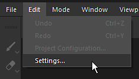
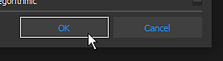

# 视区的纹理上出现块状伪像

从版本2018.3.0开始，视区中可能会显示以下种类的对象：

{width="400px"}

这些伪影与Nvidia GPU驱动程序的问题有关。\
为了避免伪影，需要取消稀疏虚拟纹理硬件支持。

GeForce **驱动程序440.97**&#x200B;现在&#x200B;**已修复此问题** 。 我们建议更新这些驱动程序并保持SVT处于启用状态，以获得良好的性能。

Nvidia网站<https://www.nvidia.com/Download/index.aspx>上提供了新的驱动程序

## 禁用稀疏虚拟纹理硬件加速

### 1 — 启动Substance 3D Painter并打开设置

通过“编辑”>“设置”打开主要设置。

### 2 — 查找名为“稀疏虚拟纹理”的部分

在“常规”部分内，向下滚动并找到名为“稀疏虚拟纹理”的子部分

### 3 — 取消选中设置

取消选中“硬件支持加速”设置，将其禁用。

### 4 — 验证并重新启动Substance 3D Painter

单击“OK”（确定）按钮验证更改。

单击“是”按钮重新启动Substance 3D Painter以应用更改。
