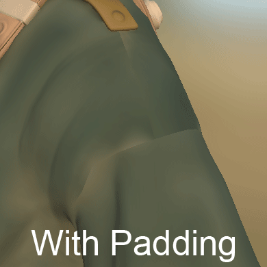

# 纹理扩展或填充

**填充**（有时也称为&#x200B;**膨胀**）是在生成纹理之后发生的过程。 其目的是扩大UV 岛的边框，以便用类似的像素填充空白区域。

生成优质填充对于确保以后由游戏引擎或脱机渲染器生成良好的[mipmaps](../../../getting-started/glossary.md)代非常重要。\
Substance 3D Painter可以生成无限边距：这意味着像素将被拉伸，直到到达其他UV 岛或纹理的边框。

## 无限填充生成

以下是无限边距的工作方式示例：

<table>
<tr style="border: 0;">
<td style="border: 0;" valign="top">

{width="512px"}

</td>
<td style="border: 0;" valign="top">

</td>
</tr>
</table>

## MipMaps

在3D计算机图形中，**mipmaps**&#x200B;是预计算的优化纹理序列，每个纹理序列都是同一图像的逐渐降低的分辨率表示形式。 它们旨在提高渲染速度，减少锯齿伪影。 高分辨率的Mipmap图像用于靠近相机的对象。 当对象看起来距离较远时，将使用较低分辨率的图像。 这是替代从原始纹理读取所有像素的有效渲染方式。 mipmaps（每个级别）嵌入在纹理本身内（当文件格式支持时）。

内边距对于混合图非常重要，因为如果要降低纹理分辨率，可以避免错误的颜色在网格的UV内溢出。

<table>
<tr style="border: 0;">
<td style="border: 0;" valign="top">

{width="400px"}

</td>
<td style="border: 0;" valign="top">

{width="400px"}

</td>
</tr>
</table>

在上例中，灰色背景溢出UV（右图），而内边距保持颜色干净（左图）。

在3D应用程序中，结果如下：

## 填充控件

Substance 3D Painter允许在不同位置更改内边距生成的行为（例如禁用它）：

* **烘焙时**：有关详细信息，请参阅[烘焙文档](../../../baking/baking.md)。
* **生成纹理集的纹理时**：有关详细信息，请参阅[纹理集设置](../../../interface/texture-set/texture-set-settings.md)文档。
* **导出纹理时** ：有关详细信息，请参阅[导出设置](../../../export/export-window/export-window.md)文档的“内边距设置”部分。
