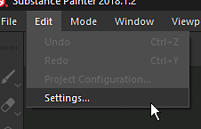

# 架子中的缩览图看起来不正确

如果架子中的缩览图看起来与常规缩览图不同，可能是因为用于渲染预览的着色器。

| 损坏的缩略图 | 正常缩略图 |
| --- | --- |
| 

 | 

 |

## 1 — 打开主设置窗口

转到&#x200B;**编辑**&#x200B;并单击&#x200B;**设置** ：

## 2 — 移除架子预览着色器

在&#x200B;**常规**&#x200B;视图中，向下滚动直到“预览选项”部分可见。\
单击“**材质预览着色器**”前面的&#x200B;**交叉**&#x200B;按钮以移除指定的当前着色器。

{width="450px"}

## 3 — 重新启动Substance 3D Painter

为了重新生成缩览图以便它们看起来正确，需要重新启动Substance 3D Painter。
